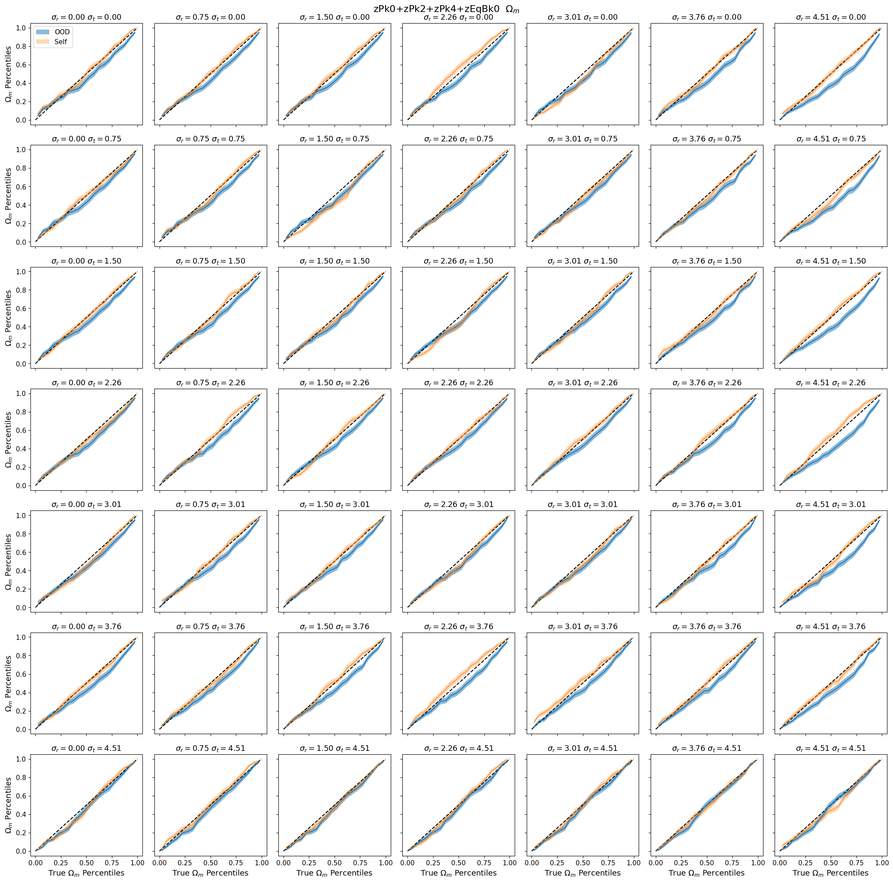
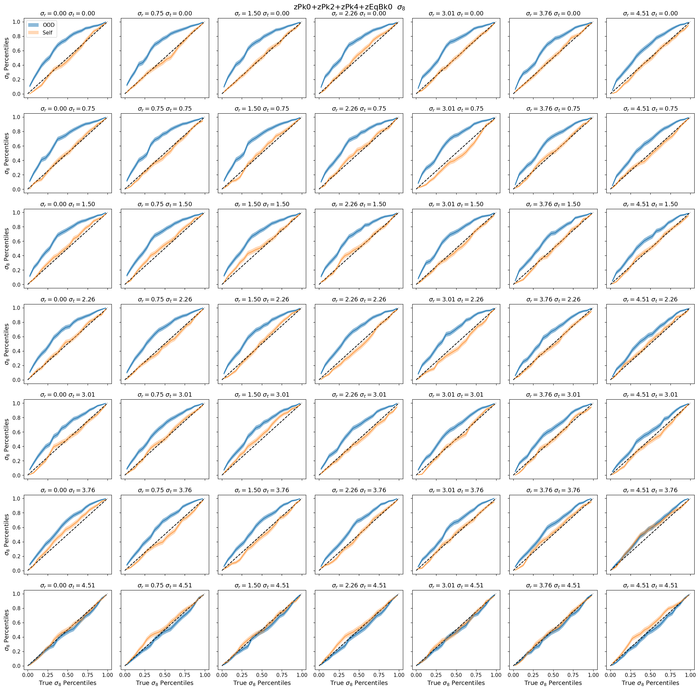
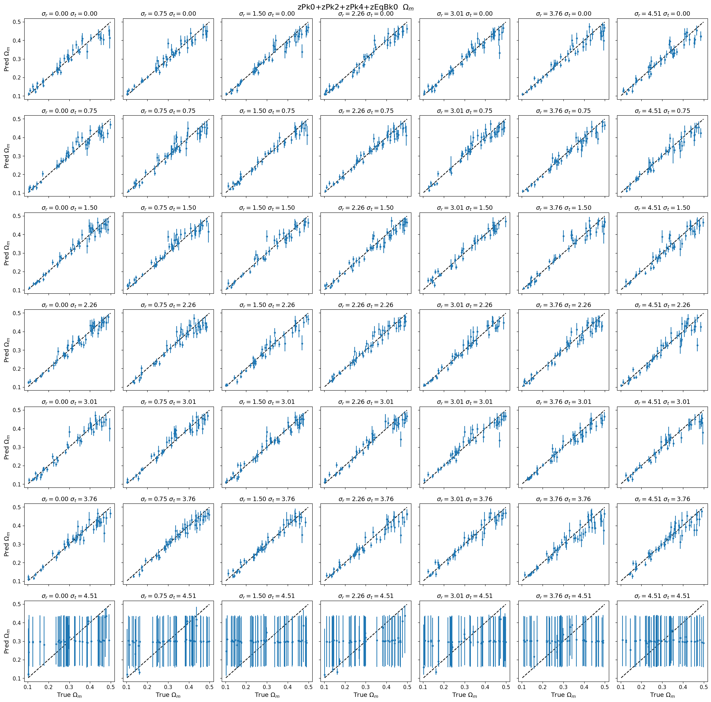
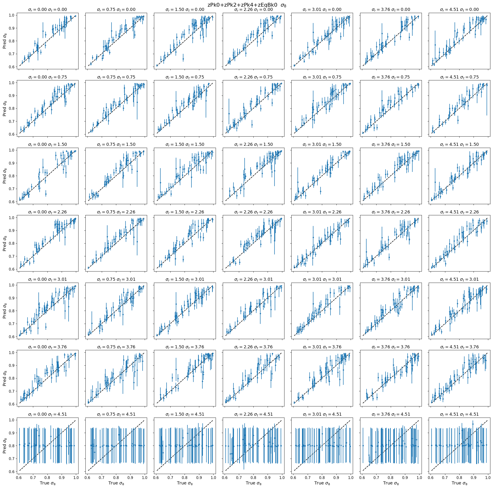
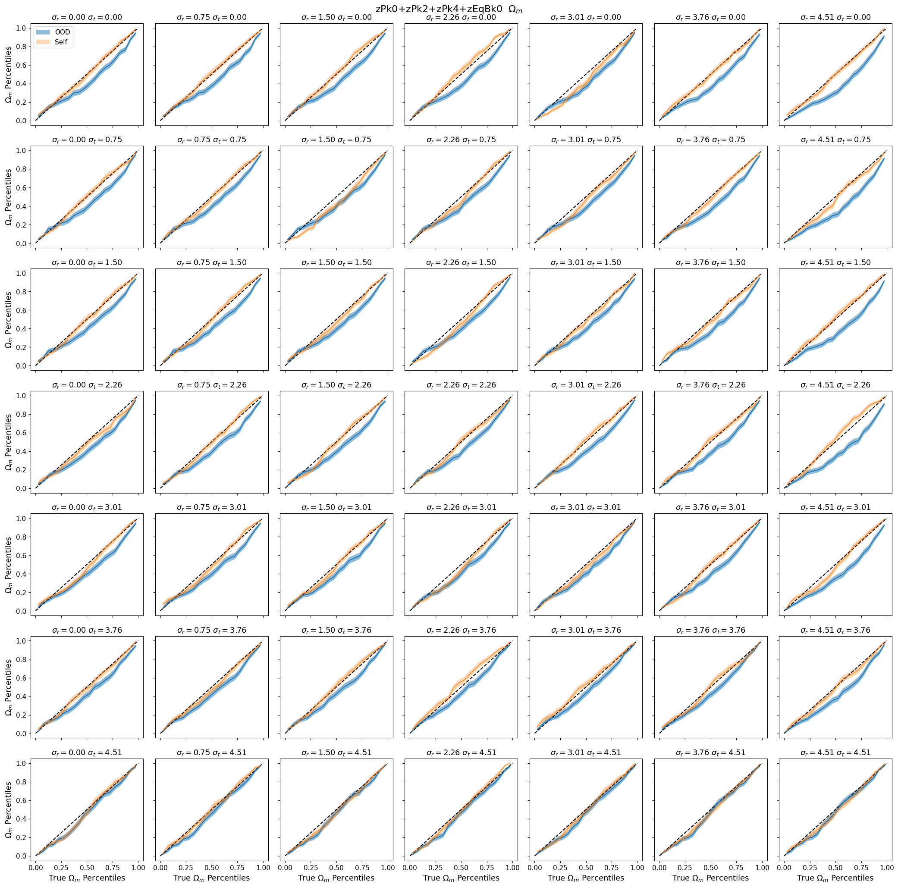
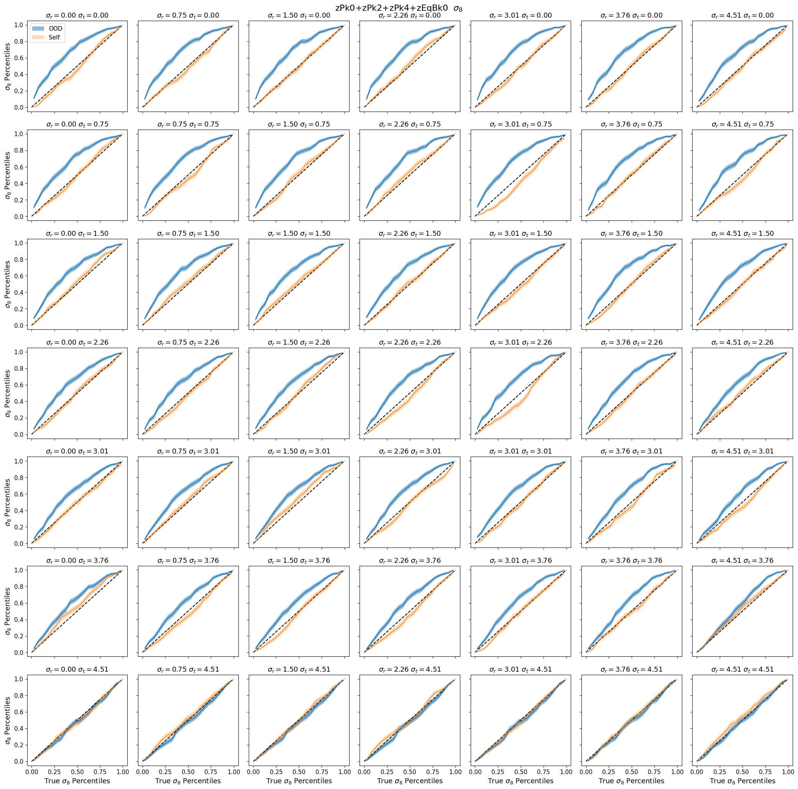
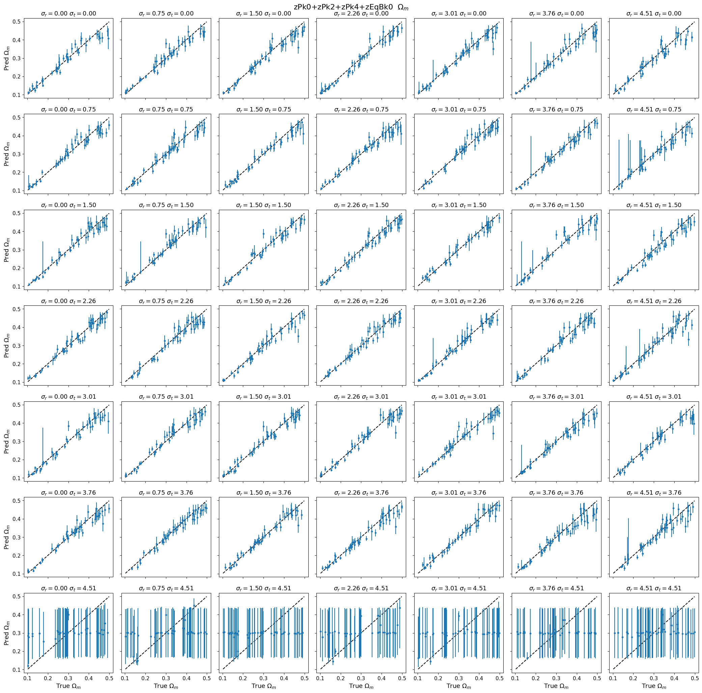
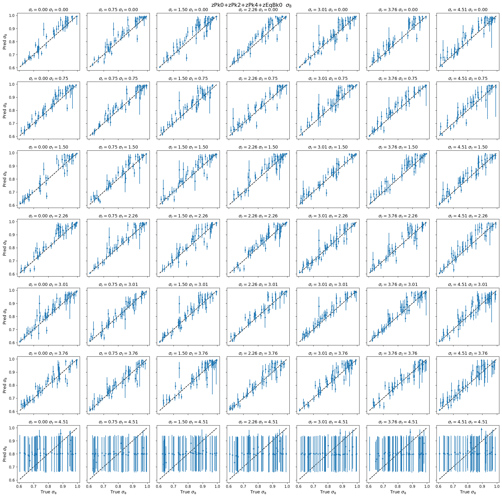

# OOD: quijotelike/fastpm_charm6 → quijote/nbody_hodz_gridnoise
**Date**: 2026-06-12
**Type**: OOD inference
**Train**: quijotelike/fastpm_charm6
**Test**: quijote/nbody_hodz_gridnoise
**Tracer**: galaxy
**Summaries**: zPk0+zPk2+zPk4, zPk0+zPk2+zPk4+zBk0, zPk0+zPk2+zPk4+zEqBk0
**kmax**: 0.2, 0.3, 0.4
**Notes**: 

## Overview
- Ωm is well-calibrated across most of the (summary, kmax) grid; the exception is zPk024 at kmax=0.2, where coverage sits below 0.5 across the noise grid, driven primarily by low-noise configurations where posteriors are too narrow (overconfident).
- σ8 is well-calibrated for the power-spectrum-only summary (zPk024) at all kmax values, but becomes systematically biased high (coverage > 0.5) at kmax ≥ 0.3 when bispectrum modes are added (zBk0 or zEqBk0); the effect is strongest at kmax=0.4 and at low-to-moderate noise.
- The complementary bias pattern — Ωm biased low at low kmax and σ8 biased high at higher kmax with bispectrum summaries — is consistent with CHARM devoxelization bias.
- Adding bispectrum modes (zBk0, zEqBk0) does not improve the OOD coverage; both bispectrum summaries show similar σ8 overprediction at kmax ≥ 0.3, with neither clearly worse than the other.
- The power-spectrum-only summary (zPk024) at kmax=0.3 and kmax=0.4 shows the most stable calibration for both parameters across the noise grid.

## Figures

### Overview

Median coverage — Ωm

Median coverage — σ8

### Flagged cells

zPk024 kmax=0.2 — Ωm biased-low

- Low-noise configurations drive the bias: coverage curves for Ωm sit below the diagonal, indicating overconfident posteriors, most severely at σ_rad ≈ 0.0–0.1.
- σ8 is substantially better calibrated in the same cell; its coverage curves track near the diagonal across most noise configurations, in contrast to Ωm.
- The true vs. predicted scatter shows compressed posterior widths for Ωm at low noise rather than a systematic shift in predicted values.

<table>
<tr>
<td></td>
<td></td>
</tr>
<tr>
<td></td>
<td></td>
</tr>
</table>

zPk024+Bk0 kmax=0.3 — σ8 biased-high

- σ8 coverage curves lie above the diagonal across most noise configurations, with the strongest deviation at low-to-moderate noise (σ_rad ≤ 1.50, σ_tran ≤ 1.50), indicating systematic underconfidence.
- Ωm remains relatively well-calibrated in this cell; only mild below-diagonal deviations appear at low-noise corners.
- At the highest noise levels, both parameters flatten toward horizontal coverage curves, consistent with the signal becoming noise-dominated.

<table>
<tr>
<td></td>
<td></td>
</tr>
<tr>
<td></td>
<td></td>
</tr>
</table>

zPk024+Bk0 kmax=0.4 — σ8 biased-high

- σ8 coverage curves lie above the diagonal across all noise configurations, including at high noise; the bias is therefore not confined to low-noise regimes and appears systematic across the noise grid.
- Ωm remains reasonably well-calibrated, tracking near the diagonal across most configurations.
- The true vs. predicted scatter shows reasonable mean predictions for σ8 but posterior widths that are too conservative (too wide), consistent with underconfidence rather than a prediction offset.

<table>
<tr>
<td></td>
<td></td>
</tr>
<tr>
<td></td>
<td></td>
</tr>
</table>

zPk024+EqBk0 kmax=0.3 — σ8 biased-high

- σ8 coverage curves lie above the diagonal across all noise configurations; the deviation is most pronounced at low noise (σ_rad ≤ 0.01) where median coverage exceeds 0.6, and improves only modestly with increasing noise.
- Ωm coverage tracks closer to the diagonal; the predicted scatter is more centered relative to true values than σ8.
- The directionality is consistent with the zBk0 kmax=0.3 cell: σ8 is systematically underconfident while Ωm is not.

<table>
<tr>
<td></td>
<td></td>
</tr>
<tr>
<td></td>
<td></td>
</tr>
</table>

zPk024+EqBk0 kmax=0.4 — σ8 biased-high

- σ8 coverage curves are below the diagonal across all noise levels, with the strongest overconfidence at low noise (σ_rad + σ_tran ≤ 0.20); even moderate noise configurations show measurable underconfidence in σ8.
- Ωm coverage tracks near the diagonal across the full noise grid and does not show the same systematic pattern.
- The true vs. predicted scatter for σ8 shows compressed posterior widths relative to true spread rather than biased central predictions.

<table>
<tr>
<td></td>
<td></td>
</tr>
<tr>
<td></td>
<td></td>
</tr>
</table>

