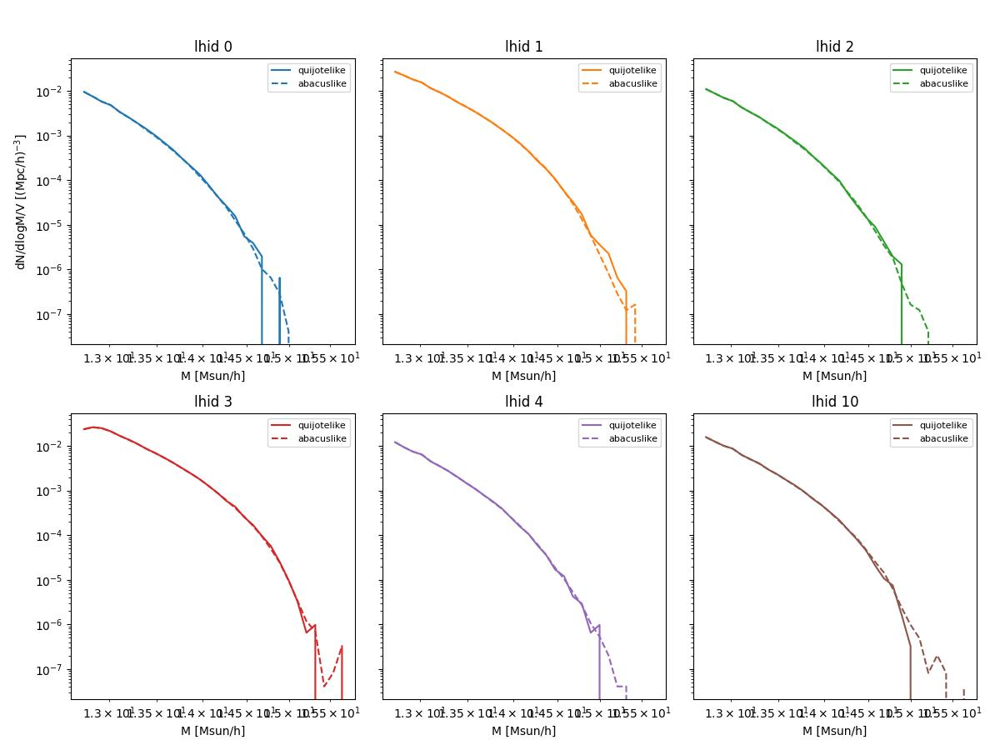
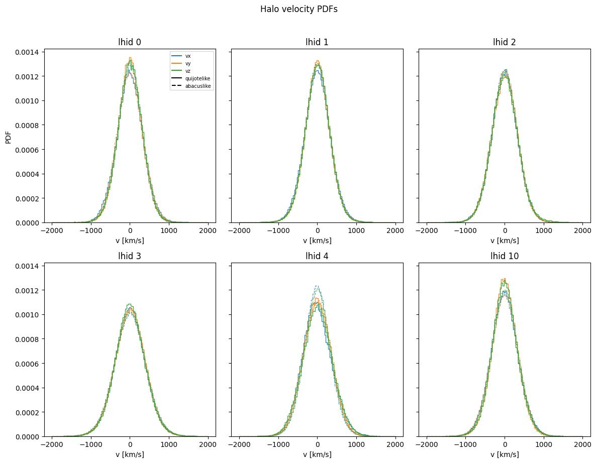
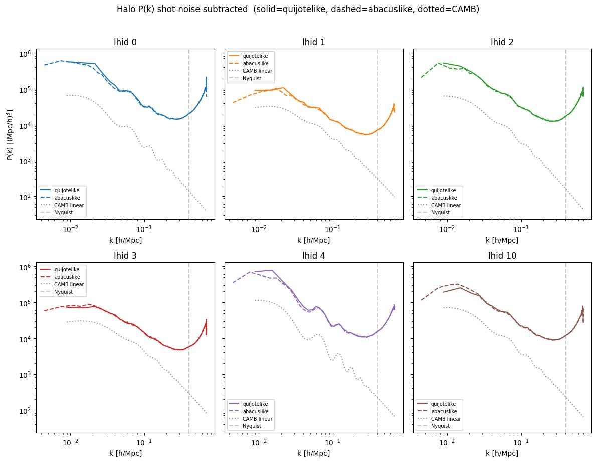
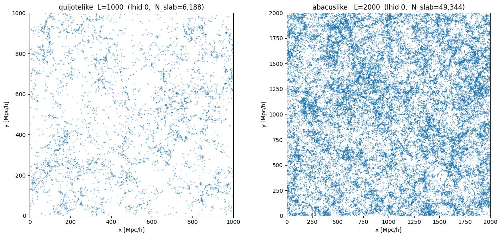
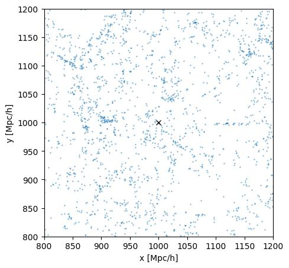
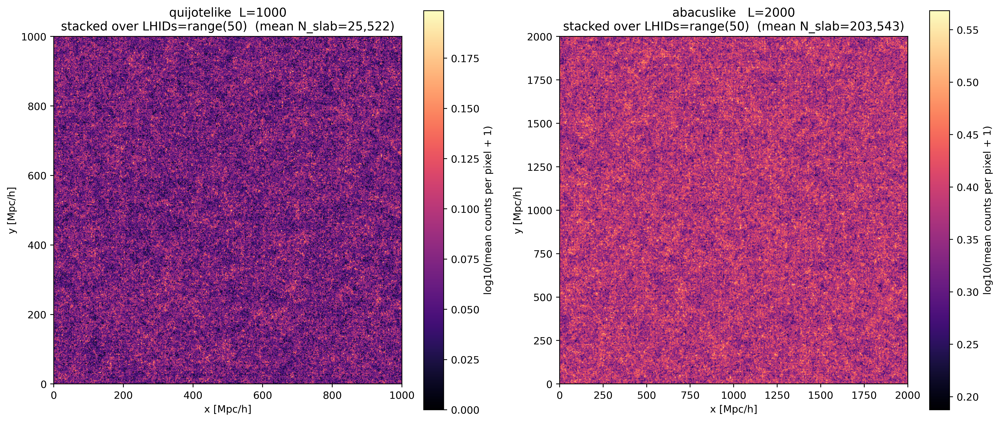

# Sanity check: quijotelike vs. abacuslike CHARM 6

**Date**: 2026-06-12
**Type**: Miscellaneous / sanity
**Train**: —
**Test**: quijotelike/fastpm_charm6 (L=1 Gpc/h), abacuslike/fastpm_charm6 (L=2 Gpc/h)

---

## Overview

- Halo mass functions for quijotelike and abacuslike agree closely across the mass range resolved by the 1 Gpc/h volume. The abacuslike volume samples the high-mass tail more densely due to its larger volume, and the quijotelike HMF extrapolates consistently into that regime without discontinuity.

- Halo number densities match to within 0.3–0.7% across all tested LHIDs (see `figures/number_density_report.txt`), confirming that the mass cut is applied consistently between volumes.

- Halo velocity PDFs (vx, vy, vz) are in close agreement between quijotelike and abacuslike across all six LHIDs, with no visible systematic offset in the width or shape of the distributions.

- Shot-noise-subtracted halo P(k) curves for quijotelike and abacuslike overlap across the full k range up to the Nyquist frequency. The CAMB linear matter power spectrum is offset below the halo P(k) by a roughly constant bias factor, as expected.

- Visual inspection of the halo point distribution for lhid 0 shows uniform large-scale structure morphology in both volumes with no obvious systematic features.

- A concern was raised that a line-like artifact might appear at emulator patch boundaries in the abacuslike volume. A zoom-in of the suspected region shows no clearly anomalous feature at the marked location.

- Stacking the halo count field over 50 LHIDs yields a spatially uniform mean field for both volumes, with no consistent line-like artifact at any location. The concern is attributed to a spurious fluctuation in a single realization.

