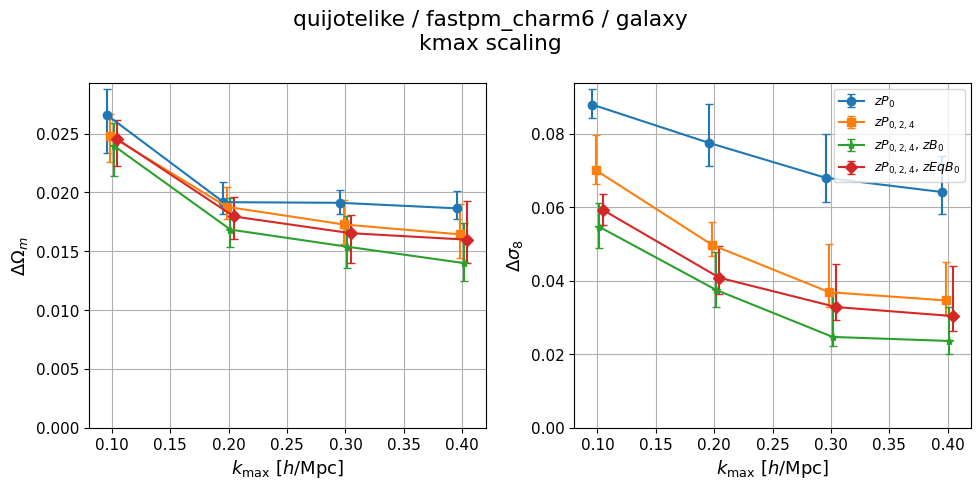
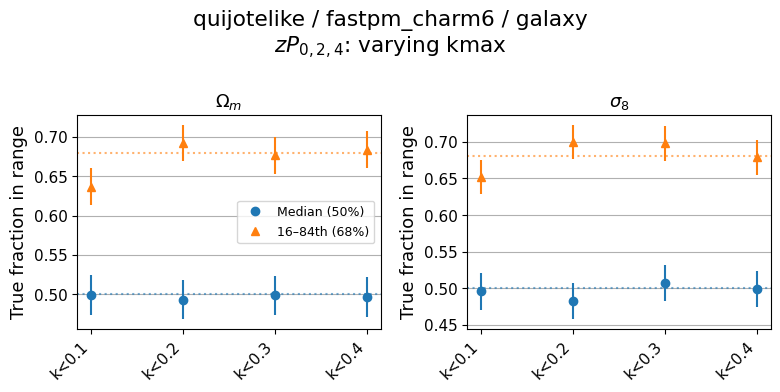
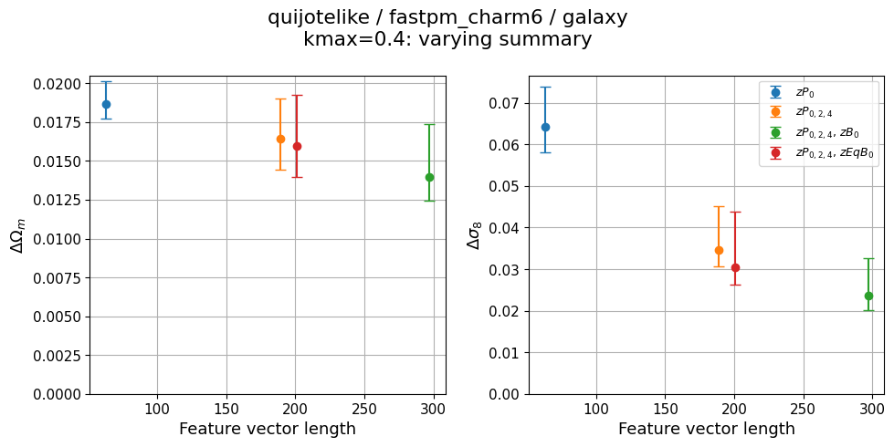
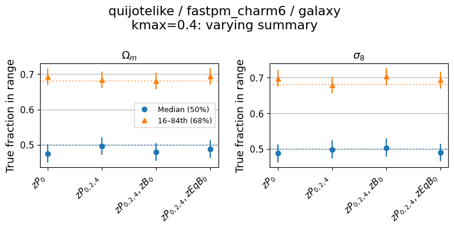
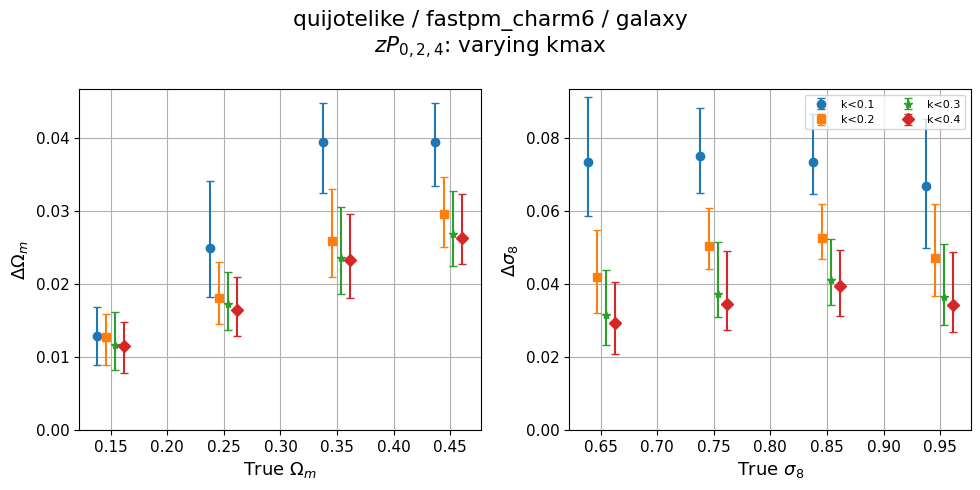
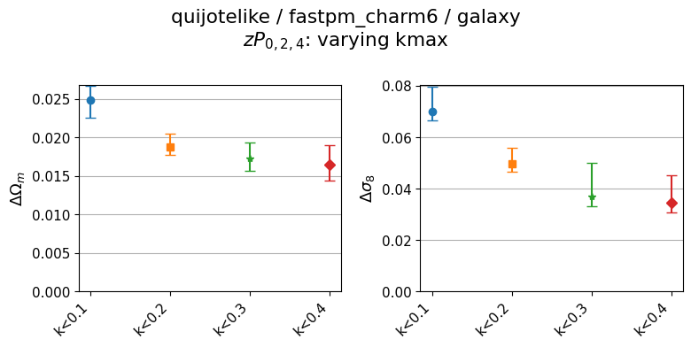
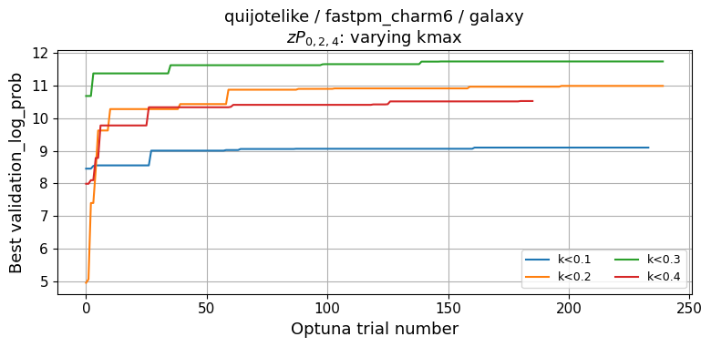
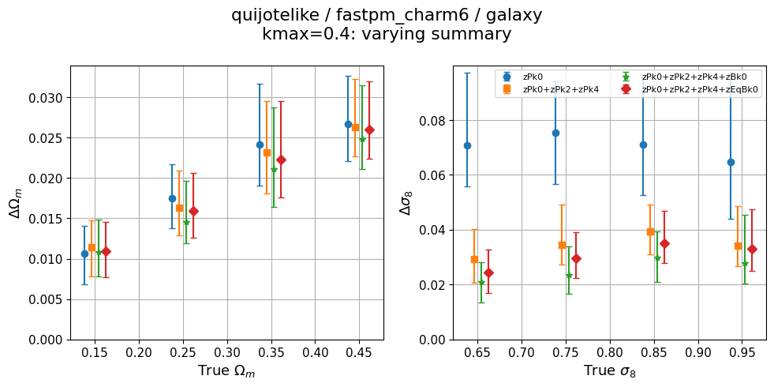
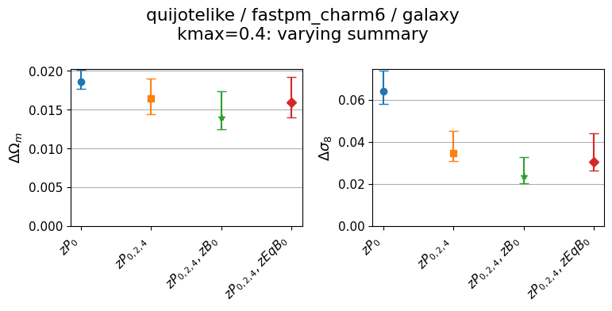
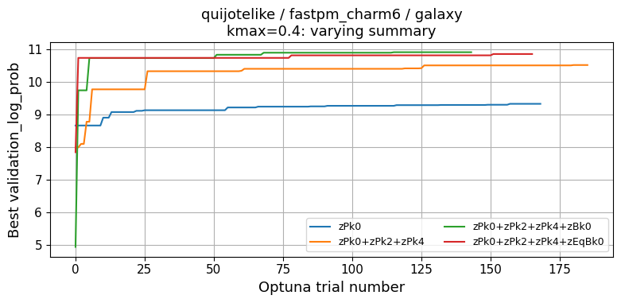

# Self-consistent: quijotelike/fastpm_charm6
**Date**: 2026-06-12
**Type**: Self-consistent
**Suite**: quijotelike/fastpm_charm6
**Tracer**: galaxy
**kmax sweep summary**: zPk0+zPk2+zPk4
**kmax values**: 0.1, 0.2, 0.3, 0.4
**Feature sweep kmax**: 0.4
**Feature sweep summaries**: zPk0, zPk0+zPk2+zPk4, zPk0+zPk2+zPk4+zBk0, zPk0+zPk2+zPk4+zEqBk0
**Notes**: 

## Overview
- Calibration holds across all kmax values and all summary configurations; both Ωm and σ8 maintain median coverage at 0.50 and 68% interval fractions near 0.68 throughout.
- Ωm constraining power (stdev) saturates by kmax=0.2 (Δωm ≈ 0.020) with diminishing improvement beyond that; σ8 continues to benefit from higher kmax, improving from Δσ8 ≈ 0.084 at kmax=0.1 to ≈ 0.067 at kmax=0.4.
- Adding bispectrum features (zBk0, zEqBk0) at kmax=0.4 dramatically improves σ8 constraints — from Δσ8 ≈ 0.071 (zPk0 alone) to ≈ 0.021 (zPk024+zEqBk0) — a monotonic ~3× improvement.
- Ωm feature scaling is non-monotonic: stdev decreases from zPk0 to zPk024, but worsens slightly when adding zBk0 or zEqBk0, suggesting some redundancy or degeneracy in Ωm extraction when bispectra are included alongside power spectrum multipoles.
- No sweeps are flagged for calibration failure or training instability.

## Figures

### kmax sweep

kmax scaling

Calibration

### Feature sweep

Feature length scaling

Calibration

### Zoom-ins

kmax_sweep

<table>
<tr>
<td></td>
<td></td>
</tr>
<tr>
<td></td>
<td></td>
</tr>
</table>

feature_sweep

<table>
<tr>
<td></td>
<td></td>
</tr>
<tr>
<td></td>
<td></td>
</tr>
</table>

