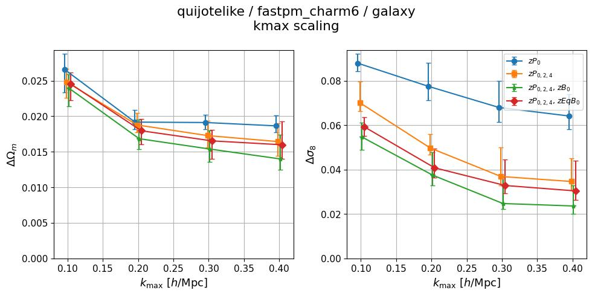
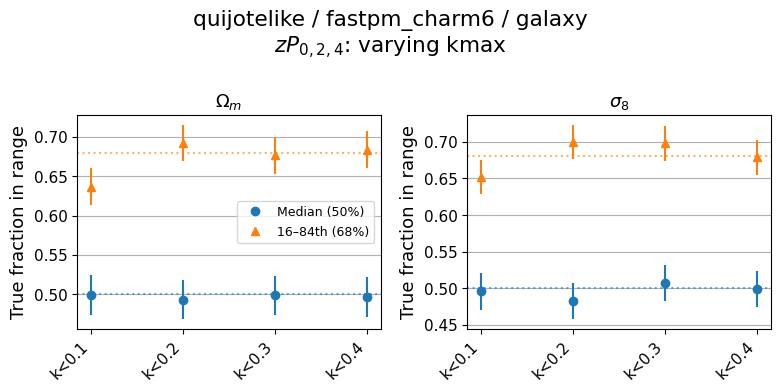
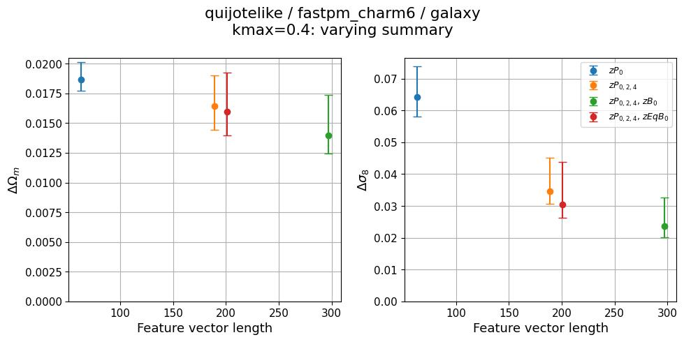
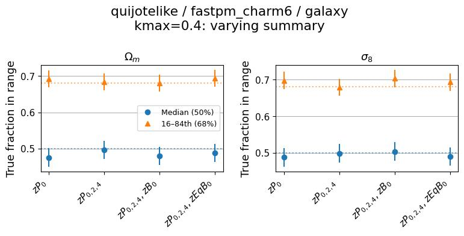
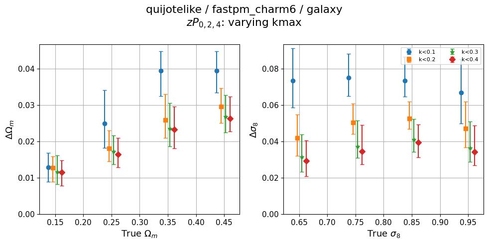
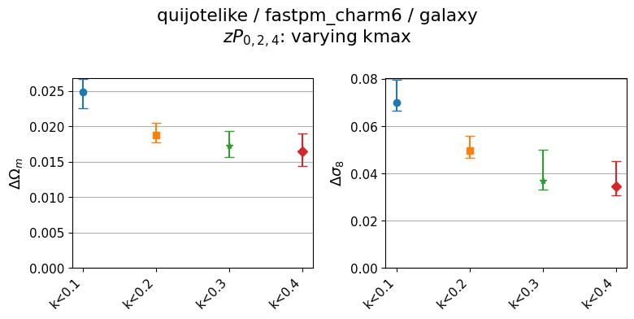
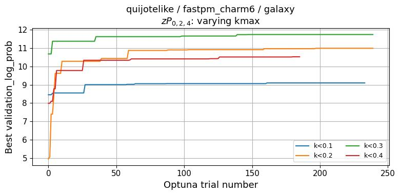

# 2026-06-15_self_quijotelike-fastpm_charm6
**Date**: 2026-06-15
**Type**: Self-consistent
**Suite**: quijotelike/fastpm_charm6
**Tracer**: galaxy
**kmax sweep summary**: zPk0+zPk2+zPk4
**kmax values**: 0.1, 0.2, 0.3, 0.4
**Feature sweep kmax**: 0.4
**Feature sweep summaries**: zPk0, zPk0+zPk2+zPk4, zPk0+zPk2+zPk4+zBk0, zPk0+zPk2+zPk4+zEqBk0
**Notes**: 

## Overview
- Inference is well-calibrated across all kmax values and all summary statistics at kmax=0.4; median coverage is consistently near 0.5 and the 68% interval fraction is near 0.69 for both Ωm and σ8.
- In the kmax sweep, posterior stdev decreases sharply from kmax=0.1 to 0.2 for all summaries, then plateaus from kmax=0.2 through 0.4; zP₀ plateaus earliest and most strongly for Ωm, while richer summaries (zPk024, zPk024+zBk0/zEqBk0) show continued modest improvement in σ8 at higher kmax.
- In the feature sweep at kmax=0.4, posterior stdev decreases monotonically with feature vector length for both Ωm and σ8, with the largest gain from adding multipoles (zP₀→zPk024) and continued improvement from adding the bispectrum; calibration is maintained across all summaries.
- Zoom-in on kmax_sweep: fiducial stdev drops steeply from k<0.1 to k<0.2 then remains essentially flat; no cosmology-dependent variation in stdev is visible across the Ωm–σ8 parameter space; Optuna converges within ~50 trials for all kmax configurations.

## Figures

### kmax sweep

kmax scaling

Calibration

### Feature sweep

Feature length scaling

Calibration

### Zoom-ins

kmax_sweep

<table>
<tr>
<td></td>
<td></td>
</tr>
<tr>
<td></td>
<td></td>
</tr>
</table>

