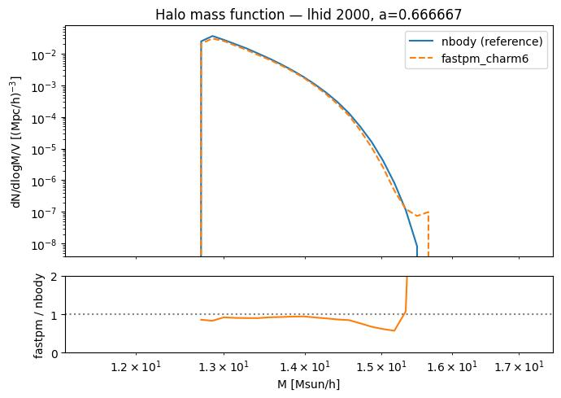
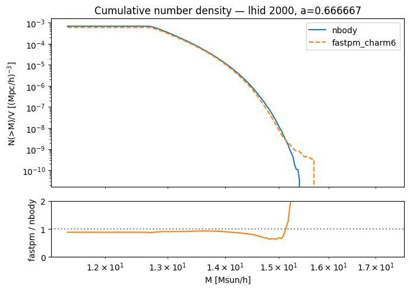
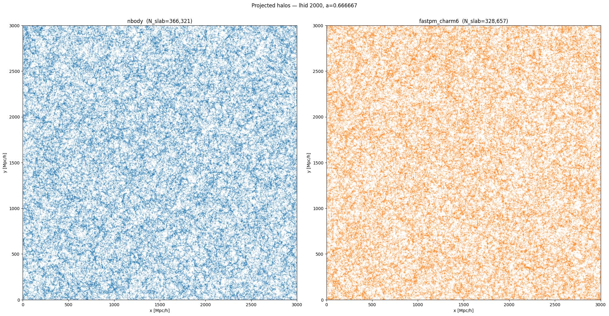
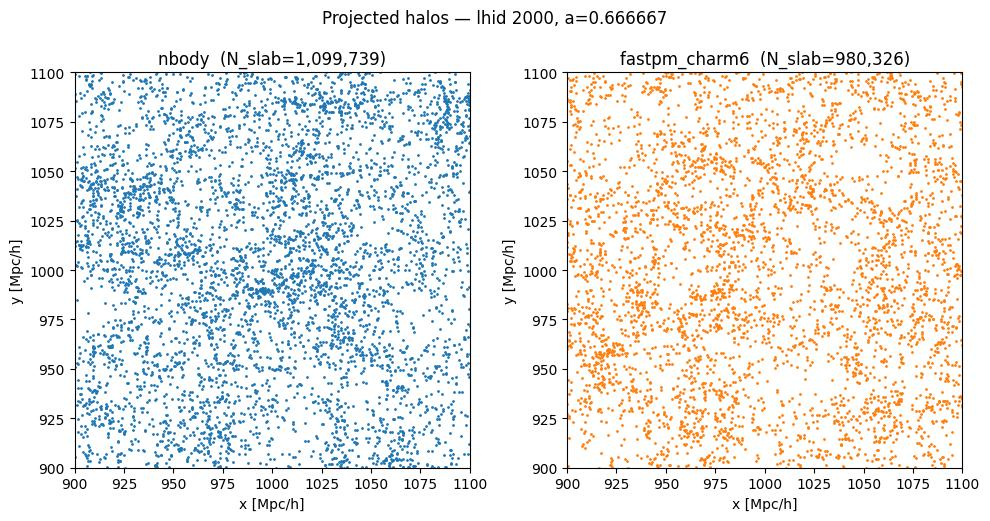
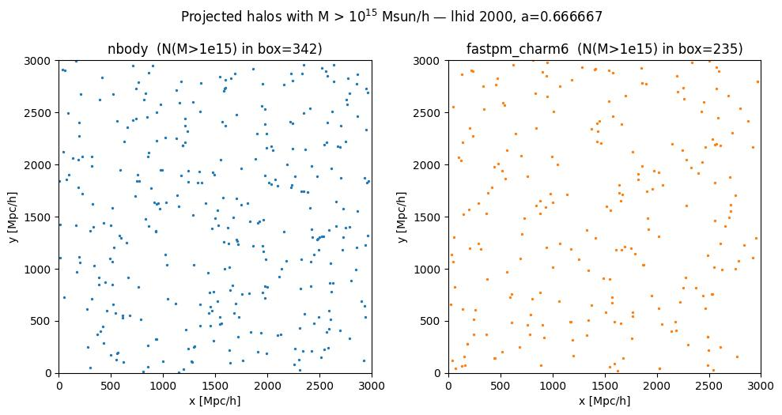
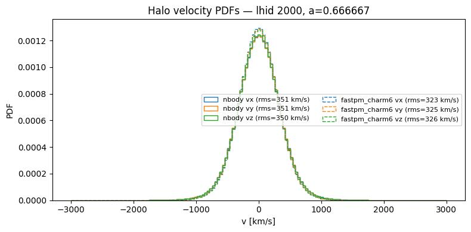
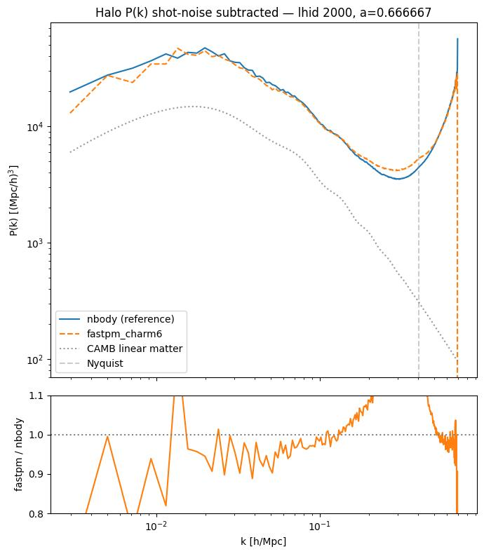
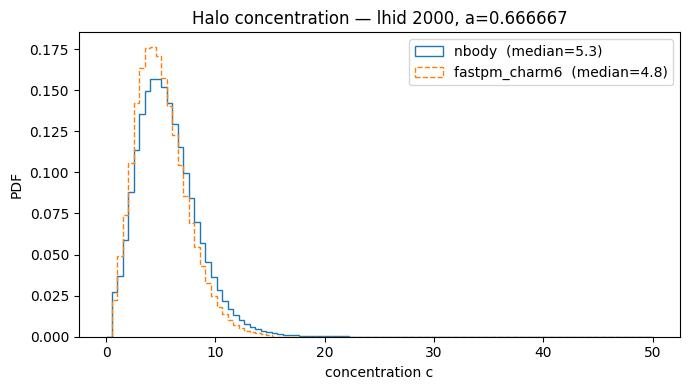

# Sanity check: N-body vs. FastPM+CHARM6 at L=3 Gpc/h

**Date**: 2026-06-16
**Type**: Miscellaneous / sanity
**Suite**: Quijote N-body (reference) vs. fastpm_charm6, L=3 Gpc/h, fiducial cosmology, z=0.5 (a=0.6667)

---

## Overview

- Cosmological parameters match exactly between the two catalogs ([Ωm, Ωb, h, ns, σ8] = [0.3175, 0.049, 0.6711, 0.9624, 0.834]).

- Total halo number density is ~12% lower in fastpm_charm6 than in the N-body reference (5.99×10⁻⁴ vs. 6.79×10⁻⁴ [h/Mpc]³). The HMF ratio is consistently ~0.9 across the bulk of the mass range, indicating a uniform deficit rather than a mass-dependent one.

- The cumulative number density confirms fastpm_charm6 falls below the N-body reference at all mass thresholds. For M > 10^15 M☉/h specifically, fastpm_charm6 contains 235 halos versus 342 in the N-body. The HMF ratio shows a localized spike at ~1.5×10^15 M☉/h, indicating irregular behavior at the extreme high-mass tail, consistent with limited CHARM6 training coverage at rare masses.

- Projected halo distributions are visually consistent in large-scale structure morphology. No line-like artifacts are visible at emulator patch boundaries in either the full-volume or zoom-in views.

- Halos above 10^15 M☉/h trace the large-scale structure in both catalogs with no clustering along patch boundaries, indicating that the high-mass tail irregularity is not caused by spatial artifacts.

- Halo velocity PDFs are visually similar in shape, though the rms velocity is slightly lower in fastpm_charm6 (~324–326 km/s) than in the N-body (~350–351 km/s) across all three components.

- The shot-noise-subtracted halo P(k) agrees to within ~5% in the range 0.02 < k < 0.2 h/Mpc. At large scales (k < 0.02 h/Mpc), the ratio shows oscillations with deviations up to ~20%, likely dominated by sample variance given the different halo counts. Near the Nyquist frequency, fastpm_charm6 shows a shallower upturn than the N-body.

- The provenance of the Quijote 3 Gpc/h reference catalog is uncertain: it was generated by a collaborator (Shivam) for the CHARM paper and the original Rockstar catalog is unavailable. Differences in subhalo inclusion or concentration computation could contribute to the observed discrepancies.

## Additional figures

- Halo concentration PDFs show the same lognormal-like shape in both catalogs, with fastpm_charm6 peaking at a slightly lower median concentration (4.8 vs. 5.3 for the N-body), consistent with the known catalog provenance uncertainty noted above.

