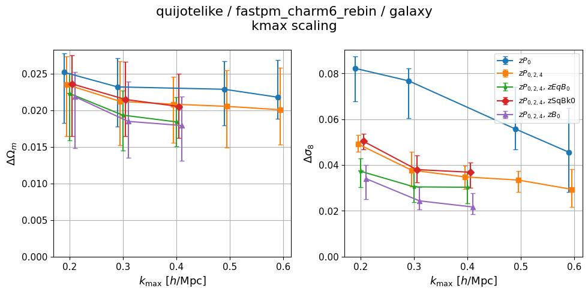
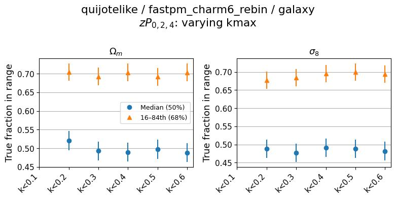
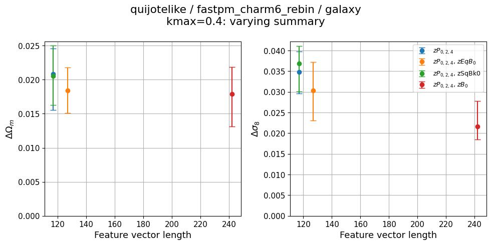
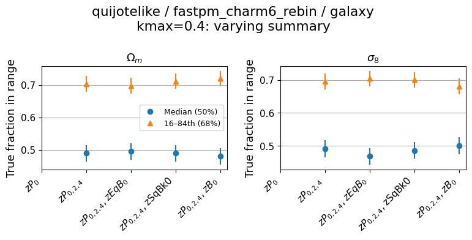
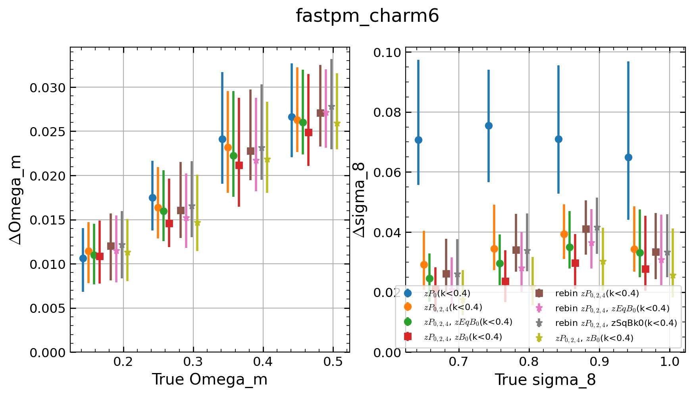

# Self-consistent diagnostics: quijotelike/fastpm_charm6_rebin

**Date**: 2026-06-17
**Type**: Self-consistent
**Suite**: quijotelike/fastpm_charm6_rebin
**Tracer**: galaxy
**kmax sweep summary**: zPk0+zPk2+zPk4
**kmax values**: 0.1, 0.2, 0.3, 0.4, 0.5, 0.6
**Feature sweep kmax**: 0.4
**Feature sweep summaries**: zPk0, zPk0+zPk2+zPk4, zPk0+zPk2+zPk4+zEqBk0, zPk0+zPk2+zPk4+zSqBk0, zPk0+zPk2+zPk4+zBk0
**Notes**: Rebinned power spectrum and bispectrum summaries; comparison to old (non-rebinned) CHARM6 summaries included.

## Overview

- Calibration is well-behaved across both sweeps. The median coverage fraction stays within ~0.49–0.53 for both Ωm and σ8 across all kmax values and all summary combinations, and the 68% interval fraction is consistently ~0.69–0.71. No sweep is flagged.

- In the kmax sweep (zPk024), posterior stdev for both Ωm and σ8 decreases monotonically from kmax=0.2 to 0.4 and then plateaus within measurement uncertainty from 0.4 to 0.6. Adding higher multipoles and bispectra uniformly reduces stdev relative to zPk0 alone, with the largest gains at low kmax. By kmax=0.6, zPk024 with the full bispectrum (zBk0) achieves ΔΩm ≈ 0.019 and Δσ8 ≈ 0.021.

- In the feature sweep (kmax=0.4), posterior stdev decreases monotonically as summaries are added: zPk024 → +zEqBk0/zSqBk0 → +zBk0. The full bispectrum (zBk0) yields the greatest improvement over the multipoles alone, reducing Δσ8 from ~0.035 to ~0.022. There is no non-monotonic increase when adding summaries.

- The rebinned summaries achieve equal or better constraining power than the original (non-rebinned) CHARM6 summaries at kmax=0.4 across all summary combinations. The rebinned zBk0 in particular shows lower Δσ8 than the original zBk0, while Ωm performance is comparable. This confirms the rebinning does not sacrifice information.

## Figures

### kmax sweep

kmax scaling

Calibration

### Feature sweep

Feature length scaling

Calibration

### Comparison to old CHARM6 summaries

Rebin vs. original summaries (kmax=0.4)

