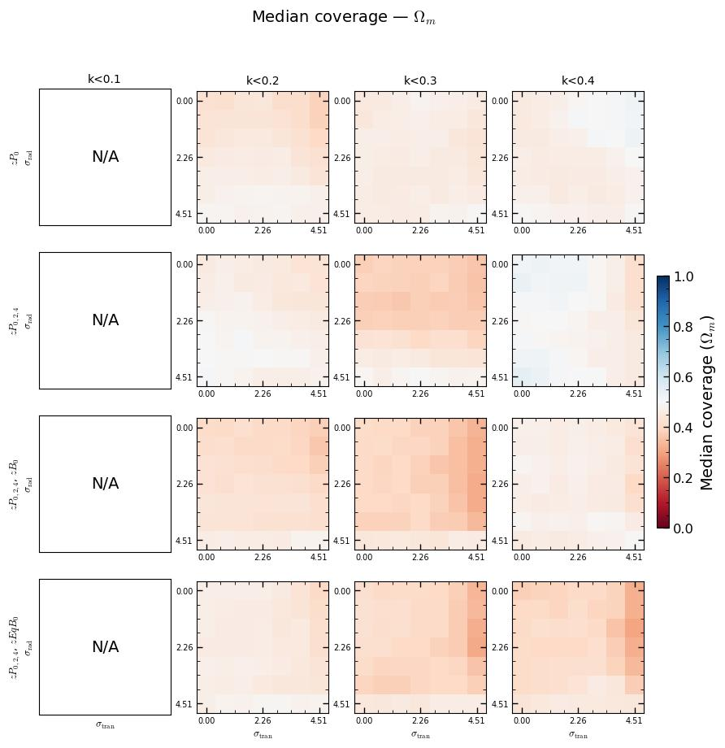
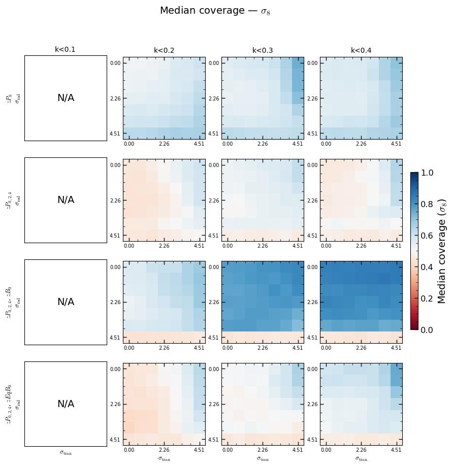
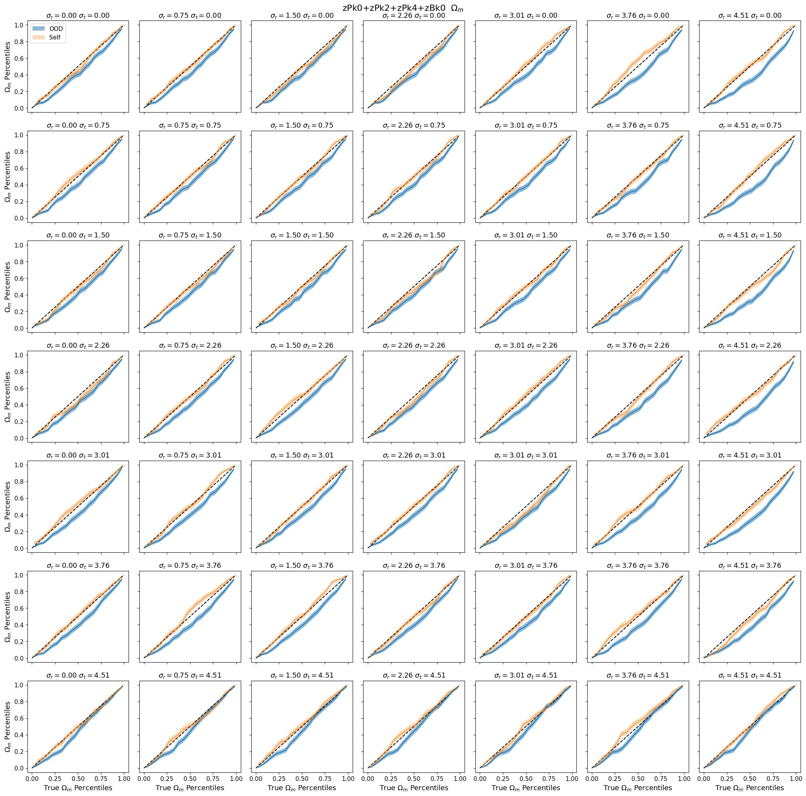
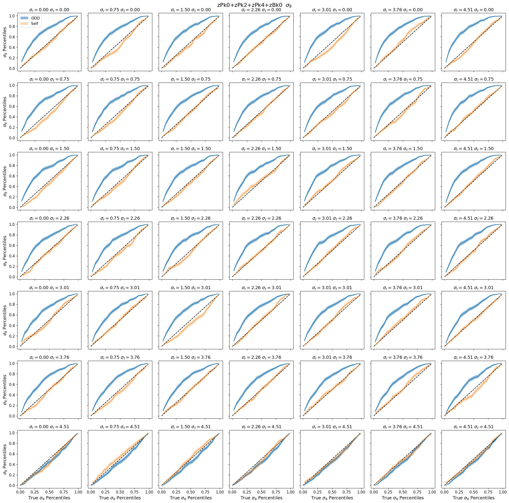
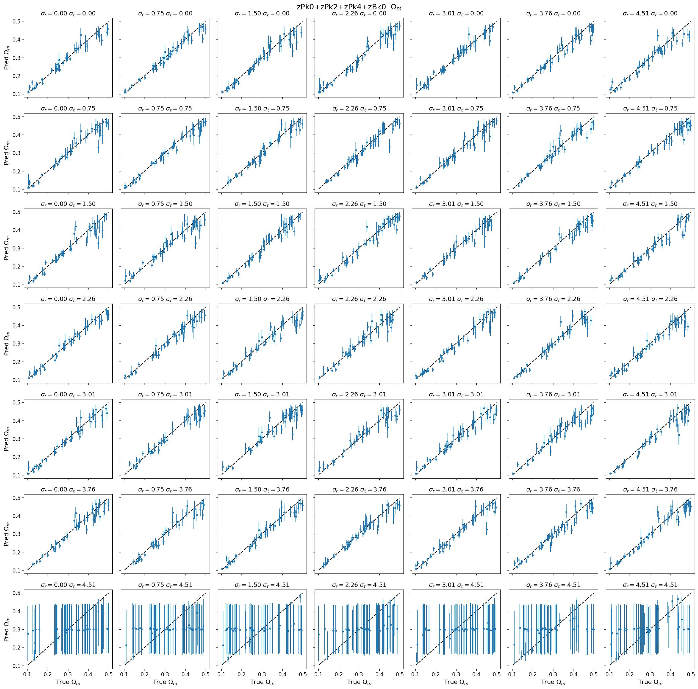
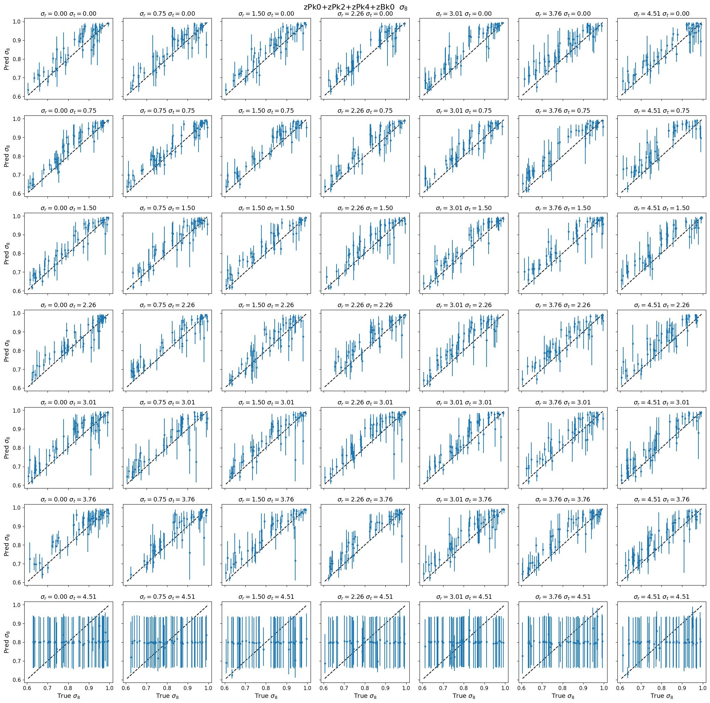
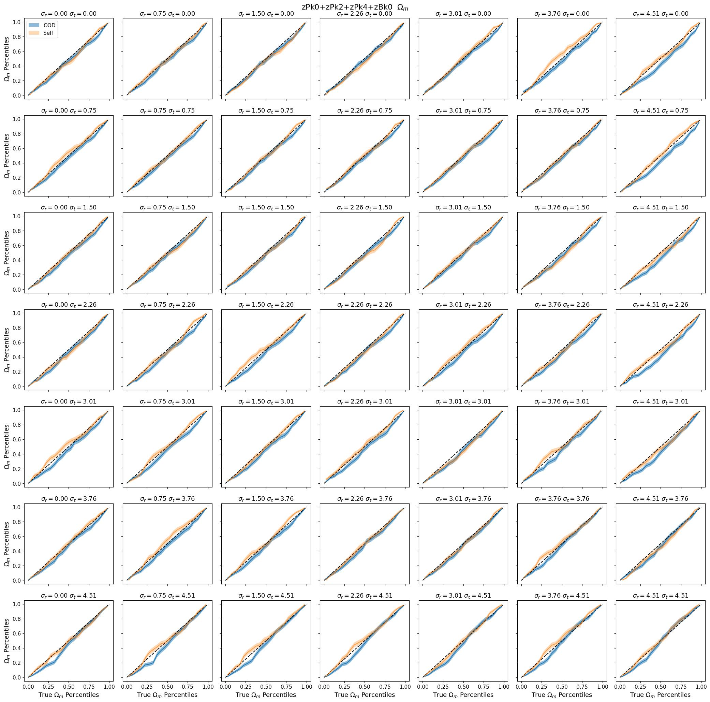
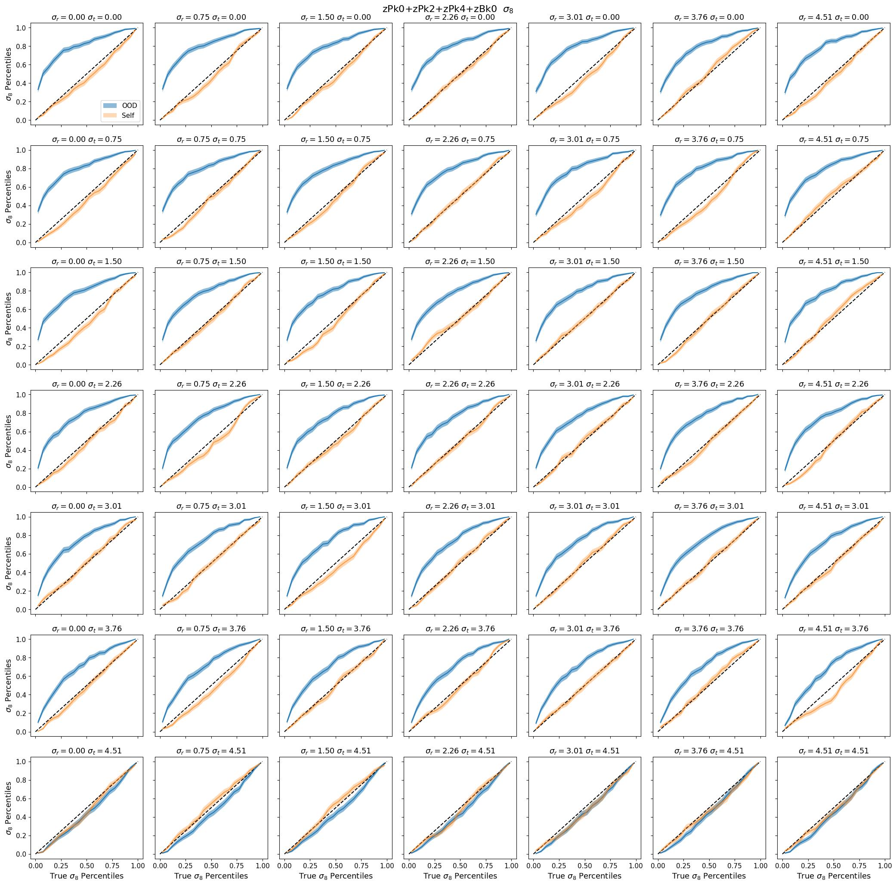
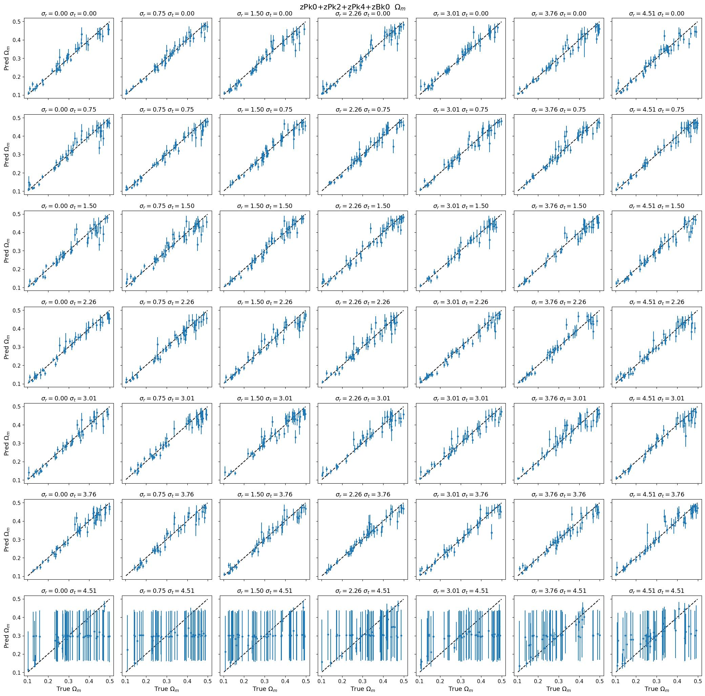
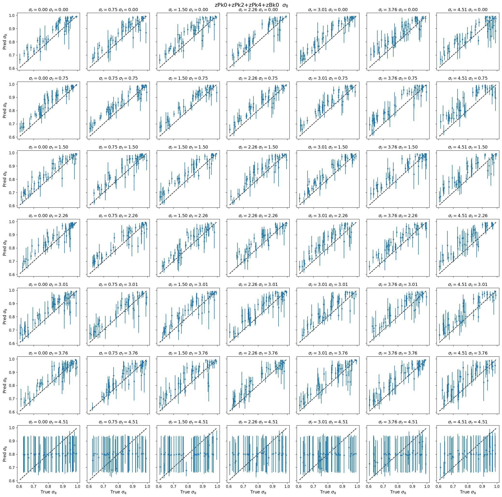

# OOD: quijotelike/fastpm_charm6_comp → quijote/nbody_comp_gridnoise
**Date**: 2026-06-24
**Type**: OOD inference
**Train**: quijotelike/fastpm_charm6_comp
**Test**: quijote/nbody_comp_gridnoise
**Tracer**: galaxy
**Summaries**: zPk0+zPk2+zPk4, zPk0+zPk2+zPk4+zBk0, zPk0+zPk2+zPk4+zEqBk0
**kmax**: 0.2, 0.3, 0.4, 0.5, 0.6
**Notes**: comp model uses a wider HOD prior than hodz; expects higher posterior stdev

## Overview
- Ωm is mildly underpredicted (red) across most (summary, kmax) cells, consistently across the noise grid; the effect is most pronounced for zPk024+zBk0 at all kmax values shown.
- σ8 is systematically overpredicted (blue) for zPk0 at kmax=0.3 and 0.4, and for zPk024+zBk0 at kmax=0.3 and 0.4, across the full noise grid; this is the dominant pathology.
- zPk024 and zPk024+zEqBk0 show near-neutral σ8 coverage at kmax=0.2–0.3 and mild overprediction at kmax=0.4; both are within or near the ±0.1 threshold.
- For zPk024+zBk0 at kmax=0.3, coverage curves for both Ωm and σ8 track close to the diagonal within uncertainty; deviations are mild and comparable to the self-consistent baseline, with slight σ8 undercoverage at high-noise configurations.
- For zPk024+zBk0 at kmax=0.4, σ8 exhibits consistent underprediction (posteriors biased low) across the full noise grid; the bias is most severe at low noise (σ_rad = 0.0–1.0), where OOD coverage curves diverge substantially from the self-consistent baseline. Ωm shows milder underprediction that grows with increasing noise.
- At the representative noise index (σ_rad=2.26, σ_tran=2.26) for kmax=0.4, the σ8 calibration fraction is ~20% against an expected ~53%, confirming calibration failure for σ8 at this kmax.
- The asymmetric behavior — Ωm red and σ8 blue in the same cells — is consistent across the Bk0-augmented summary but is not the CHARM devoxelization pathology (which produces bias in the same direction for both parameters).

## Figures

### Overview

Median coverage — Ωm

Median coverage — σ8

### Flagged cells

zPk024+zBk0, kmax=0.3

<table>
<tr>
<td></td>
<td></td>
</tr>
<tr>
<td></td>
<td></td>
</tr>
</table>

zPk024+zBk0, kmax=0.4

<table>
<tr>
<td></td>
<td></td>
</tr>
<tr>
<td></td>
<td></td>
</tr>
</table>

