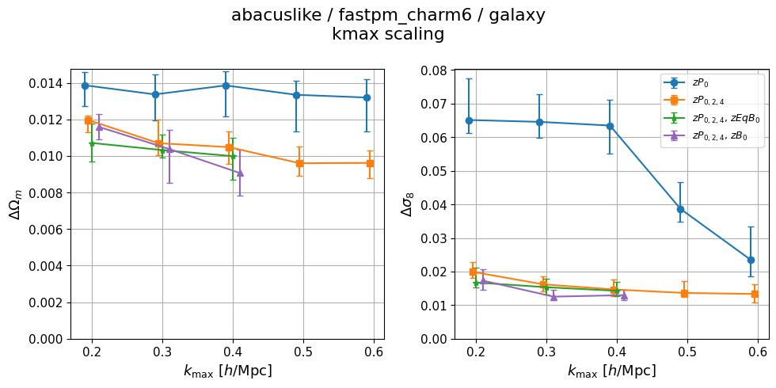
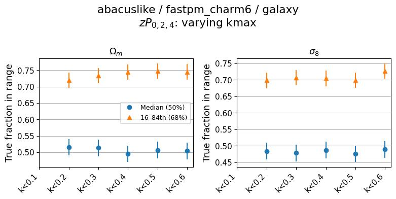
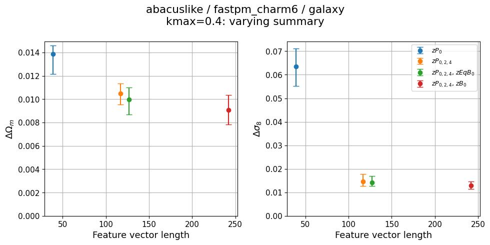
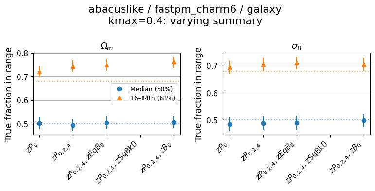
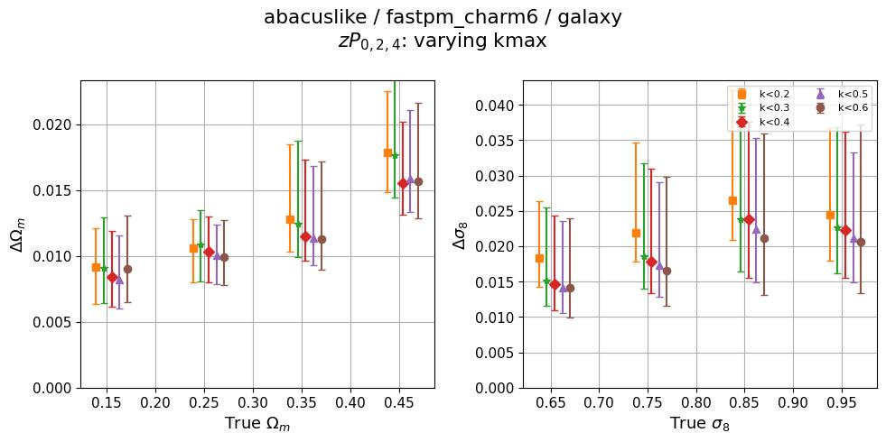
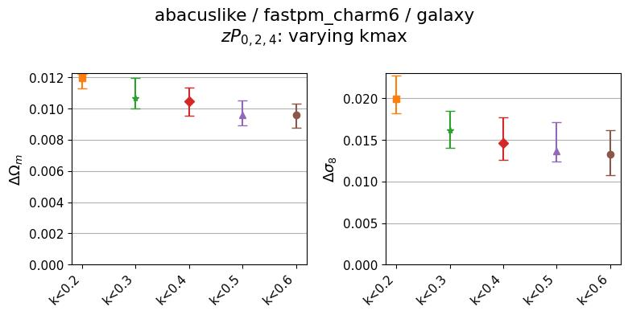
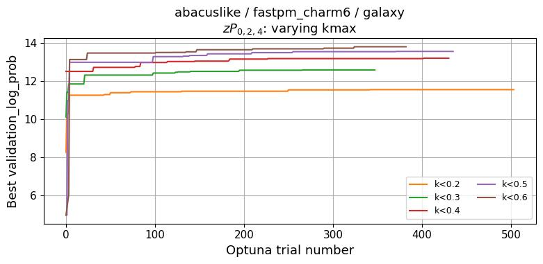

# 2026-06-24_self_abacuslike-fastpm_charm6
**Date**: 2026-06-24
**Type**: Self-consistent
**Suite**: abacuslike/fastpm_charm6
**Tracer**: galaxy
**kmax sweep summary**: zPk0+zPk2+zPk4
**kmax values**: 0.1, 0.2, 0.3, 0.4, 0.5, 0.6
**Feature sweep kmax**: 0.4
**Feature sweep summaries**: zPk0, zPk0+zPk2+zPk4, zPk0+zPk2+zPk4+zEqBk0, zPk0+zPk2+zPk4+zSqBk0, zPk0+zPk2+zPk4+zBk0
**Notes**: 

## Overview
- Calibration is well-maintained across both the kmax sweep and feature sweep: median coverage stays near 0.5 for both Ωm and σ8, and the 68% interval fractions hover around 0.70–0.74 (slightly above the ideal 0.68 but consistent).
- In the kmax sweep, zPk024, zPk024+zEqBk0, and zPk024+zBk0 all show monotonically decreasing or flat ΔΩm with increasing kmax; zP0 alone shows no improvement in ΔΩm across the full kmax range (0.013–0.014 from kmax=0.2 to 0.6), indicating a plateau. For Δσ8, zP0 does improve substantially at higher kmax, while the multipole combinations saturate early.
- In the kmax sweep at the fiducial point, stdev improves from kmax=0.2 to 0.3 and then plateaus or shows mild fluctuations at higher kmax; Optuna optimization converged cleanly with no instability across all kmax runs.
- stdev_vs_theta shows some cosmology-dependent variation: for Ωm, stdev is higher at larger true Ωm values at low kmax, becoming flatter at higher kmax.
- Feature length scaling is monotonically decreasing for both Ωm and σ8: adding multipoles (zP024) over zP0 gives the largest gain, and adding the bispectrum (zBk0) provides further improvement within uncertainty bounds. No non-monotonic behavior is present in the feature sweep.
- The feature sweep calibration is well-maintained across all summary combinations, with median coverage near 0.5 and 68% fractions near 0.70–0.75 for both parameters.

## Figures

### kmax sweep

kmax scaling

Calibration

### Feature sweep

Feature length scaling

Calibration

### Zoom-ins

kmax_sweep

<table>
<tr>
<td></td>
<td></td>
</tr>
<tr>
<td></td>
<td></td>
</tr>
</table>

