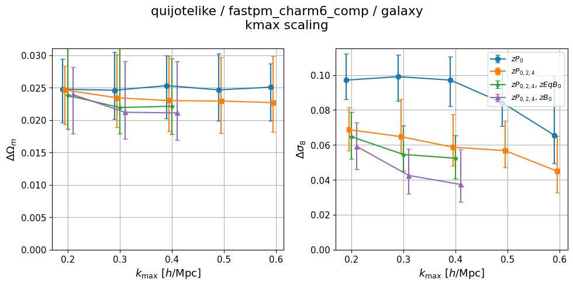
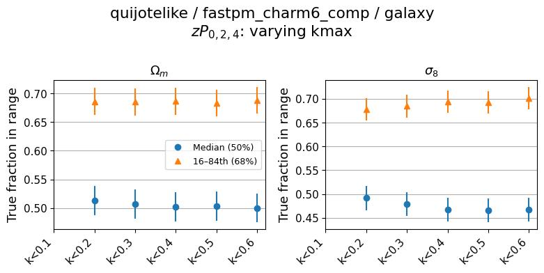
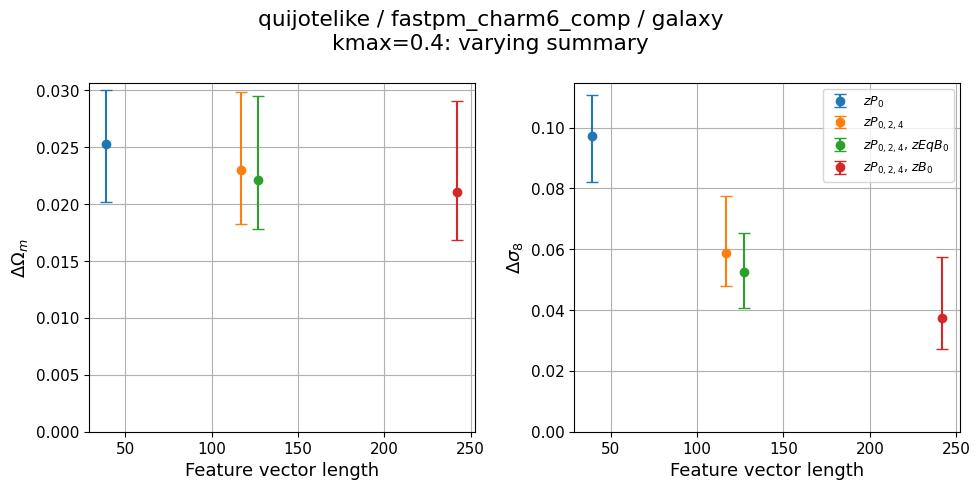
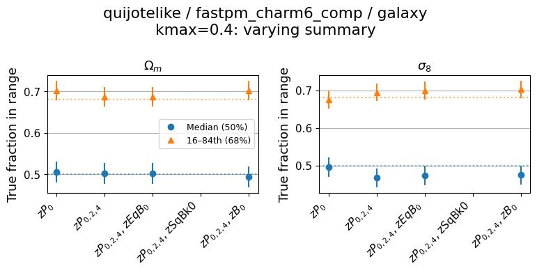

# 2026-06-24_self_quijotelike-fastpm_charm6_comp
**Date**: 2026-06-24
**Type**: Self-consistent
**Suite**: quijotelike/fastpm_charm6_comp
**Tracer**: galaxy
**kmax sweep summary**: zPk0+zPk2+zPk4
**kmax values**: 0.1, 0.2, 0.3, 0.4, 0.5, 0.6
**Feature sweep kmax**: 0.4
**Feature sweep summaries**: zPk0, zPk0+zPk2+zPk4, zPk0+zPk2+zPk4+zEqBk0, zPk0+zPk2+zPk4+zSqBk0, zPk0+zPk2+zPk4+zBk0
**Notes**: Uses wider HOD prior (comp) than hodz variants; expect higher posterior stdev as baseline.

## Overview
- Calibration is well-maintained across all kmax values: median coverage is ~0.50–0.51 for Ωm and ~0.47–0.49 for σ8, both within ±0.1 of 0.5; the 68% interval fraction sits near 0.69, close to the target of 0.68.
- Ωm posterior stdev is flat across all kmax from 0.2 to 0.6 (~0.020–0.025) for all summary combinations, with no improvement beyond kmax=0.2; given the wide HOD prior and large per-kmax uncertainties, this plateau is within measurement uncertainty.
- σ8 posterior stdev decreases monotonically with increasing kmax for zPk024, zPk024+zEqBk0, and zPk024+zBk0, improving from ~0.065–0.10 at kmax=0.2 to ~0.04–0.065 at kmax=0.6; zP0 alone shows no improvement beyond kmax=0.2.
- Feature length scaling is monotonically decreasing for both Ωm and σ8: adding higher-order summaries (zEqBk0, zBk0) to zPk024 reduces stdev, with zBk0 providing the largest gain in σ8 (from ~0.060 to ~0.039).
- No sweeps are flagged; both kmax and feature sweeps are within acceptable behavior given the wider HOD prior.

## Figures

### kmax sweep

kmax scaling

Calibration

### Feature sweep

Feature length scaling

Calibration

