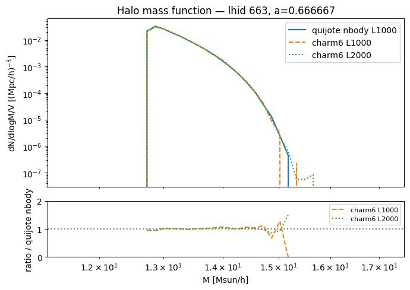
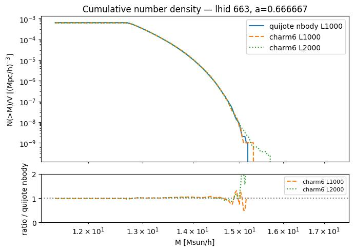
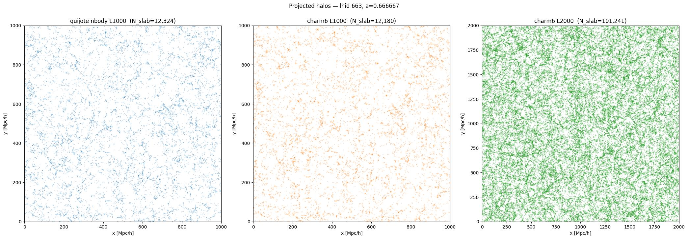
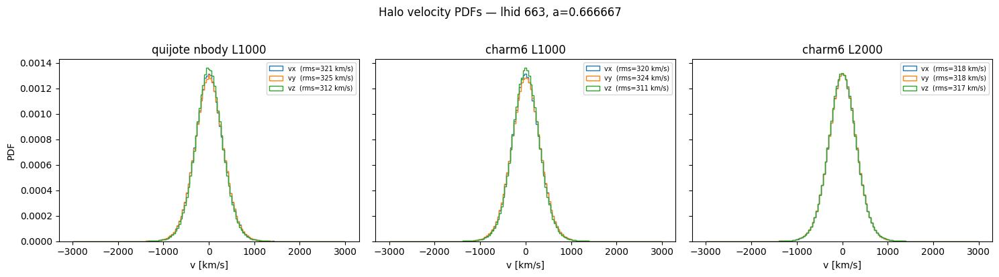
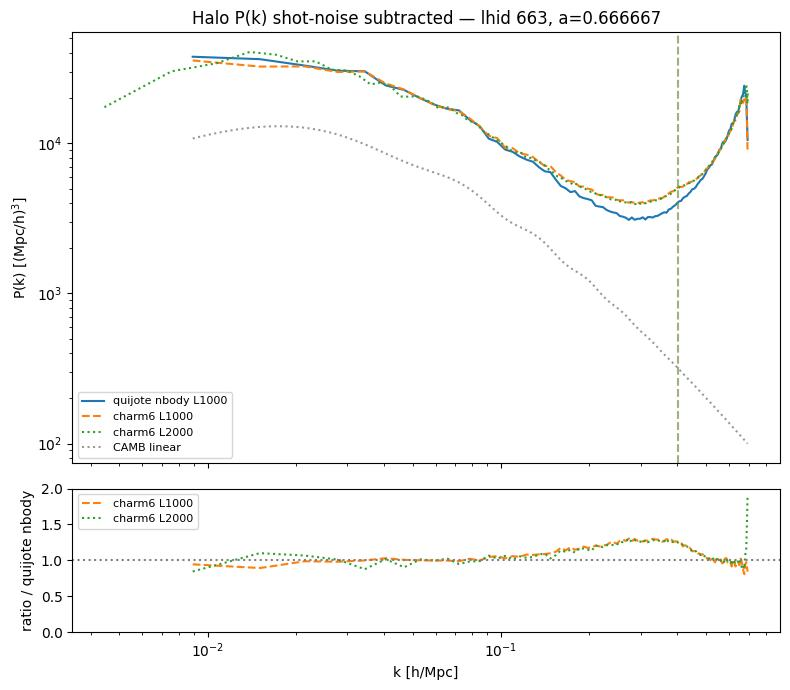
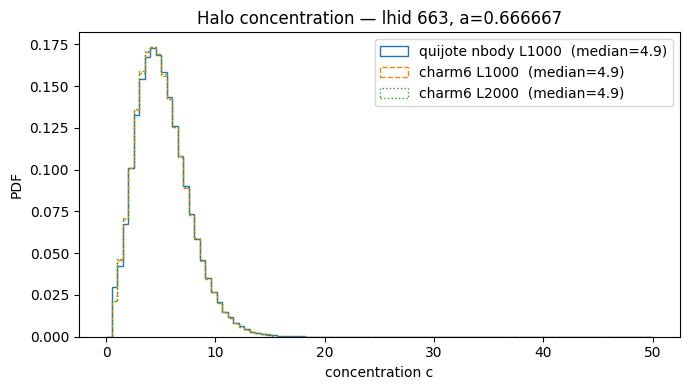

# Sanity check: Quijote N-body vs. CHARM6 at L=1 and 2 Gpc/h

**Date**: 2026-07-08
**Type**: Miscellaneous / sanity
**Suite**: Quijote N-body L1000 (reference) vs. fastpm_charm6 L1000 vs. fastpm_charm6 L2000, lhid 663, a=0.666667

---

## Overview

- The halo mass function agrees closely across all three catalogs over the bulk of the mass range, with the ratio to the N-body reference staying within ~10% up to ~1.5×10^15 Msun/h. Above this mass, the ratio becomes noisy for both charm6 L1000 and L2000 due to low halo counts in the tail.

- The cumulative number density shows the same close agreement across the mass range, with divergence only appearing at the highest-mass end (N(>M) below ~10^-8.5 [Mpc/h]^-3), consistent with the mass function comparison.

- Projected halo distributions show consistent large-scale structure morphology between quijote nbody L1000 and charm6 L1000. In the charm6 L2000 panel, faint diagonal line-like artifacts are visible in the halo distribution, suggestive of patch-boundary structure at the larger box size.

- Halo velocity PDFs are visually indistinguishable across all three catalogs, with rms velocities in a narrow range (311-325 km/s) across all components and catalogs.

- The shot-noise-subtracted halo P(k) agrees to within ~10% between charm6 L1000 and the N-body reference across 0.01 < k < 0.3 h/Mpc. The charm6 L2000 spectrum shows larger deviations from the N-body reference, running ~10-20% high at k < 0.03 h/Mpc and oscillating between under- and over-prediction at intermediate k, before all three converge again near k ~ 0.3-0.4 h/Mpc.

- Halo concentration PDFs are nearly identical across all three catalogs, with the same median concentration (4.9) in each case.

