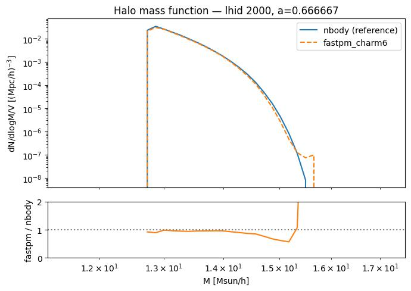
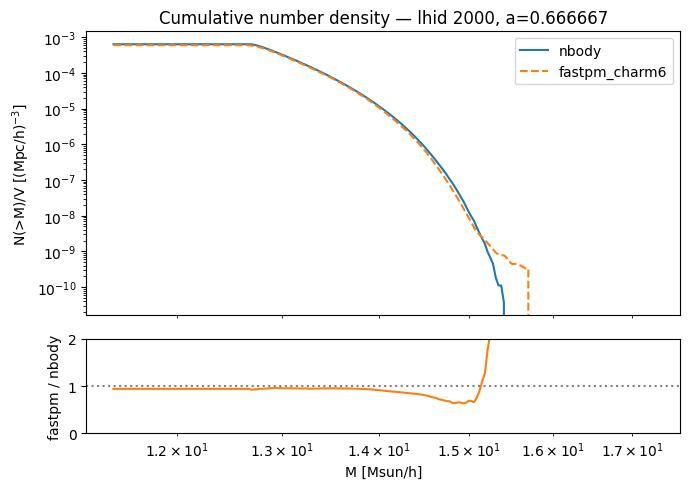
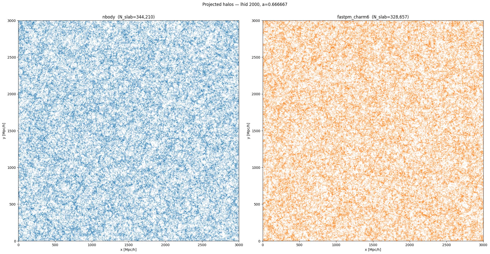
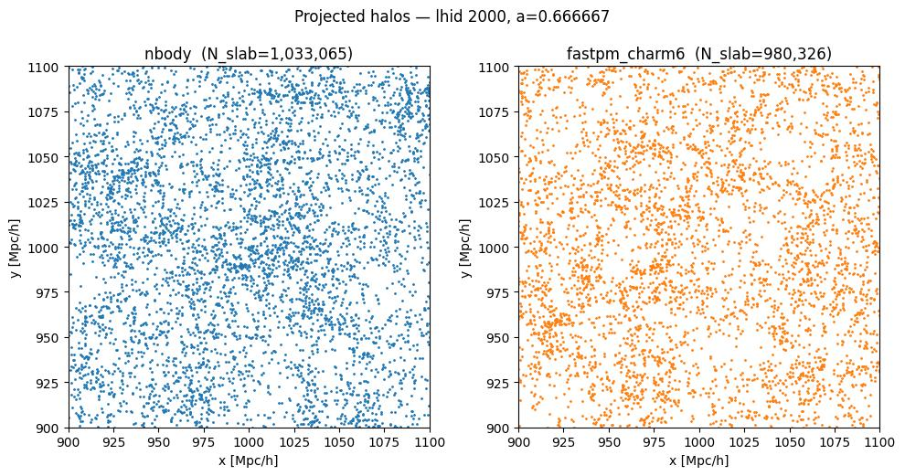
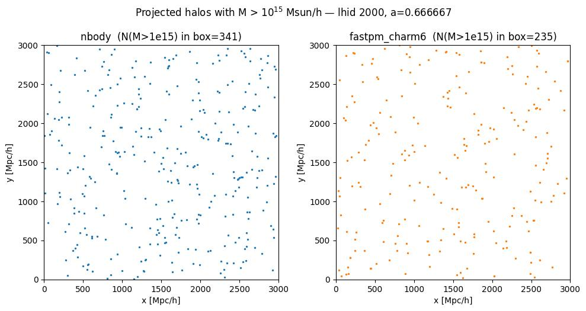
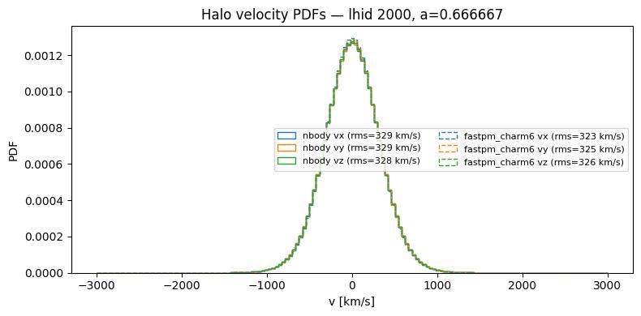
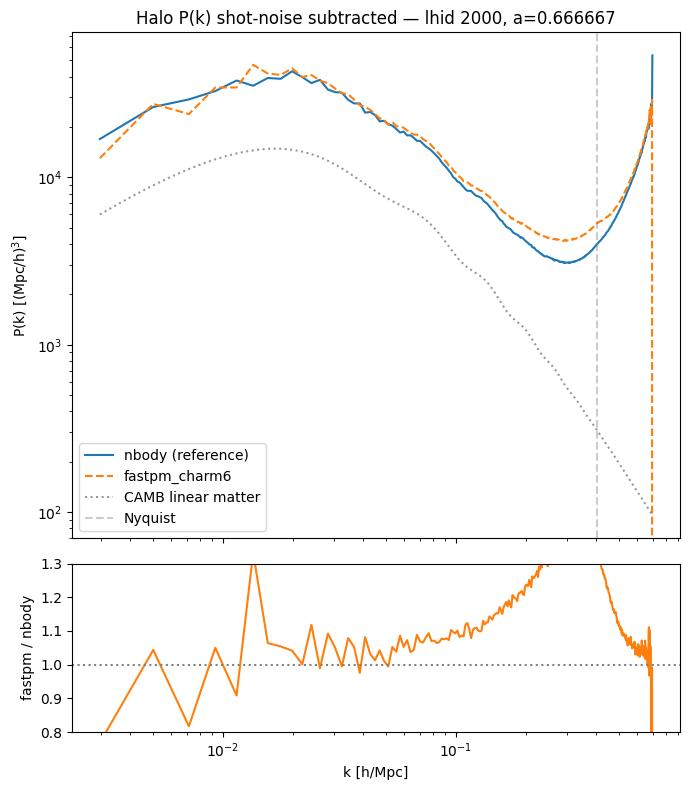
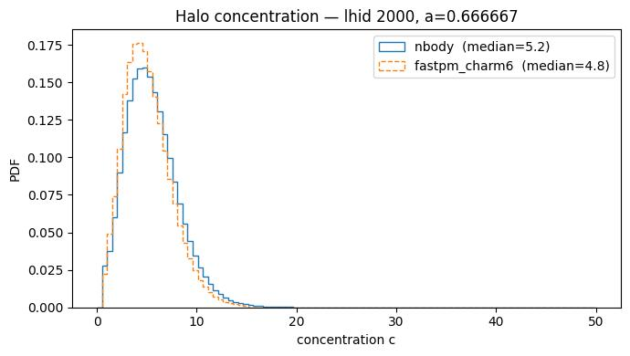

# Sanity check: N-body vs. FastPM+CHARM6 at L=3 Gpc/h

**Date**: 2026-07-09
**Type**: Miscellaneous / sanity
**Suite**: N-body (reference) vs. fastpm_charm6, L=3 Gpc/h, lhid 2000, a=0.666667

---

## Overview

- Total halo number density is lower in fastpm_charm6 than in the N-body reference (N_slab = 328,657 vs. 344,210 in the full-box projection). The HMF ratio sits at ~0.85–1.0 across the bulk of the mass range, with a dip to ~0.6 around M ~ 1.5×10^15 Msun/h before spiking above 1 at the highest masses.

- The cumulative number density confirms fastpm_charm6 falls below the N-body reference across most mass thresholds, with the fastpm/nbody ratio dipping to ~0.6–0.7 near M ~ 1.5×10^15 Msun/h and then rising sharply above 1 at the highest-mass end where counts are low.

- Projected halo distributions show visually consistent large-scale structure morphology between the two catalogs, both at full-box scale and in the 200 Mpc/h zoom-in. No line-like or patch-boundary artifacts are visible.

- Halos above 10^15 Msun/h trace similar large-scale structure in both catalogs (341 halos in N-body vs. 235 in fastpm_charm6), with no evidence of clustering along patch boundaries.

- Halo velocity PDFs are visually consistent in shape between the two catalogs, with rms velocities slightly lower in fastpm_charm6 (323–326 km/s across the three components) than in the N-body (328–329 km/s).

- The shot-noise-subtracted halo P(k) shows fastpm_charm6 tracking the N-body reference closely at large and intermediate scales, with the ratio oscillating around 1 for k < 0.02 h/Mpc (including a spike above 1.3 near k ~ 0.013 h/Mpc) and drifting upward to ~1.1–1.3 as k approaches 0.1–0.3 h/Mpc. Both catalogs rise steeply and diverge near the Nyquist frequency.

## Additional figures

- Halo concentration PDFs show similar lognormal-like shapes in both catalogs, with fastpm_charm6 peaking at a slightly lower median concentration (4.8 vs. 5.2 for the N-body).

