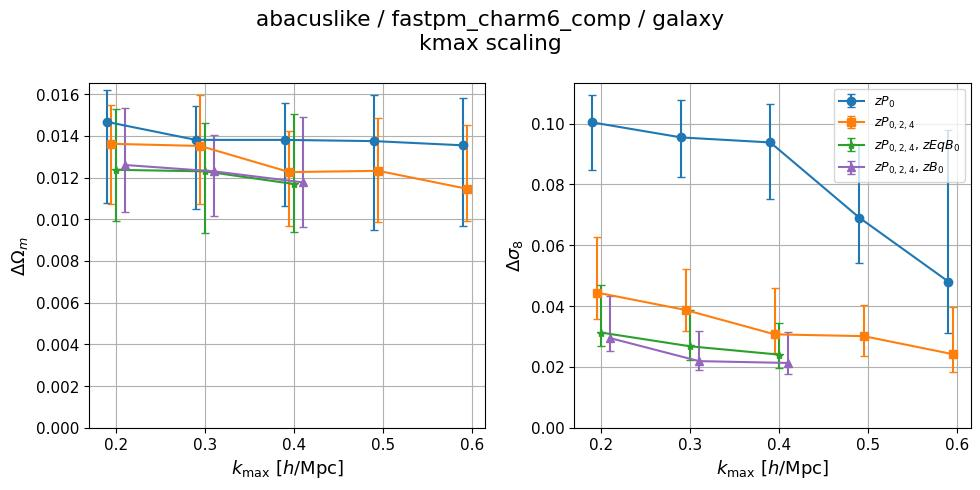
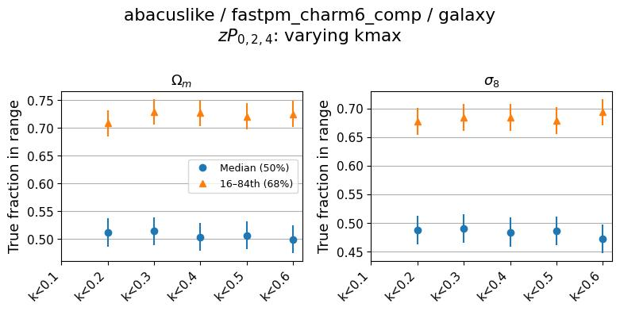
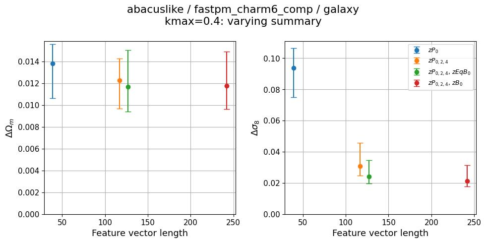
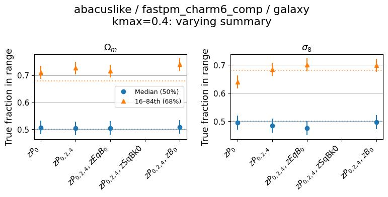

# 2026-07-10_self_abacuslike-fastpm_charm6_comp
**Date**: 2026-07-10
**Type**: Self-consistent
**Suite**: abacuslike/fastpm_charm6_comp
**Tracer**: galaxy
**kmax sweep summary**: zPk0+zPk2+zPk4
**kmax values**: 0.1, 0.2, 0.3, 0.4, 0.5, 0.6
**Feature sweep kmax**: 0.4
**Feature sweep summaries**: zPk0, zPk0+zPk2+zPk4, zPk0+zPk2+zPk4+zEqBk0, zPk0+zPk2+zPk4+zSqBk0, zPk0+zPk2+zPk4+zBk0
**Notes**:

## Overview
- Median coverage stays within ±0.03 of 0.5 for both Ωm and σ8 across the full kmax sweep and the full feature sweep; neither sweep is flagged by the calibration criterion.
- 68% interval fractions sit slightly above the nominal 0.68 (~0.70–0.74) for both Ωm and σ8 in both sweeps, consistently across all kmax and summary values; this is a mild, uniform offset rather than a trend with kmax or summary.
- kmax sweep: ΔΩm for zP0 and zPk0,2,4 decreases only slightly from kmax=0.2 to kmax=0.6, with error bars overlapping across the range, consistent with flat within measurement uncertainty; Δσ8 decreases monotonically for all summaries, most strongly for zP0 (0.10 → 0.05).
- kmax sweep: summaries including bispectra (zEqBk0, zBk0) give lower ΔΩm and Δσ8 than zP0 or zPk0,2,4 alone at all kmax values shown (kmax ≥ 0.2), with the gap most pronounced at low kmax and narrowing by kmax=0.4–0.6.
- No kmax=0.1 point is shown for the bispectrum summaries (zEqBk0, zBk0) or for zP0/zPk0,2,4 in the kmax_scaling figure; only kmax=0.2–0.6 are present.
- Feature sweep: ΔΩm and Δσ8 decrease with increasing feature vector length from zP0 (length ~40) through zPk0,2,4 (~120) to zPk0,2,4+zEqBk0/zBk0 (~130–240), with no reversal (increase) observed among the summaries shown.
- The zSqBk0 feature-sweep point (zPk0+zPk2+zPk4+zSqBk0) is absent from both feature_length_scaling.jpg and calibration.jpg; the x-axis label for it is present but no data point is plotted. Noted as missing.
- Neither kmax_sweep nor feature_sweep is flagged under the stated criteria: calibration medians hold within ±0.1 of 0.5, and stdev trends are flat-to-improving within uncertainty for both sweeps.

## Figures

### kmax sweep

kmax scaling

Calibration

### Feature sweep

Feature length scaling

Calibration

### Zoom-ins

Neither sweep was flagged; zoom-in figures (stdev_vs_theta.jpg, fiducial_stdev.jpg, optuna_history.jpg) are present under figures/model_scaling/kmax_sweep/ and figures/model_scaling/feature_sweep/ but not included here.
