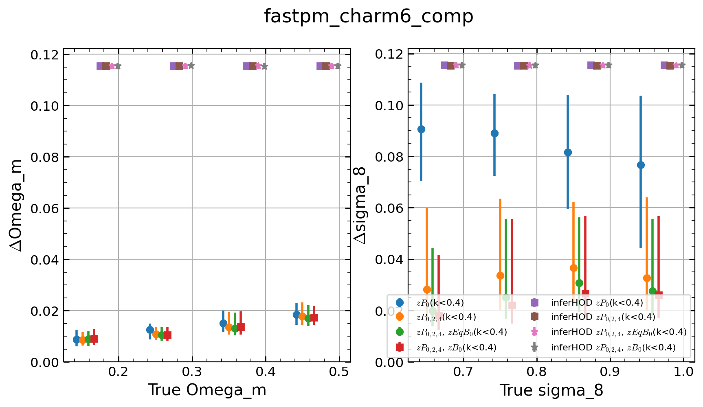
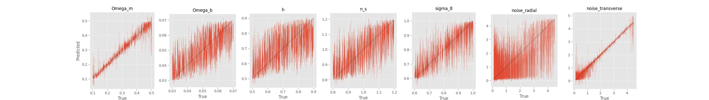
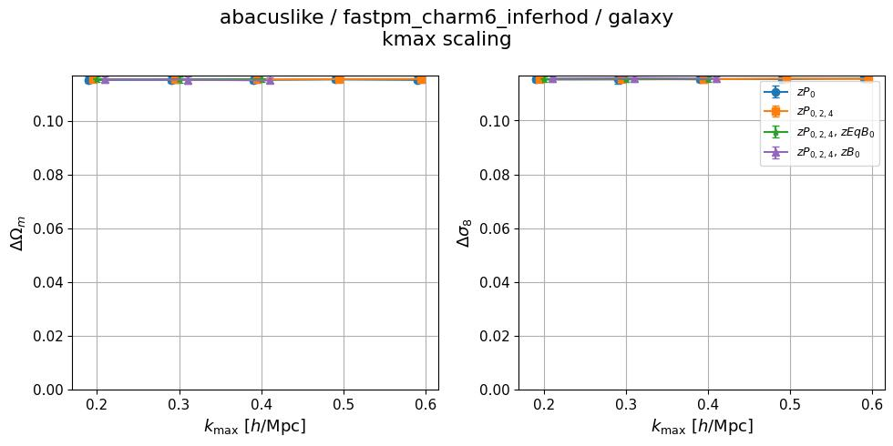
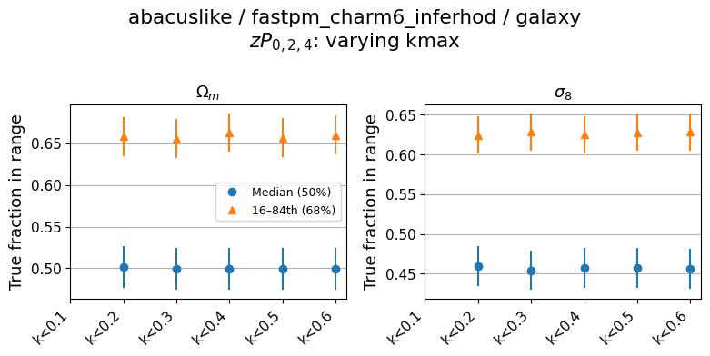
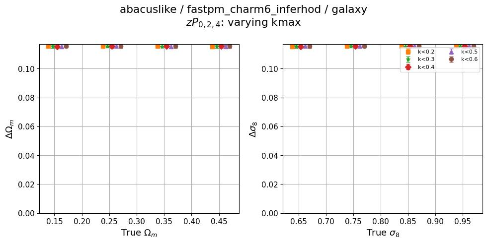
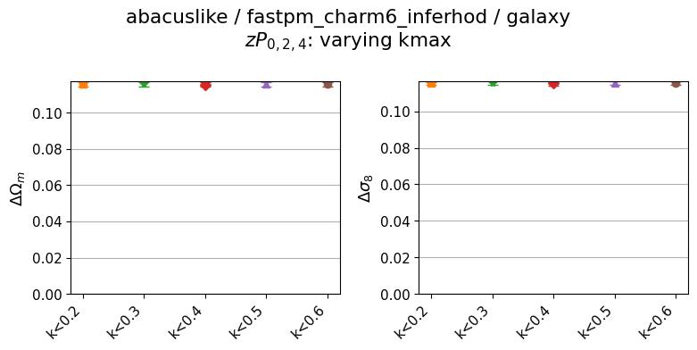
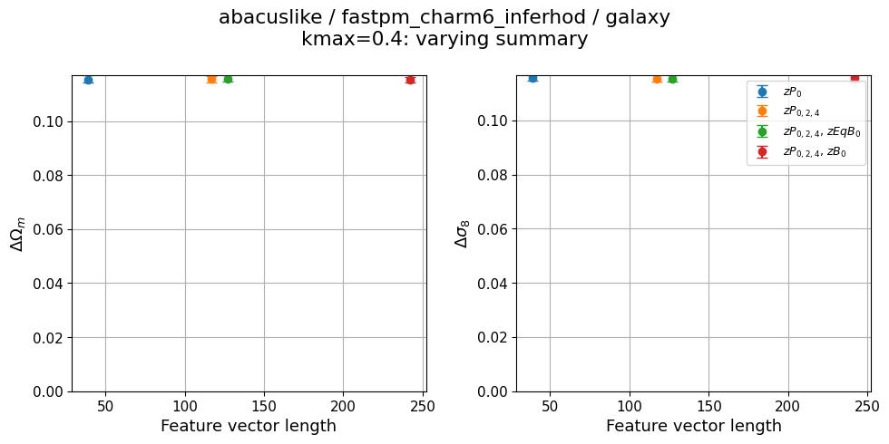
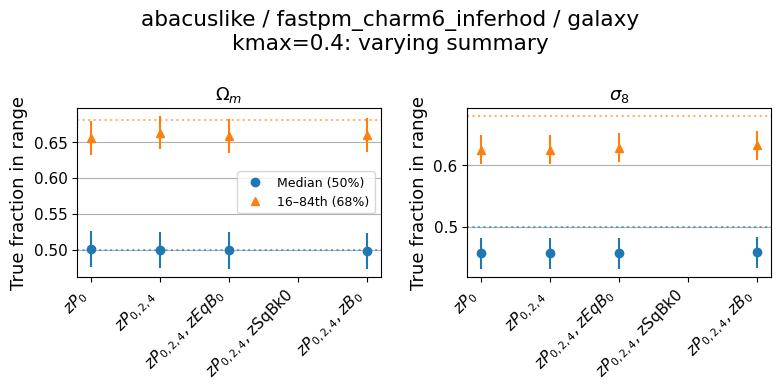

# 2026-07-14_multisim_abacuslike-fastpm_charm6_comp_vs_fastpm_charm6_inferhod

**Date**: 2026-07-14
**Type**: Self-consistent (multi-sim comparison)
**Suite**: abacuslike
**Tracer**: galaxy
**Model 1**: fastpm_charm6_comp ("just cosmo" — cosmology-only posterior)
**Model 2**: fastpm_charm6_inferhod ("cosmo+HOD" — joint cosmology+HOD posterior)
**kmax sweep summary**: zPk0+zPk2+zPk4
**kmax values**: 0.1, 0.2, 0.3, 0.4, 0.5, 0.6
**Feature sweep kmax**: 0.4
**Feature sweep summaries**: zPk0, zPk0+zPk2+zPk4, zPk0+zPk2+zPk4+zEqBk0, zPk0+zPk2+zPk4+zSqBk0, zPk0+zPk2+zPk4+zBk0
**Notes**: —

## Overview

- `fastpm_charm6_comp` behaves as expected: fiducial posterior stdev on Ωm and σ8 decreases with increasing kmax and with increasing summary/feature complexity, `stdev_vs_theta` shows non-trivial variation across true parameter bins, and `plot_predictions.jpg` shows a clear diagonal true-vs-predicted trend for Ωm and σ8.
- `fastpm_charm6_inferhod` shows no constraining power on Ωm or σ8 at any kmax or summary tested. The fiducial posterior stdev is flat at ≈0.115 for both parameters across the full kmax and feature sweeps, with no visible dependence on kmax, summary, or true parameter value in `stdev_vs_theta`.
- A value of ≈0.115 matches the standard deviation of a uniform distribution spanning the full prior range for Ωm (0.1–0.5) and σ8 (0.6–1.0), i.e. (range)/√12. This is consistent with the `fastpm_charm6_inferhod` posterior samples being statistically indistinguishable from draws from the prior rather than from a trained conditional posterior.
- Directly checking the raw model outputs for `fastpm_charm6_inferhod` (`plot_predictions.jpg`) confirms this: predicted vs. true Ωm and σ8 (and most HOD parameters) show no diagonal trend, unlike the corresponding `fastpm_charm6_comp` plot.
- The calibration plots for `fastpm_charm6_inferhod` still show median coverage near 0.5 and 68% interval fraction near 0.65, i.e. nominally within the flagging tolerance. This is expected for an uninformative posterior equal to the prior when the true values are also prior draws, and does not by itself indicate the posterior is informative — the calibration diagnostic alone does not catch this failure mode.
- The Optuna validation log-prob history for `fastpm_charm6_inferhod` shows normal-looking convergence behavior (increasing and plateauing with trial number, and increasing with kmax), so hyperparameter search itself did not visibly fail; log-prob values are not directly comparable to `fastpm_charm6_comp` since the two models fit posteriors of different dimensionality (17 vs. 7 parameters).
- A direct overlay of posterior stdev vs. true Ωm/σ8 for both models at kmax=0.4 (`output.png`) shows the same contrast in one plot: `fastpm_charm6_comp` points scale with true parameter value and sit well below 0.05, while all `fastpm_charm6_inferhod` points are pinned at ≈0.115 regardless of summary or true parameter value.
- This appears to be a real training failure specific to `fastpm_charm6_inferhod`, not a plotting or script bug — reproduced directly from `posterior_samples.npy` and confirmed by the model's own `plot_predictions.jpg`, independent of the analysis script in this repo. It does not represent a fair "with HOD vs. without HOD" constraining-power comparison until the `fastpm_charm6_inferhod` training is investigated and re-run.

## Figures

### Multi-sim comparison

Posterior stdev vs. true Ωm/σ8, both models overlaid (kmax=0.4)

Predicted vs. true, raw model outputs (kmax=0.4, zPk0+zPk2+zPk4)

<table>
<tr><td>fastpm_charm6_comp</td></tr>
<tr><td></td></tr>
<tr><td>fastpm_charm6_inferhod</td></tr>
<tr><td></td></tr>
</table>

### fastpm_charm6_comp ("just cosmo")

kmax sweep

<table>
<tr>
<td></td>
<td></td>
</tr>
<tr>
<td></td>
<td></td>
</tr>
</table>

Feature sweep

<table>
<tr>
<td></td>
<td></td>
</tr>
</table>

### fastpm_charm6_inferhod ("cosmo+HOD")

kmax sweep

<table>
<tr>
<td></td>
<td></td>
</tr>
<tr>
<td></td>
<td></td>
</tr>
</table>

Feature sweep

<table>
<tr>
<td></td>
<td></td>
</tr>
</table>

