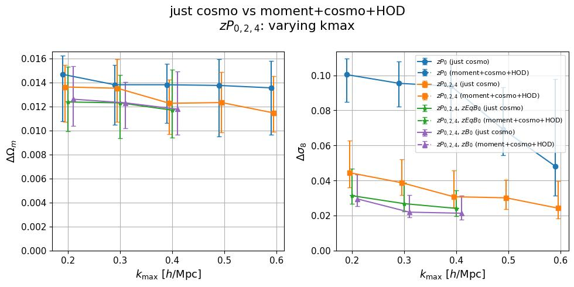
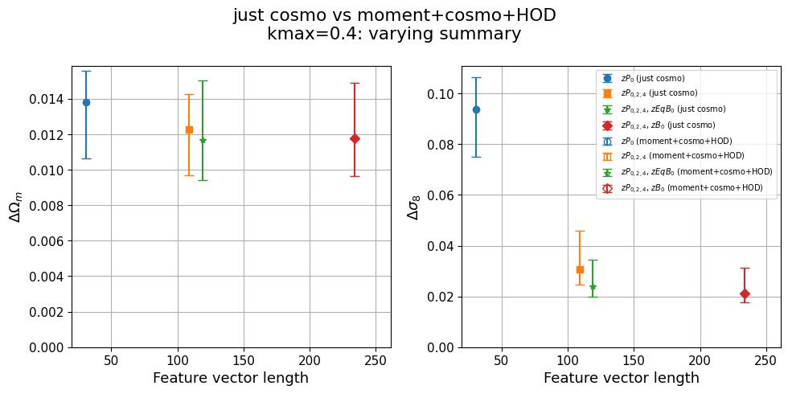
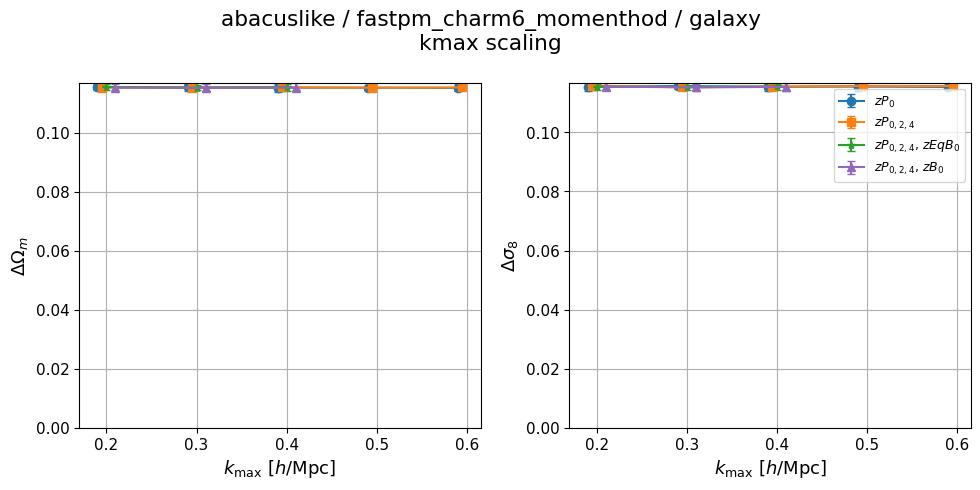
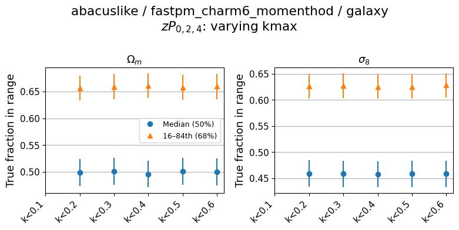
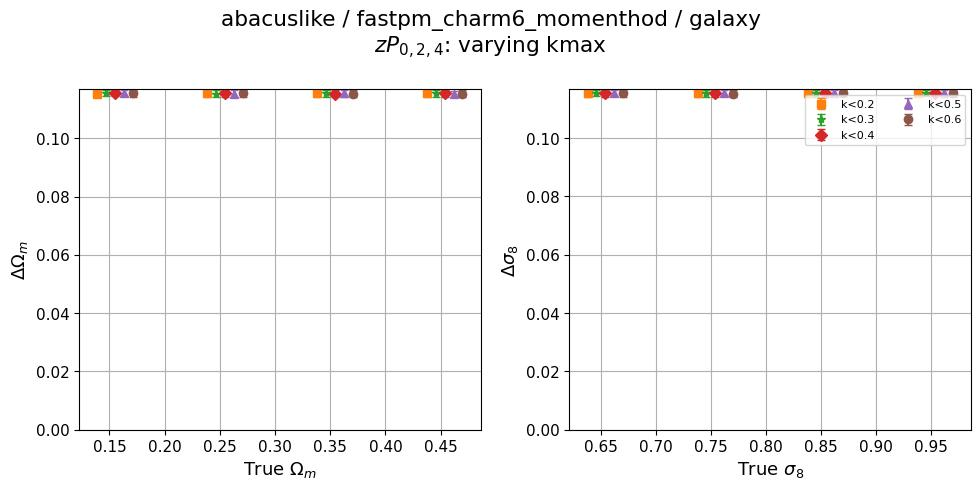
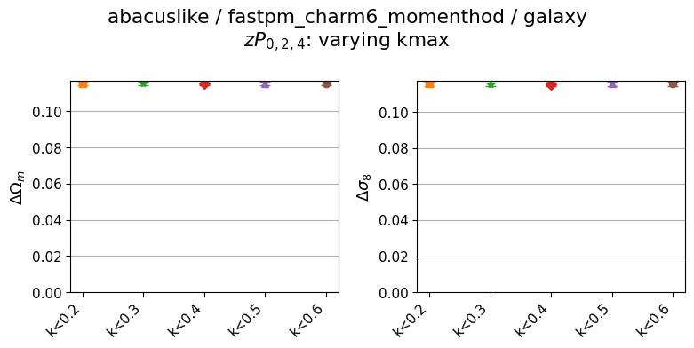
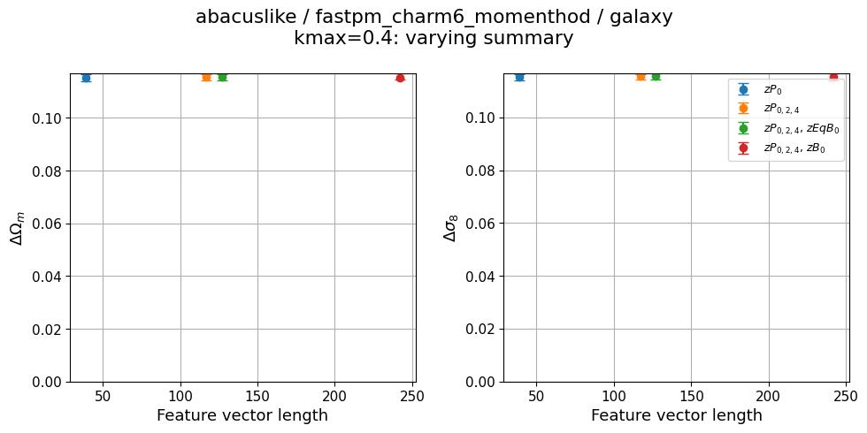
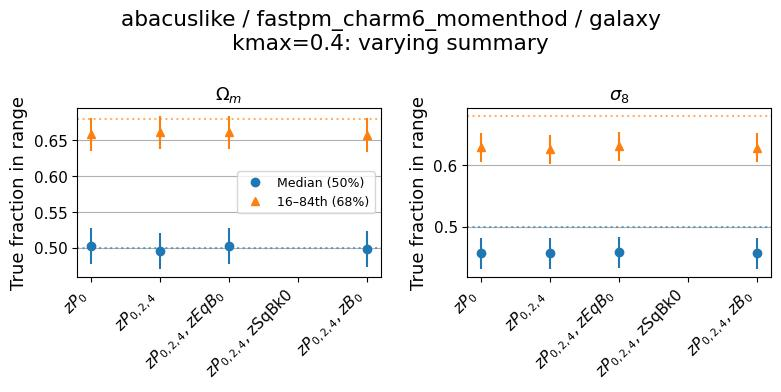

# 2026-07-23_multisim_abacuslike-fastpm_charm6_comp_vs_fastpm_charm6_momenthod

**Date**: 2026-07-23
**Type**: Self-consistent (multi-sim comparison)
**Suite**: abacuslike
**Tracer**: galaxy
**Model 1**: fastpm_charm6_comp ("just cosmo" — cosmology-only posterior)
**Model 2**: fastpm_charm6_momenthod ("moment+cosmo+HOD" — joint moment+cosmology+HOD posterior)
**kmax sweep summary**: zPk0+zPk2+zPk4
**kmax values**: 0.1, 0.2, 0.3, 0.4, 0.5, 0.6
**Feature sweep kmax**: 0.4
**Feature sweep summaries**: zPk0, zPk0+zPk2+zPk4, zPk0+zPk2+zPk4+zEqBk0, zPk0+zPk2+zPk4+zSqBk0, zPk0+zPk2+zPk4+zBk0
**Notes**: —

## Overview

- `fastpm_charm6_comp` behaves as expected: fiducial posterior stdev on Ωm and σ8 decreases (or stays flat within uncertainty) with increasing kmax and with increasing summary/feature complexity, `stdev_vs_theta` shows non-trivial variation across true parameter bins, and calibration is close to nominal (median ≈0.50-0.51, 68% interval fraction ≈0.67-0.73) across the full kmax and feature sweeps.
- `fastpm_charm6_momenthod` shows no constraining power on Ωm or σ8 at any kmax or summary tested. The fiducial posterior stdev is flat at ≈0.115 for both parameters across the full kmax and feature sweeps, with no visible dependence on kmax, summary, or true parameter value in `stdev_vs_theta`.
- A value of ≈0.115 matches the standard deviation of a uniform distribution spanning the full prior range for Ωm (0.1-0.5) and σ8 (0.6-1.0), i.e. (range)/√12, the same signature seen previously for `fastpm_charm6_inferhod` (see [2026-07-14 multisim update](../2026-07-14_multisim_abacuslike-fastpm_charm6_comp_vs_fastpm_charm6_inferhod/update.md)). This is consistent with the `fastpm_charm6_momenthod` posterior samples being statistically indistinguishable from draws from the prior rather than from a trained conditional posterior.
- Because the `momenthod` fiducial stdev (≈0.115) sits far above the y-axis range plotted in the multi-sim comparison figures (`kmax_scaling_multisim.jpg`, `feature_length_scaling_multisim.jpg`, both scaled to the `just cosmo` range), the `momenthod` traces are clipped out of view entirely; the visible curves in those two figures are effectively only the `fastpm_charm6_comp` traces.
- The calibration plots for `fastpm_charm6_momenthod` still show median coverage near 0.50 and 68% interval fraction near 0.62-0.66, nominally within the flagging tolerance. As previously noted, this is expected for an uninformative posterior equal to the prior when the true values are also prior draws, and does not by itself indicate the posterior is informative — the calibration diagnostic alone does not catch this failure mode.
- The Optuna validation log-prob history for `fastpm_charm6_momenthod` is blank (no data plotted) in both the kmax sweep and feature sweep, unlike `fastpm_charm6_comp` which shows normal-looking convergence (increasing and plateauing with trial number, increasing with kmax).
- As in the prior `inferhod` experiment, the `zPk0+zPk2+zPk4+zSqBk0` point is missing from the feature-length sweep for both models.
- This reproduces the same training-failure signature documented for `fastpm_charm6_inferhod` on 2026-07-14, now for a different joint model (`fastpm_charm6_momenthod`). It does not represent a fair "with HOD/moments vs. without" constraining-power comparison until the `fastpm_charm6_momenthod` training is investigated and re-run.

## Figures

### Multi-sim comparison

kmax scaling (both models overlaid; momenthod traces clipped above the plotted y-range)

Feature length scaling (both models overlaid; momenthod traces clipped above the plotted y-range)

### fastpm_charm6_comp ("just cosmo")

kmax sweep

<table>
<tr>
<td></td>
<td></td>
</tr>
<tr>
<td></td>
<td></td>
</tr>
</table>

Feature sweep

<table>
<tr>
<td></td>
<td></td>
</tr>
</table>

### fastpm_charm6_momenthod ("moment+cosmo+HOD")

kmax sweep

<table>
<tr>
<td></td>
<td></td>
</tr>
<tr>
<td></td>
<td></td>
</tr>
</table>

Feature sweep

<table>
<tr>
<td></td>
<td></td>
</tr>
</table>

