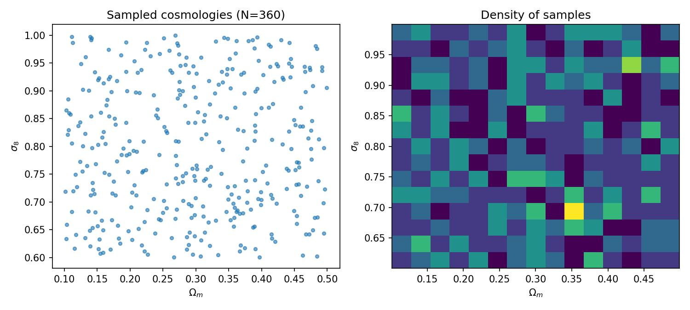
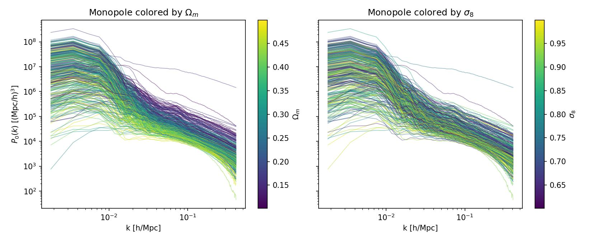
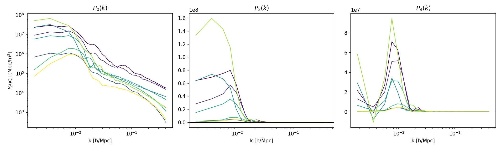
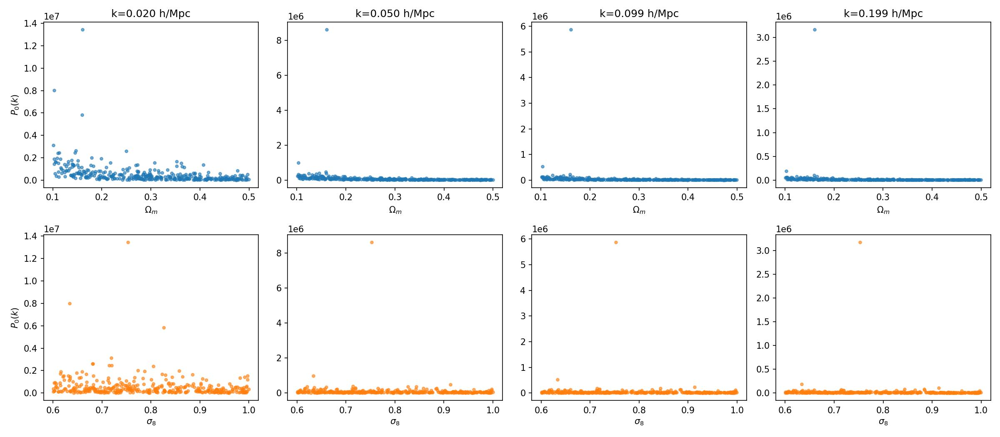
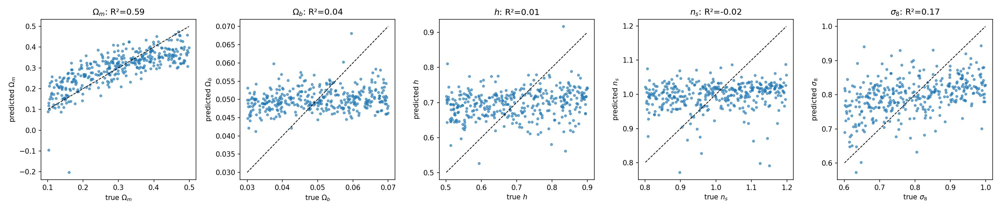

# Sanity check: FastPM CHARM7 MTNG-like L=3 Gpc/h test-set power spectrum diversity

**Date**: 2026-07-23
**Type**: Miscellaneous / sanity
**Suite**: fastpm_charm7, mtnglike geometry, L=3000/h=384, lhid 3000-3408
**Notes**: 360/409 sims have completed lightcone diagnostics (49 missing); redshift-space power spectrum multipoles P0/P2/P4 (192 k-bins, 0.0018 < k < 0.41 h/Mpc) read from `diag/mtng_lightcone/hod00001_aug00001.h5` per lhid

---

## Overview

- The sampled cosmologies (Ωm, σ8) cover the prior domain (Ωm in [0.10, 0.50], σ8 in [0.60, 1.00]) with no visible gaps or clustering in the Latin-hypercube coverage.

- The monopole P0(k) shows clear diversity across the 360 sims, spanning roughly two orders of magnitude in amplitude at fixed k. Coloring by Ωm shows a visible amplitude trend, with low-Ωm sims (dark) systematically higher amplitude than high-Ωm sims (yellow) across the full k range. Coloring by σ8 shows a much weaker, noisier trend.

- Two sims (both at Ωm < 0.17) stand out as outliers with P0(k) amplitude 5-15x above the rest of the population at every k bin shown; these two same points also show up as outliers in P2 and P4.

- A ridge regression trained on P0+P2+P4 (log-amplitude, standardized, k ≤ 0.2 h/Mpc, 5-fold cross-validated) recovers Ωm with R²=0.59 and σ8 with R²=0.17. Ωb, h, and ns show no recovery (R² ≈ 0, consistent with these summaries carrying no information on those parameters at this noise/resolution). The Ωm true-vs-predicted scatter is tight and follows the diagonal above Ωm≈0.15, with the two amplitude-outlier sims falling well off the diagonal at true Ωm≈0.1-0.16.

