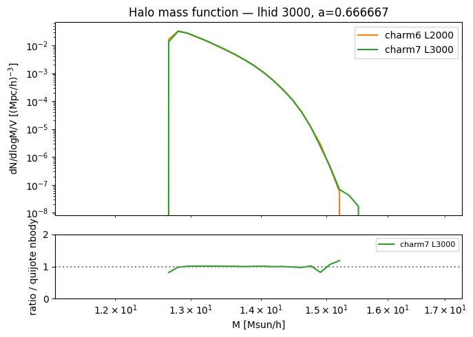
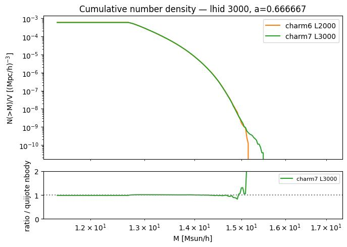
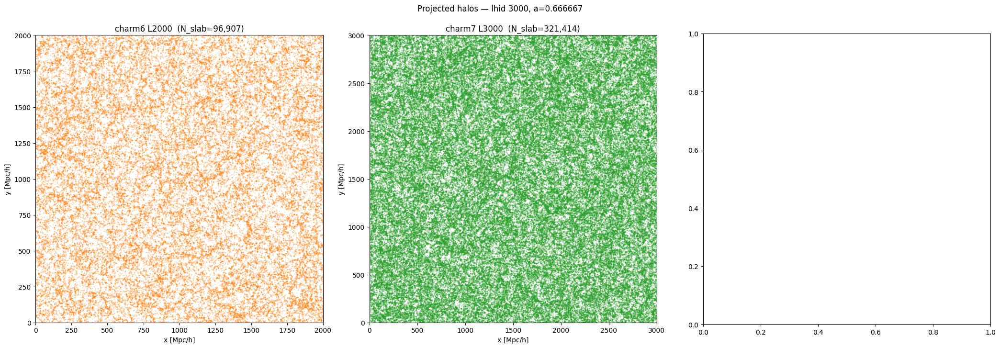
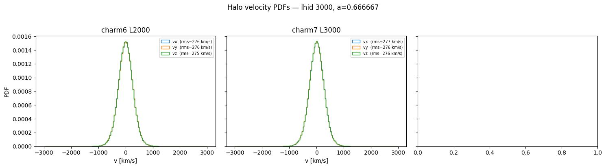
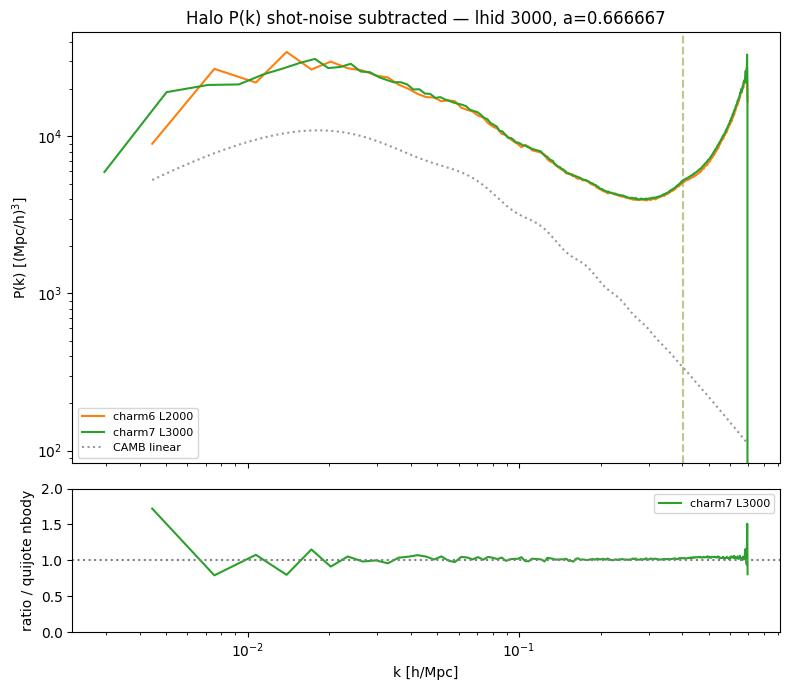
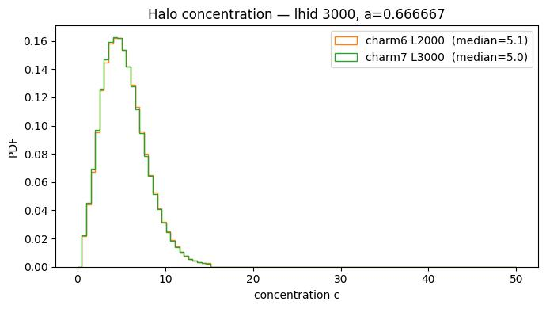
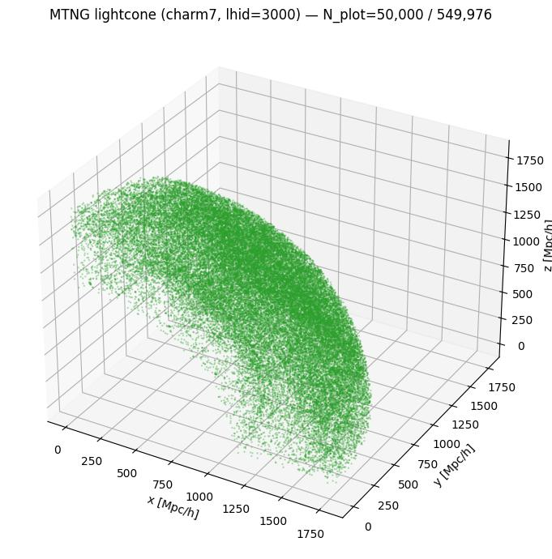
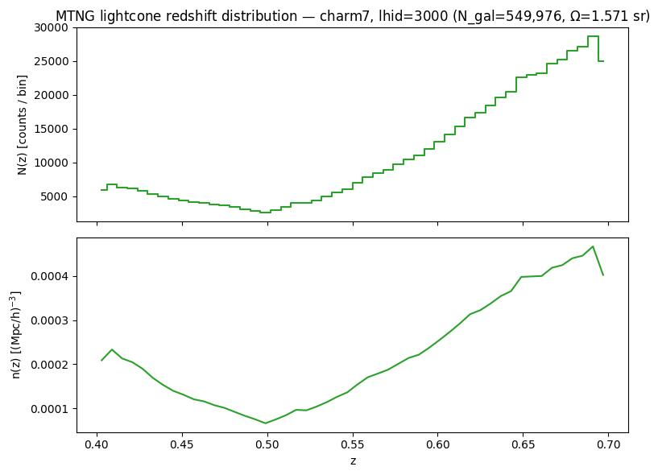
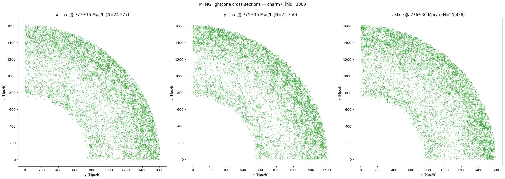

# Sanity check: FastPM CHARM6 L=2 Gpc/h vs. CHARM7 L=3 Gpc/h (MTNG-like)

**Date**: 2026-07-23
**Type**: Miscellaneous / sanity
**Suite**: fastpm_charm6 L2000 vs. fastpm_charm7 L3000 (MTNG-like), lhid 3000, a=0.666667, compared against quijote nbody reference

---

## Overview

- The halo mass function agrees closely between charm6 L2000 and charm7 L3000, with the ratio to the quijote nbody reference staying within ~±15% across the mass range. Both catalogs show increased scatter in the ratio at the high-mass tail (above ~1.5×10^15 Msun/h) due to low halo counts.

- The cumulative number density shows the same close agreement, with the ratio to the nbody reference remaining near 1 across most of the mass range and diverging (rising toward ~2) only at the highest-mass end, below N(>M) ~ 10^-9 [Mpc/h]^-3.

- Projected halo distributions are shown for charm6 L2000 and charm7 L3000; both show visually uniform large-scale structure with no evident patch-boundary artifacts in either panel.

- Halo velocity PDFs are visually indistinguishable between charm6 L2000 and charm7 L3000, with rms velocities in a narrow range (275-277 km/s) across all components and catalogs.

- The shot-noise-subtracted halo P(k) ratio to the quijote nbody reference is close to 1 across 0.02 < k < 0.3 h/Mpc. At the lowest k (k < 0.02 h/Mpc), the ratio is noisier and departs from 1 by up to ~60-70%, consistent with limited large-scale mode counts.

- Halo concentration PDFs are nearly identical between charm6 L2000 (median 5.1) and charm7 L3000 (median 5.0).

- The MTNG-like lightcone (charm7, lhid 3000, N_gal=549,976) has a wedge/cone geometry spanning a solid angle of 1.571 sr, shown here in 3D for a 50,000-point subsample.

- The lightcone redshift distribution N(z) decreases from z=0.40 to a local minimum near z=0.50, then rises monotonically out to z=0.70. The comoving number density n(z) follows the same shape, dipping near z=0.50 before increasing toward higher z.

- Cross-sectional slices of the lightcone along x, y, and z all show the same quarter-sky wedge footprint, with galaxy density visibly increasing toward the outer (high-z) edge of the wedge, consistent with the N(z) trend.

