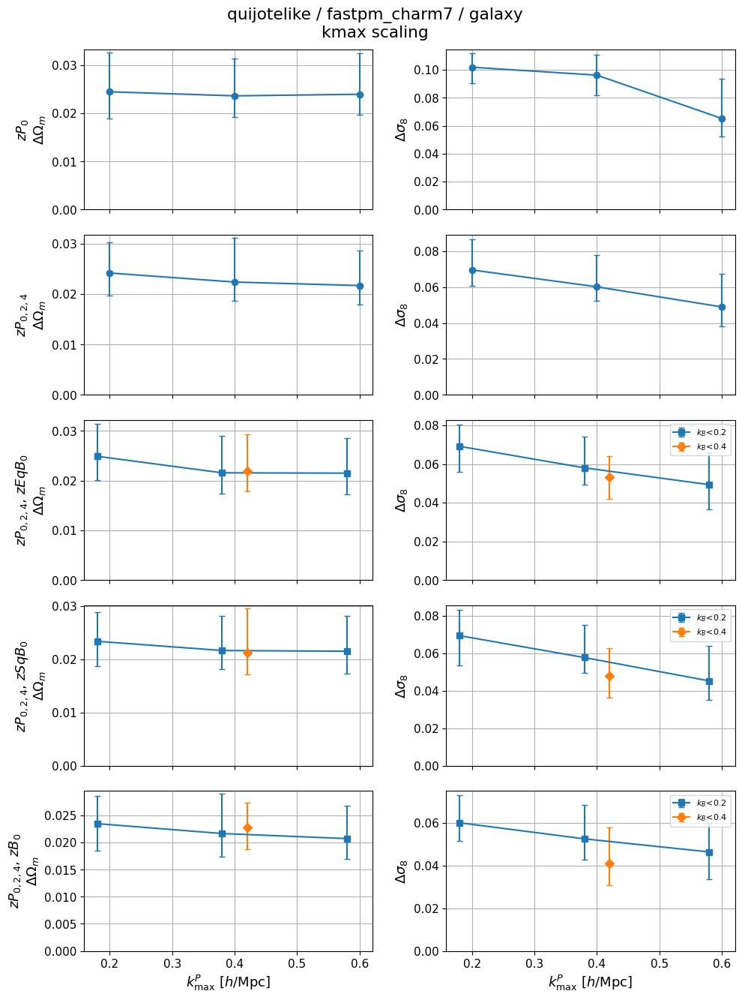
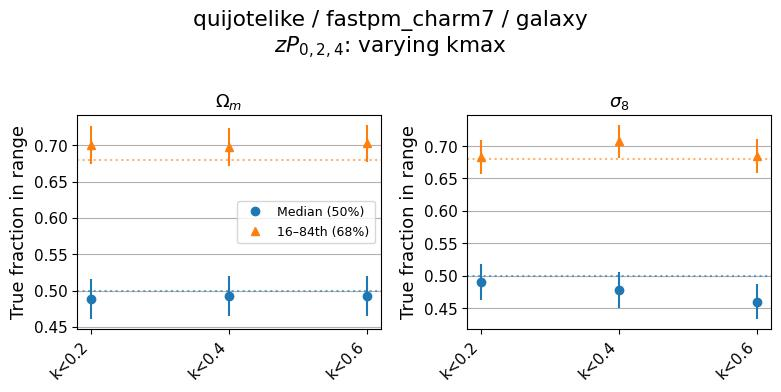
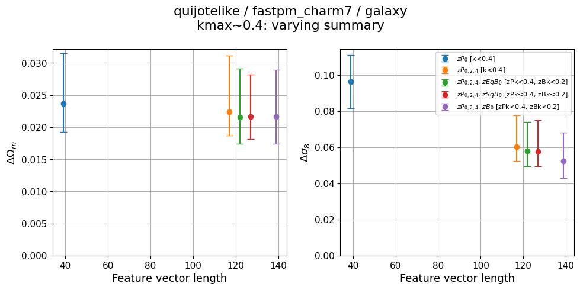
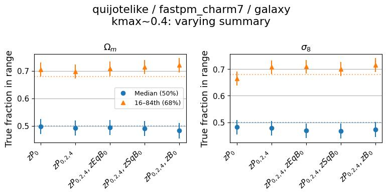
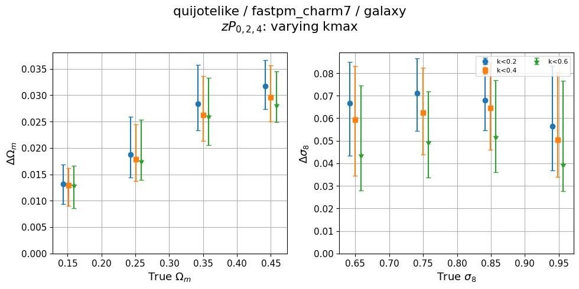
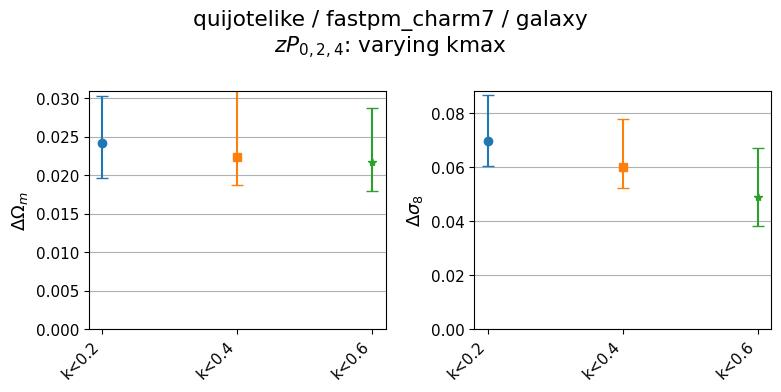
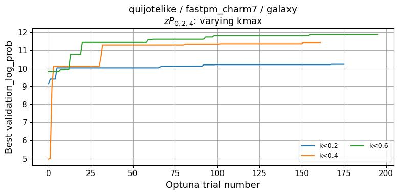

# self_quijotelike-fastpm_charm7
**Date**: 2026-07-29
**Type**: Self-consistent
**Suite**: quijotelike/fastpm_charm7
**Tracer**: galaxy
**kmax sweep summary**: zPk0+zPk2+zPk4 (k-cuts auto-discovered)
**kmax values**: zPk cuts 0.2 / 0.4 / 0.6 h/Mpc; bispectrum summaries additionally carry dynamic zBk cuts at 0.2 and 0.4
**Feature sweep kmax**: 0.4 (per-summary k-cut with closest zPk kmax)
**Feature sweep summaries**: zPk0, zPk0+zPk2+zPk4, zPk0+zPk2+zPk4+zEqBk0, zPk0+zPk2+zPk4+zSqBk0, zPk0+zPk2+zPk4+zBk0
**Notes**: —

## Overview
- Calibration holds in both sweeps: median coverage sits at 0.46–0.50 and the 68% interval fraction at 0.67–0.71 for both Ωm and σ8, within ±0.1 of nominal everywhere. No calibration break at any kmax or summary.
- The kmax sweep is flagged for an Ωm plateau. ΔΩm is flat across the full k range for every summary: ~0.024 at all three cuts for zPk0, and ~0.022–0.025 for the multipole and bispectrum summaries, with error bars (~±0.003–0.005) that overlap completely between adjacent cuts. Only zPk024+zBk0 shows any downward trend (0.0233 → 0.0215 → 0.0207), and it is within uncertainty.
- Δσ8 improves monotonically with kmax in the same sweep: 0.101 → 0.096 → 0.065 for zPk0, 0.069 → 0.060 → 0.049 for zPk024, and 0.060 → 0.052 → 0.046 for zPk024+zBk0. Higher-k modes add σ8 constraining power but not Ωm constraining power.
- Loosening the bispectrum cut from k_B<0.2 to k_B<0.4 at fixed zPk kmax≈0.4 improves Δσ8 for all three bispectrum summaries (zEqBk0 0.058 → 0.053, zSqBk0 0.058 → 0.048, zBk0 0.052 → 0.041) while leaving ΔΩm unchanged within uncertainty.
- Posterior stdev is cosmology-dependent: ΔΩm rises with true Ωm from ~0.01 at Ωm≈0.15 to ~0.035 at Ωm≈0.45, and Δσ8 varies non-monotonically across the σ8 range with the tightest constraints near σ8≈0.80. The three kmax cuts separate from one another across parameter space rather than only at the fiducial point.
- The feature sweep is not flagged. Both parameters improve or hold flat as the feature vector grows from 39 to ~139 entries: ΔΩm 0.0237 (zPk0) → 0.0224 (zPk024) → 0.0215–0.0216 for all three bispectrum additions, and Δσ8 0.096 → 0.060 → 0.058 (zEqBk0) → 0.058 (zSqBk0) → 0.052 (zBk0). No non-monotonic increase. The gain from adding any bispectrum on top of zPk024 is within uncertainty for Ωm and small for σ8, with zBk0 the largest.
- Optuna converged cleanly in the flagged sweep: all three kmax curves plateau by trial ~50–100 and stay flat through trial 200 with no oscillation, and higher kmax reaches higher log-probability. No sign of training instability.

## Figures

### kmax sweep

kmax scaling

Calibration

### Feature sweep

Feature length scaling

Calibration

### Zoom-ins

kmax_sweep (flagged)

<table>
<tr>
<td></td>
<td></td>
</tr>
<tr>
<td></td>
<td></td>
</tr>
</table>

