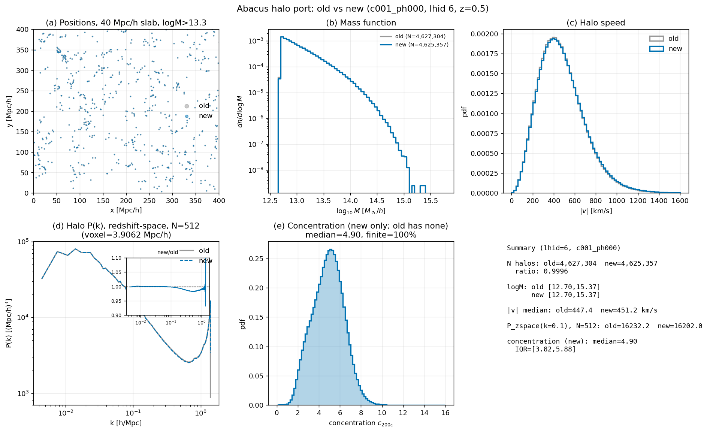
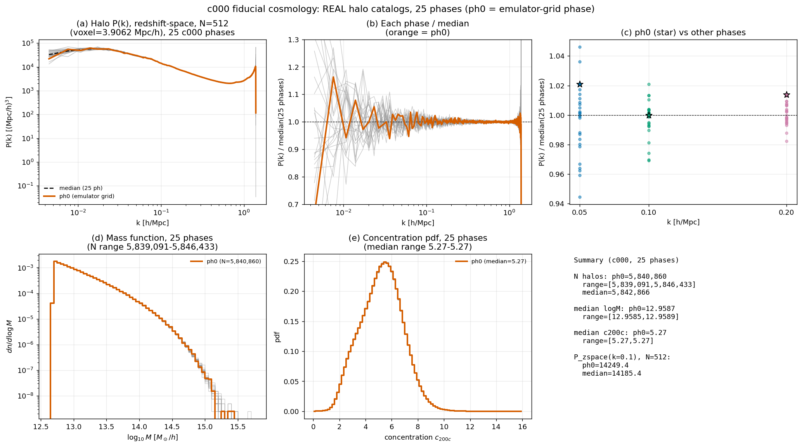
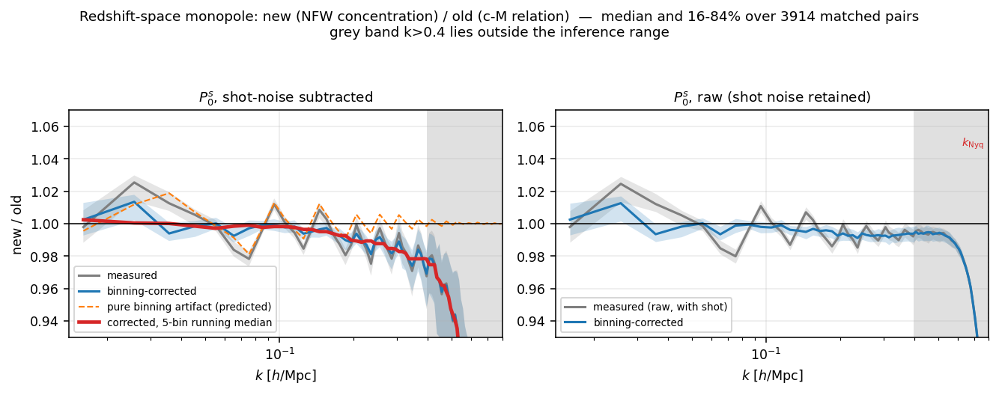
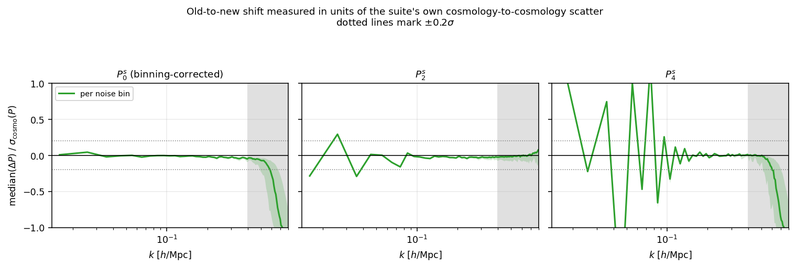
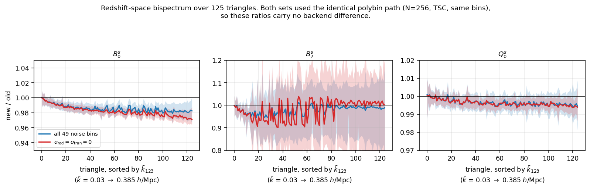
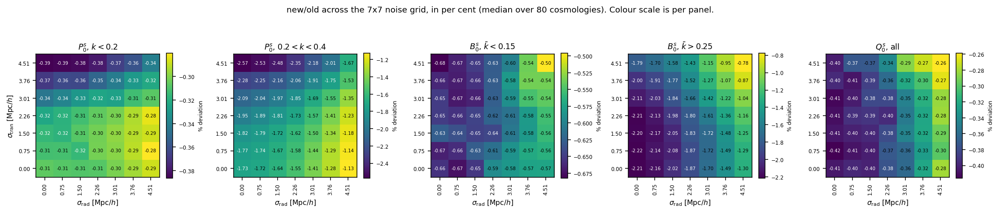
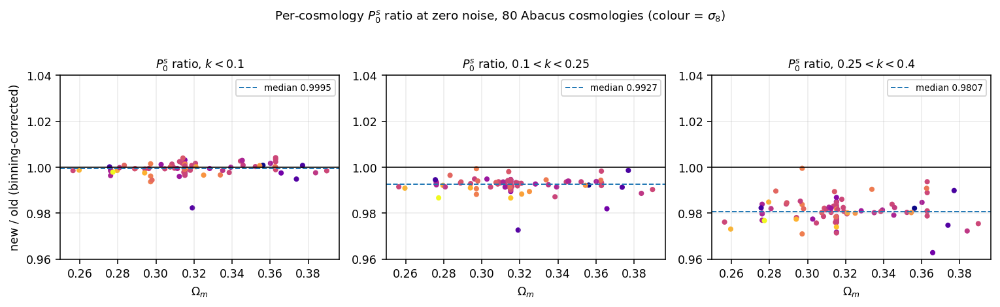
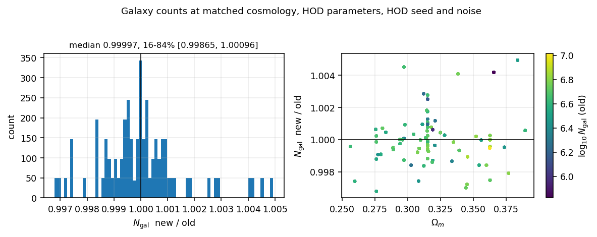
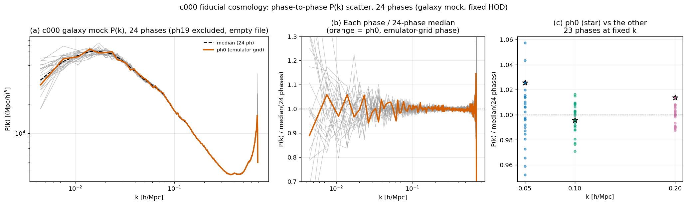

# AbacusSummit CompaSO halo port: NFW-fit concentration, and its effect on galaxy summaries

**Date**: 2026-08-07 (galaxy-summary section added 2026-08-18)
**Type**: Miscellaneous / decision
**Suite**: AbacusSummit `base` (z=0.500, L=2000 Mpc/h, 6912 PPD), 114 emulator-grid
cosmologies (`AbacusSummit_base_c001_ph000` ... `c181_ph000`) plus 25 `c000` phases,
cleaned CompaSO halos ported into the `ltu-cmass` `halos.h5` format.
**Notes**: Halo-level numbers are read from the production `halos.h5` outputs
(`/anvil/scratch/x-mho1/cmass-ili/abacus/{custom,nbodyall}/L2000-N256`, cosmology
`c001_ph000` = lhid 6, Ωm=0.276126) and the SLURM array logs (job 19727045). Output
naming: `nbodyall` holds the new port under the `abacus_custom_table.csv` lhid
ordering; `nbodyconc` holds the same catalogs under the **same lhid as
`abacus/custom`**, a drop-in companion to `custom` that adds the concentration field.
The galaxy-summary section uses the Delta copies under
`/work/hdd/bdne/maho3/cmass-ili/abacus/`. The exploratory plotting scripts behind the
original `fig1`-`fig6` bimodality figures were scratch and have been removed; every
number quoted below was recomputed from what is currently on disk.

---

## TL;DR

CompaSO does not report a concentration. The recommended proxy
`c ≈ 2.1626·SO_radius/rvcirc_max` is visibly bimodal because it mixes a radius defined
about the whole L1 halo (`SO_radius`) with one defined about the L2 core
(`rvcirc_max_L2com`). A `colossus` mass-definition conversion anchored on
`SO_L2max_radius` was also rejected: extrapolating from the dense L2 core out to 200c
saturates for many halos and produces a different spurious second mode. The adopted
fix fits an NFW profile directly to each halo's enclosed-mass curve
(`r10...r98_L2com`, all about the same L2 center) and solves for R200c. It is
unimodal (median c200c = 4.90 for `c001_ph000`), finite for 100% of halos, and
consistent with Quijote's Rockstar `R200c/Rs` at matched cosmology (4.30 at Ωm=0.271).
Production: 112 of 114 cosmologies, mean 17.7 min/sim, 655M halos.

Propagated through the HOD, the change is small and confined to small scales. Galaxy
counts are unchanged (median ratio 0.99997). After correcting a k-binning artifact
that is unrelated to the halos, the redshift-space monopole is flat at 1.000 below
k = 0.15 h/Mpc and falls to roughly -1% at k = 0.2 and -3% at k = 0.4; B0 shifts by
-0.6% on large triangles and -1.7% on small ones; Q0 by -0.35%. Measured against the
suite's own cosmology-to-cosmology scatter, every one of these shifts is below 0.05σ
for P0 and below 0.01σ for the bispectrum.

---

## Setup

- Source: `/anvil/scratch/x-mho1/abacus/z0.500_base.tar`, a 15 TB HTAR archive of the
  114 `base`-resolution cosmologies in `abacus_custom_table.csv`. Both
  `SimName/halos/z0.500/halo_info/` and `cleaning/SimName/z0.500/cleaned_halo_info/`
  are present per sim; `CompaSOHaloCatalog(..., cleaned=True)` merges the two.
- The archive's `.idx` offsets are HTAR-internal logical block counts, not seekable
  byte offsets, so random access goes through Python's `tarfile` against the tar. On
  Lustre a bare header scan drags the default ~10 MB/seek readahead across the wire,
  so `get_index()` disables readahead (`POSIX_FADV_RANDOM`) for the one-time scan that
  builds a `{member name: TarInfo}` index, caches it as a 2.2 MB pickle, then reopens
  the tar normally for the sequential slab extraction.
- Output: `pos` (comoving Mpc/h), `vel` (physical km/s), `mass` (log10 Msun/h),
  `concentration` (c200c), in the same `halos.h5`/`{a:.6f}` layout as
  `port_quijote.ipynb`. Mass cut at `M ≥ 5e12 Msun/h`, identical to the Quijote port.

---

## CompaSO catalog structure

CompaSO reports two centers per L1 halo: `x_com` (center of mass of every particle in
the L1 group, including substructure and tidal debris) and `x_L2com` (center of mass
of the L2 core, the dense central subhalo from a second group-finding pass). It
reports two matching SO radii: `SO_radius`, about `x_com` at the group's threshold
`SODensityL1`, and `SO_L2max_radius`, the SO radius of the largest L2 subhalo about
its own center at a denser threshold. These track each other for relaxed halos and
diverge when substructure is significant. CompaSO also reports enclosed-mass radii
about the L2 center, `r{10,25,33,50,67,75,90,95,98}_L2com`, which is what the adopted
fit uses (`RFIELDS` in `port_abacus_lib.py`).

`SODensityL1` is cosmology- and redshift-dependent, not a fixed 200 or 500. CompaSO
scales the Bryan & Norman (1998) virial overdensity,
`Δ_BN(z) = 18π² + 82x − 39x²` with `x = Ωm(z) − 1`, converts it to mean-matter units
(`Δ_m = Δ_BN/Ωm(z)`), then rescales by `200/(18π²)` so it reduces to 200 in the
Einstein-de Sitter limit. For `c001_ph000` at z=0.5 this gives Ωm(z) = 0.5628,
Δ_BN = 134.35, Δ_m = 238.71 and `238.71 × 200/(18π²) = 268.7`, matching the
`SODensityL1 ≈ 268.7` seen during the investigation.

## Rejected approaches

- **`2.1626·SO_radius/rvcirc_max_L2com` (the CompaSO "Vmax method" proxy)**: bimodal,
  because the numerator is defined about `x_com` and the denominator about `x_L2com`;
  decomposing by L2-core mass fraction puts substructure-rich and substructure-poor
  halos on separate branches.
- **`colossus` mass-definition conversion from `SO_L2max_radius` out to Δ=200c**: also
  bimodal. The L2 core sits well above 200c, so this is a large extrapolation of an
  assumed profile rather than an interpolation between measured points, and it
  saturates for a substantial fraction of halos.

---

## The adopted fix: NFW profile fit in log space

`fit_c200c` fits `M(<r) = A·μ(r/rs)` with `μ(x) = ln(1+x) − x/(1+x)` to the nine
enclosed-mass points `(r10...r98_L2com, frac·N·Mpart)` in log space, equally weighted,
via a grid search over `rs` (500 points, geometric in `[3e-3, 2.0]` comoving Mpc/h).
For each trial `rs` the normalization `A` follows in closed form as the mean of the
log residuals, and the `rs` with the lowest sum of squared log residuals is kept. The
search is vectorized across a whole slab at once: `(Nh, 9)` arrays and one loop over
the 500 grid points, not one fit per halo. From `(A, rs)` it gets
`ρ_s = A/(4π·rs³)`, inverts the overdensity condition for `y = R200c/rs` on a
6000-point `μ(y)/y³` lookup, and reports `c200c = y`. Every radius entering the fit is
defined about the same L2 center, so no center mixing remains.

On the test sim (`c001_ph000`, lhid 6, 4,625,357 halos above the mass cut),
`concentration` is finite for 100% of halos, with min/median/max
0.30 / 4.90 / 14.97 and 1st/25th/75th/99th percentiles 1.75 / 3.82 / 5.88 / 8.28. The
minimum sits exactly at the `rs` grid floor (3e-3 Mpc/h), so the search saturates for
a small number of very compact or poorly resolved halos rather than returning a
genuinely constrained value. This is worth knowing if very low concentrations get used
downstream.

---

## Halo-level validation

- **Old vs new counts (`c001_ph000`, lhid 6)**: the old `custom` port has 4,627,304
  halos above the mass cut, the new port 4,625,357, a 0.04% difference consistent with
  the new pipeline's extra `R > 0` selection on all nine `RFIELDS`. Mass ranges match
  to five significant figures (logM min/median/max 12.699/12.950/15.369 in both).
- **Against Quijote at matched cosmology**: Quijote lhid 884 (Ωm=0.2713) has median
  concentration 4.30 (IQR 3.00-5.85) from Rockstar's `R200c/Rs`, against the Abacus
  NFW fit's 4.90 (IQR 3.82-5.88). Quijote lhid 0 (Ωm=0.1755) gives 2.99, lower than
  both Ωm≈0.27 catalogs, the same direction as the Abacus fit's own Ωm dependence.
  Halo abundances are not comparable across these (L=1000 vs 2000 Mpc/h, different
  codes and resolution), so only the concentration distributions were used.

A single combined figure was regenerated for `c001_ph000` to replace the removed
`fig1`-`fig6` set. Its power spectrum panel uses an N=512 mesh (voxel 3.9062 Mpc/h)
in redshift space, following `cmass.diagnostics.calculations.MAz`, to expose any
small-scale difference a coarser real-space mesh could have masked.



- Positions (40 Mpc/h slab, logM>13.3) overlay pixel for pixel, with no visible offset
  or missing structure.
- Mass functions overlay across the full 12.7-15.4 logM range; the 0.04% count
  difference produces no visible shape difference.
- Halo speed |v|: medians 447.4 km/s (old) and 451.2 km/s (new), distributions
  overlay.
- Power spectrum: the new/old ratio is flat at 1.00 from k~0.005 to the N=512 mesh
  corner (~1.4 h/Mpc). P_zspace(k=0.1) = 16232 (old) against 16202 (new) (Mpc/h)³.
- Concentration (new only): unimodal, median 4.90, IQR [3.82, 5.88], 100% finite.

---

## c000 phase variance: is the emulator-grid phase typical?

The emulator grid uses phase 000 for every cosmology, so it is worth asking whether
ph000 is a typical realization. A 3.56 TB archive of all 25
`AbacusSummit_base_c000_ph{000..024}` phases was transferred and ported with the same
pipeline (`abacus_custom_table.csv` extended with 19 rows for ph006-ph024 as lhid
119-137, leaving the existing 0-118 identities undisturbed). All 25 ported cleanly in
978-1662 s each, with 5,839,091-5,846,433 halos per phase, a spread below 0.13%.

P(k) here is redshift-space on an N=512 mesh. Mass function and concentration are
shown as overlapping histograms across all 25 phases, so the full per-halo
distributions can be compared rather than one median per phase. (An earlier version of
this check used 25 existing HOD galaxy mocks at the same cosmology as a proxy, because
the real `c000` halo catalogs had not been downloaded; it reached the same conclusion
and is superseded by the halo-level version below. Its figure is retained at the end.)



- ph0 tracks the 25-phase median P(k) through the bulk of the k range, with the
  largest excursions at k<0.01 h/Mpc where every phase scatters widely. At high k, all
  25 phases converge tightly, so the finer mesh reveals no small-scale phase-specific
  discrepancy for ph0.
- ph0/median = 1.021 at k=0.05 (22nd of 24, within a scatter band of roughly
  0.94-1.05), 1.000 at k=0.10 (12th of 24, exactly the median phase), and 1.010 at
  k=0.20 (highest of 25, within a ~0.98-1.02 band, so a ~1% fluctuation in absolute
  terms).
- ph0's rank varies by scale (92nd, 50th and 100th percentile at k=0.05, 0.10, 0.20)
  but stays inside the visible scatter cloud at every k checked.
- Mass function and concentration pdf overlay almost perfectly across all 25 phases.
  Median c200c is 5.27 for every phase to two decimals, median logM spans
  12.9585-12.9589 (ph0: 12.9587), and halo counts span 5,839,091-5,846,433
  (ph0: 5,840,860, close to the median 5,842,866).

---

## Production run

`sbatch run_array.sh` (`--array=0-118%8`, resumable, skips any lhid whose `halos.h5`
exists). Job 19727045: 112 of 119 array tasks completed, 6 reported `missing` (SimName
absent from the tar), 1 skipped (lhid 6, done interactively). Per-sim wall time
768-1589 s, mean 1059 s (17.7 min), median 1053 s. Halo counts 4.12M-7.81M per sim
(mean 5.85M), 655.3M halos total. Each task holds roughly 90 GB of extracted
`halo_info` slabs at a time, which is why concurrency is capped at 8. Wall time is
dominated by tar extraction and slab I/O, not by the fit, which is a vectorized numpy
grid search over the whole slab.

---
---

## Effect on the galaxy summaries

The halo-level checks above say nothing about galaxies. Both halo sets were run
through the composite Zheng07 HOD (`cmass/bias/apply_hod.py`) and summarized with
`cmass/diagnostics/summ.py`, giving two matched galaxy-summary suites:

| | old | new |
|---|---|---|
| summary dir | `abacus/custom_comp_gridnoise` | `abacus/nbody_comp_gridnoise` |
| halos | `abacus/custom` (no concentration field) | `abacus/nbodyconc` (NFW-fit c200c) |
| `bias.hod.use_conc` | `false` (c from a mass-concentration relation) | `true` (c read from the halo file) |
| P(k) measured | 2026-07-09, pylians, N=512 TSC, no interlacing | 2026-08-13, pypower, N=512 TSC, interlacing=2 |
| B(k) measured | polybin, N=256 TSC | polybin, N=256 TSC (identical) |

### Matching and coverage

Old has 83 lhids, new has 138. **80 lhids are shared**, each with a 7x7 noise grid
(σ_rad, σ_tran ∈ {0, 0.75, 1.50, 2.26, 3.01, 3.76, 4.51} Mpc/h) for **3914 matched
pairs**. For every pair, the five cosmological parameters, all ten HOD parameters, the
HOD seed and both noise amplitudes were verified identical: **zero mismatches**. The
only intended difference is `use_conc`.

Excluded rather than recomputed, as requested:

- lhid 44 is missing 6 of its 49 noise files in the old set (noise indices 9, 12, 20,
  21, 32, 42), giving 3920 − 6 = 3914 pairs.
- old lhids 0, 1, 2 have halos symlinked into the new tree but no galaxy summaries yet.
- 55 lhids exist only in the new set.

### The two suites used different P(k) backends

The old summaries predate the pylians-to-pypower switch (`ltu-cmass` #160, merged
2026-07-14) and the new ones postdate it. This is visible in the stored k grids: the
old set has 139 bins labelled with nominal bin centres (0.015 ... 1.3915, running to
the FFT corner), the new set has 80 bins labelled with mode-weighted effective k
(0.016 ... 0.795, capped at k_Nyq = 0.804) plus a trailing empty bin.

Two things make this tractable. First, both pathways use the **same coarse bin edges**
(`K_MIN=0.01`, `DK_PK=0.01`), so bin *i* of one set is bin *i* of the other and both
report the mode-weighted average of P over the same shell. Aligning by index over the
79 shared bins is therefore correct, and interpolating onto the printed k labels would
inject a spurious correction. Second, the bispectrum path is untouched: both sets used
polybin on an N=256 mesh with identical triangle bins, so B and Q carry no backend
difference at all.

What the two pathways do differ in is how modes reach those coarse bins. pypower bins
the 3D modes straight onto the coarse edges; pylians first bins onto k_F-wide fine
bins (k_F = 0.00314) and `rebin_pk` then assigns each fine bin wholly to whichever
coarse bin contains its mean k. With only ~3.2 fine bins per coarse bin, that
quantisation shifts each coarse bin's effective k, and for a steep P(k) that alone
moves the reported power. This was modelled directly on the production mode grid
(N=512, L=2000, 67.4M modes) with a smooth P(k) taken from the data. The prediction
reproduces the new suite's effective-k grid exactly (0.0160, 0.0257, 0.0356, 0.0454,
...), and its predicted bin-to-bin wiggle correlates with the measured one at
**r = +0.90** (k<0.15) and **+0.93** (0.15<k<0.4) once pylians' truncating
`int(k/k_F)` convention is used. Dividing it out removes 57% of the bin-to-bin rms
(0.88% to 0.38% over k<0.4). The residual ~0.35% is the systematic floor on any
single-bin comparison here.

The remaining estimator difference is bounded by the earlier
[pylians vs pypower check](../2026-07-13_pylians_pypower_check/update.md), whose
`pylians N=256 high_res` row has the same k/k_Nyq scaling as this configuration:
below 0.1% in P0 and below 0.5% in P2 for k<0.4, growing to +0.7% and −2.9% by k=0.6.
Inside the inference range the backend swap is negligible.

### Power spectrum



- After binning correction the monopole ratio is flat at 1.000 out to k = 0.15 h/Mpc
  (mean 0.9983 over that range), then declines monotonically: 0.9885 at k = 0.195,
  0.9899 at 0.245, 0.9846 at 0.295, 0.9739 at 0.345 and 0.9691 at 0.395, averaging
  0.9850 over 0.15 < k < 0.4. The pair-to-pair scatter grows from 0.005 to 0.027 over
  the same range.
- Above k ≈ 0.5 the shot-subtracted ratio collapses (0.947 at k = 0.5, 0.782 at 0.6,
  0.276 at 0.7). This is outside the inference range and outside the regime where the
  comparison is meaningful: the raw ratio (right panel) stays within 1% until it rolls
  over near k_Nyq in the pylians aliasing regime, and the shot-subtracted version is a
  difference of two nearly equal numbers there, since P0 approaches 1/nbar ≈ 1700
  (Mpc/h)³.



- Expressed in units of the suite's own cosmology-to-cosmology scatter, the P0 shift
  never exceeds **0.05σ** anywhere below k = 0.4.
- P2 is within 0.03σ above k = 0.06; its one larger excursion (0.29σ) is confined to
  the lowest bin, k = 0.026.
- P4 is noise-dominated below k ≈ 0.1 and the ratio there is not interpretable: at
  k = 0.045 the suite median P4 is 618 (Mpc/h)³ against a cosmology-to-cosmology
  scatter of 1341, that is, consistent with zero. Above k = 0.15 the P4 shift settles
  below 0.1σ.

### Bispectrum

Measured through the identical polybin path in both sets, so these ratios carry no
backend difference.



- B0 sits at 0.9858 overall, with per-triangle medians spanning 0.9788 to 1.0005. The
  shift grows with triangle size: 0.9940 for k̄ < 0.15 against 0.9831 for k̄ > 0.25.
- B2 has a median of 0.9810 but is noise-dominated, with a 16-84% spread of
  [0.855, 1.078] and per-triangle medians spanning 0.944 to 1.013.
- Q0, the reduced bispectrum, is nearly unchanged at 0.9965 (per-triangle medians
  0.9934 to 1.0010).
- In units of the cosmology-to-cosmology scatter, all three shift by **0.01σ or less**
  on every triangle.

### Noise-grid and cosmology dependence



- The shift varies smoothly and weakly across the noise grid. P0 over 0.2 < k < 0.4
  runs from −1.13% at (σ_rad = 4.51, σ_tran = 0) to −2.57% at (σ_rad = 0,
  σ_tran = 4.51), passing through −1.73% at zero noise: it deepens with transverse
  noise and shallows with radial noise. B0 on small triangles behaves the same way
  (−0.78% to −2.21%).
- P0 below k = 0.2 is flat at −0.3% across the entire grid (range −0.28% to −0.39%),
  and Q0 spans only −0.26% to −0.42%.



- The shift is coherent across cosmologies rather than driven by outliers. At zero
  noise the per-cosmology P0 ratio has a 16-84% spread of ±0.2% for k < 0.1, ±0.2% for
  0.1 < k < 0.25 and ±0.4% for 0.25 < k < 0.4, with no trend against Ωm (correlation
  +0.15, −0.03, +0.02) and no visible ordering by σ8.



- Galaxy counts are effectively unchanged: the new/old ratio has median 0.99997, a
  16-84% range of [0.99865, 1.00096] and extremes of 0.9968 and 1.0049, with no trend
  against Ωm or catalog size.

Note that the two changes bundled here, the cleaner halo catalog and the switch from a
mass-concentration relation to the fitted c200c, are not separable without recomputing
one of the suites, which was out of scope.

---

## Recommendation

Adopted: the NFW-profile-fit `c200c` in `port_abacus_lib.py`/`fit_c200c`, run via
`sbatch run_array.sh`. Do not resurrect the `2.1626·SO_radius/rvcirc_max` estimator or
a `colossus` conversion anchored on `SO_L2max_radius`. Any future halo-definition
change for Abacus should keep every radius used in a single fit or ratio defined about
the same center (`_L2com`), which is what made the adopted fit unimodal.

At the galaxy level the port is safe to swap in: all shifts are below 0.05σ of the
suite's own cosmology-to-cosmology scatter. The one thing to avoid is mixing the two
summary sets in a single training or evaluation vector, since they were measured with
different P(k) backends and the resulting bin-to-bin difference (~0.9% rms before
correction) is larger than the physical shift below k = 0.15.

## Reproducing

```bash
conda activate /anvil/scratch/x-mho1/envs/abacusport   # kernel: abacusport
cd /home/x-mho1/git/ltu-cmass/notebooks

# one-time tar index (builds z0.500_base.index.pkl if not already cached)
python -c "from port_abacus_lib import get_index; get_index()"

# single sim: port_abacus.ipynb, or
python port_abacus_one.py 6 --overwrite

# full grid (main 114-cosmology tar + the c000 25-phase tar, both in TARS)
sbatch run_array.sh                          # --array=0-118%8
sbatch --array=6 run_array.sh                # single-lhid validation
sbatch --array=1-5,119-137%8 run_array.sh    # c000 phases

python backfill_config.py         # backfills config.yaml into already-ported lhids
python mirror_custom_ordering.py  # copy into abacus/custom's lhid ordering
```

Output: `/anvil/scratch/x-mho1/cmass-ili/abacus/nbodyall/L2000-N256/{lhid}/halos.h5`,
group `0.666667`, datasets `pos`/`vel`/`mass`/`concentration`, plus `config.yaml`.
`abacus/nbodyconc/L2000-N256/{lhid}/` holds the same catalogs under the identical lhid
`abacus/custom` uses.

The galaxy-summary comparison is read-only against the two summary trees. Its scripts
(`extract.py`, `binning_artifact.py`, `analyze.py`) live in a scratch directory and
are not part of the repo; nothing in `ltu-cmass` was modified and no summary was
recomputed.

---

## Additional figures



The superseded galaxy-mock proxy for the phase-variance check, using 24 usable of 25
existing HOD mocks at `c000` (phase 19's file is empty, 2.6 KB against ~770 MB, and
was excluded). ph0 sits inside the phase-to-phase envelope across k~0.005-0.5 h/Mpc,
with ph0/median = 1.025 at k=0.05, 0.996 at k=0.10 and 1.011 at k=0.20, and galaxy
counts spanning 10,698,544-10,707,913 across phases (a spread below 0.1%).
