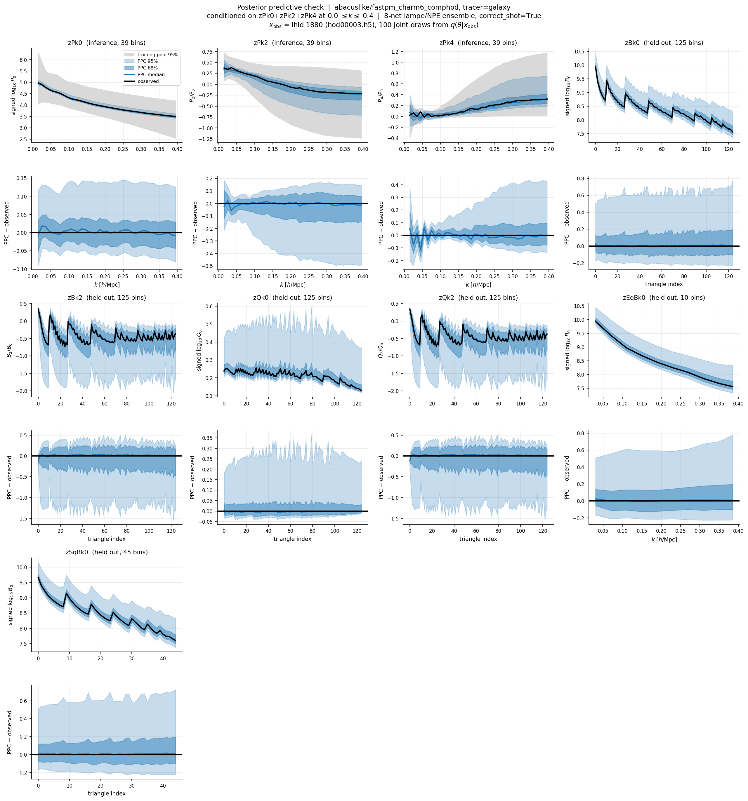
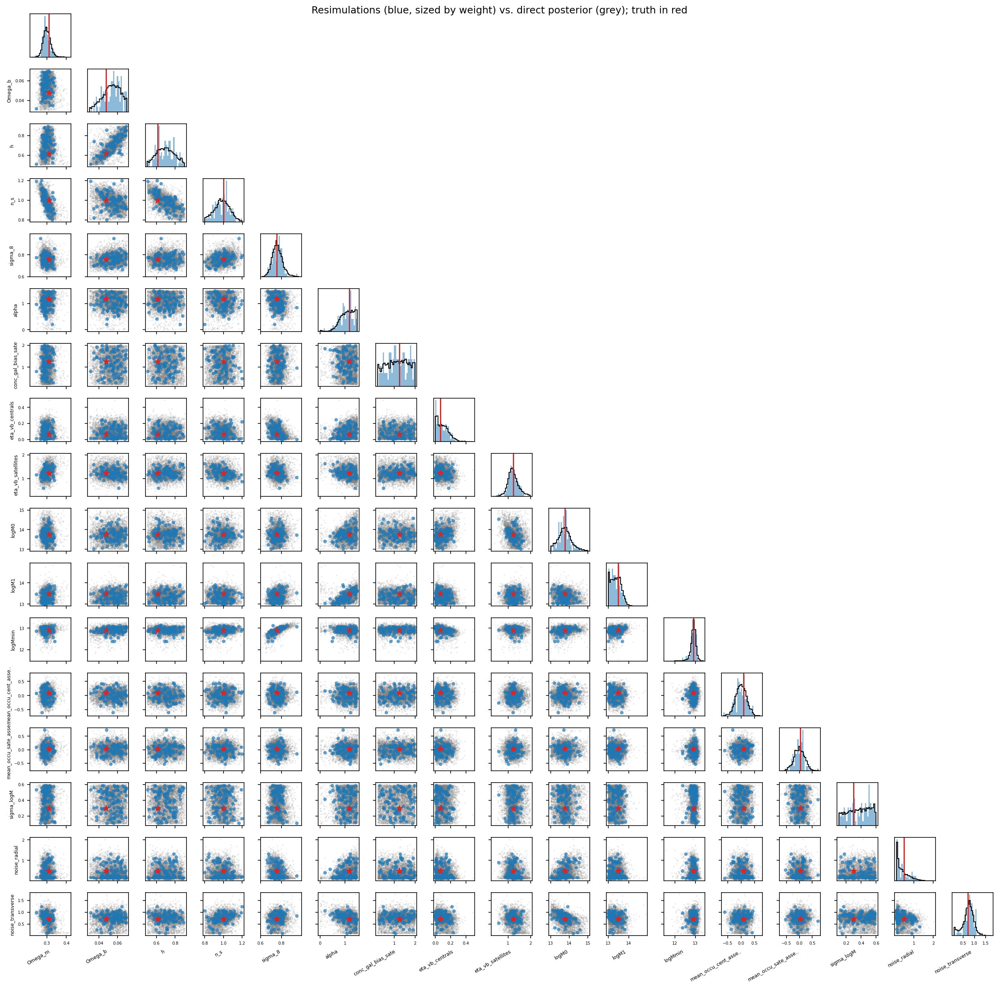
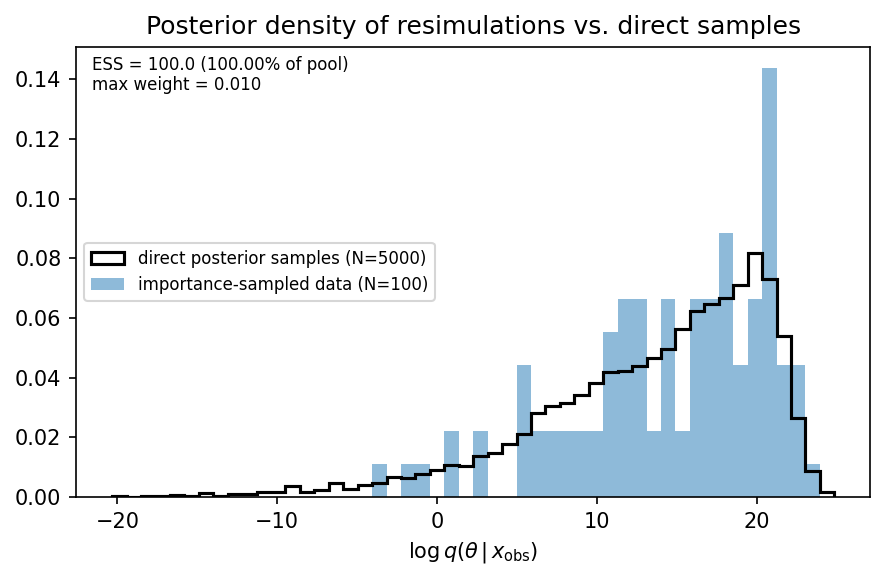

# Posterior predictive check on `abacuslike/fastpm_charm6_comphod` (zPk024, kmax=0.4)

**Date**: 2026-08-13
**Type**: Miscellaneous / posterior predictive check
**Suite**: abacuslike fastpm_charm6_comphod, L=2000 Mpc/h, N=256, a=0.66666 (z=0.5); self-consistent, observed vector drawn from the training suite's own test split
**Notes**: 100 new simulations generated for this test. Residuals are taken element-wise between the resimulated and observed feature vectors, matching how `x_ppc` and `x_obs` are used downstream.

---

**TL;DR:** Proof of concept for posterior predictive checking in the cmass
pipeline, run in the easiest regime (self-consistent) so the machinery itself
is what's tested. 100 parameter vectors drawn jointly from `q(theta | x_obs)`
were resimulated through the full forward chain, giving an unweighted
predictive ensemble. The observed vector lies inside the 68% predictive band
at every k bin of the three constrained summaries and every held-out
bispectrum summary (0% of bins outside 68%, vs ~32% expected for independent
bins — bands are conservative rather than tight). The machinery works end to
end and is ready to point at OOD suites and real data. It replaces importance
sampling of existing simulations, which failed on this model (ESS = 3/19777
in 17D).

## Setup

- Posterior: 8-net lampe/NPE ensemble (8 of 10 requested — two top Optuna
  trials have no `posterior.pkl` on disk) at
  `abacuslike/fastpm_charm6_comphod/models/galaxy/zPk0+zPk2+zPk4/kmin-0.0_kmax-0.4`,
  `include_hod=True`, `include_noise=True`. 17 parameters (5 cosmology, 10 HOD,
  2 noise); x is 117-dimensional (3 blocks of 39 k bins).
- Observed vector: lhid 1880, test split (`hod00003.h5`), chosen by
  `select_test_point` as closest to the training pool median in per-parameter
  quantile space. Cosmology [0.3119, 0.04797, 0.6129, 0.9997, 0.7557].
- 100 joint draws from `q(theta | x_obs)` (seeds 0/10), all within prior
  support, no rejections. One draw = one box, own IC phase (`matchIC=0`).
- Chain per draw matches `jobs/slurm_abacuslike_bias.sh`: `cmass.nbody.fastpm`
  (32 COLA steps, supersampling 3, `nbody.zf=0.500015`) to
  `cmass.bias.rho_to_halo` (CHARM charm6, `charm_joint_best_val_ft15.pth`) to
  `cmass.bias.apply_hod` (`bias=zheng_composite`) to `cmass.diagnostics.summ`.
- Verification: all 100 draws' recorded cosmology/HOD/noise parameters match
  the drawn values to 1e-5; no draw dropped.
- Cost: FastPM 13-19 min/draw (128-core Delta node), CHARM on a separate GPU
  machine, HOD + diagnostics ~3 min/draw (16 cores).

## Data-space bands



Fraction of bins where the observed value falls outside the predictive
interval (bins within a summary are strongly correlated, so read off the
figure rather than used as a test):

| Block | Bins | Outside 68% | Outside 95% | Median (PPC - obs) / \|obs\| |
|---|---|---|---|---|
| zPk0 (inference) | 39 | 0% | 0% | +0.000 |
| zPk2 (inference) | 39 | 0% | 0% | -0.019 |
| zPk4 (inference) | 39 | 10% | 3% | -0.042 |
| zBk0 (held out) | 125 | 0% | 0% | +0.001 |
| zEqBk0 (held out) | 10 | 0% | 0% | +0.001 |
| zSqBk0 (held out) | 45 | 0% | 0% | +0.001 |
| zQk0 (held out) | 125 | 0% | 0% | -0.012 |
| zBk2 (held out) | 125 | 1% | 0% | +0.032 |
| zQk2 (held out) | 125 | 1% | 0% | +0.032 |

- The observed vector tracks the predictive median across the three
  constrained summaries. zPk0 residuals stay within ~+/-0.03 (signed log10 P0)
  over 0.015 < k < 0.4, widening to ~+/-0.05 at the lowest two k bins.
- zPk4 is the only constrained summary with bins outside the bands (10%/3%),
  concentrated at k < 0.07 where the multipole is small.
- Held-out bispectrum summaries reproduce as well as the constrained ones:
  zBk0, zEqBk0, zSqBk0 medians are within 0.1% of observed everywhere, inside
  the 68% band throughout including the triangle-ordering sawtooth structure.
- Predictive bands are much narrower than the training pool's 95% range: at
  k=0.4, zPk2/zPk4 pool bands span ~1.5/1.6 in plotted ratio vs. ~0.15/0.2 for
  the predictive 68% band.
- Coverage is conservative overall: 0% of bins outside 68% in 7/9 blocks vs.
  ~32% expected for independent bins.
- zQk0 and zQk2 have strongly asymmetric 95% bands driven by a few draws (zQk0
  upper edge ~0.6 in signed log10 Q0 vs. observed ~0.2-0.25); quantile bands
  describe these two blocks poorly.

## Parameter-space bookkeeping

Consistency checks on the campaign rather than tests of the model: the
simulated parameters are direct posterior draws by construction, so agreement
is expected. What these can detect is drift between drawn and simulated
values, e.g. through the cosmology file round trip or a row misalignment
between `x_ppc` and `theta_ppc`.



- The 100 simulated vectors tile the direct posterior sample across all 17
  parameters, no visible offset in any 1D or 2D projection, true parameters
  within the bulk. Posterior is visibly informative on logMmin,
  eta_vb_satellites, noise_transverse; close to flat on
  conc_gal_bias_satellites and sigma_logM.



- The log-posterior-density histogram of the 100 simulated vectors overlaps
  the direct 5000-sample histogram (medians 16.28 vs. 15.12). ESS/max-weight
  annotations and the "importance-sampled data" legend label are inherited
  from the importance-sampling figure this reuses and are vacuous/incorrect
  for this unweighted ensemble (ESS = N, max weight = 1/N by construction).

## Recommendation

Machinery is validated in the self-consistent regime and ready to point at
OOD suites and real observations, where the check becomes informative (here
agreement was the expected outcome, confirming bookkeeping rather than
physics). The deliverable arrays `x_ppc.npy` and `theta_ppc.npy` are
row-aligned, the intended input to a distance statistic; the conservative band
coverage and zQk0/zQk2 asymmetry both argue against a Gaussian statistic
applied blindly across blocks.

## Reproducing

```bash
cd /u/maho3/git/ltu-cmass
PYTHONPATH=. python ppc/draw.py --ndraw 10             # first block, seed 0
PYTHONPATH=. python ppc/draw.py --start 10 --ndraw 90  # extend to 100, append only
sbatch ppc/slurm_nbody.sh                      # stage A, FastPM
bash   ppc/run_charm.sh 0 99                   # stage B, CHARM on a GPU machine
sbatch ppc/slurm_hod.sh                        # stage C, HOD + diagnostics
sbatch ppc/slurm_collect.sh                    # collect + figures
```

Outputs under
`/work/hdd/bdne/maho3/cmass-ili/ppc/abacuslike_fastpm_charm6_comphod/zPk0+zPk2+zPk4_kmin-0.0_kmax-0.4/obs01880/`:
`x_ppc.npy` (100, 117), `theta_ppc.npy` (100, 17), `x_ppc_all.npz` (all nine
plotted blocks with their observed vectors and k axes), `posterior_draws.npz`,
`logq_ppc.npy`, `manifest.tsv`, and `plots/ppc_{bands,corner,logprob}.png`.
