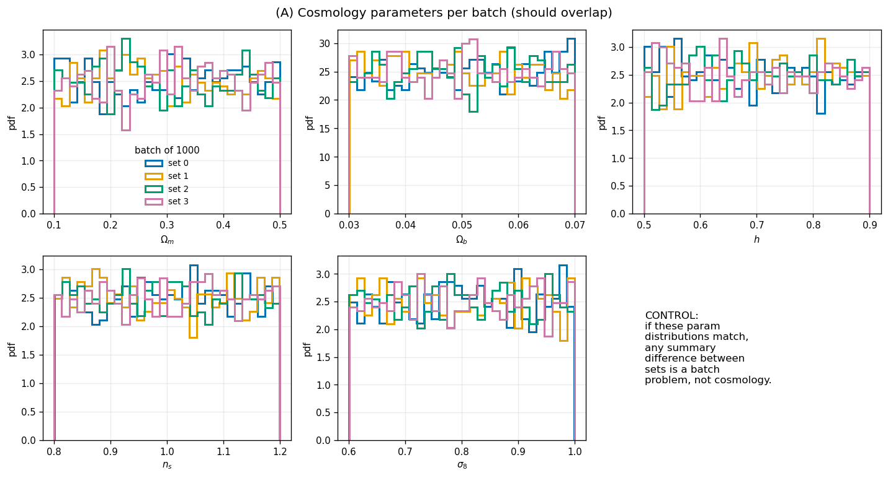
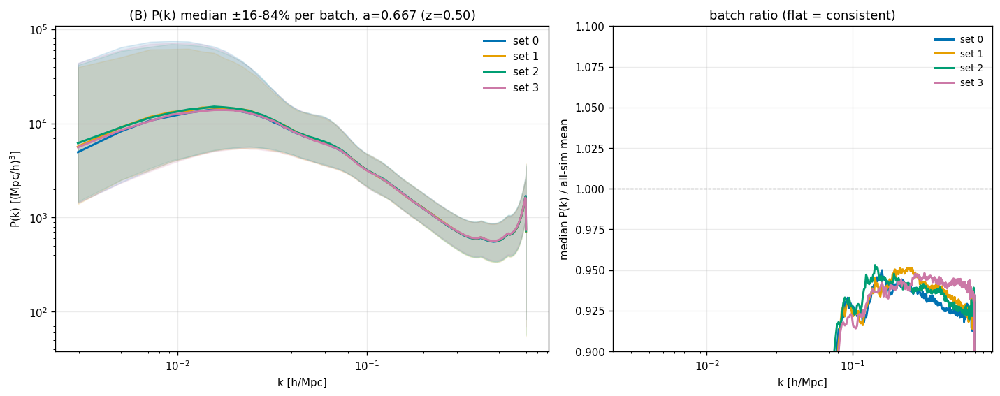
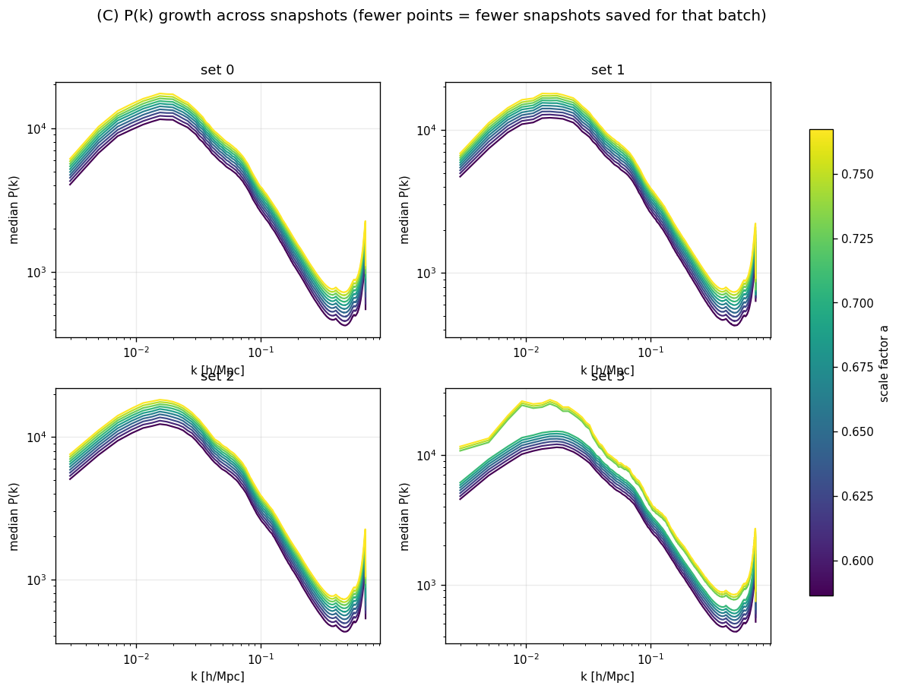
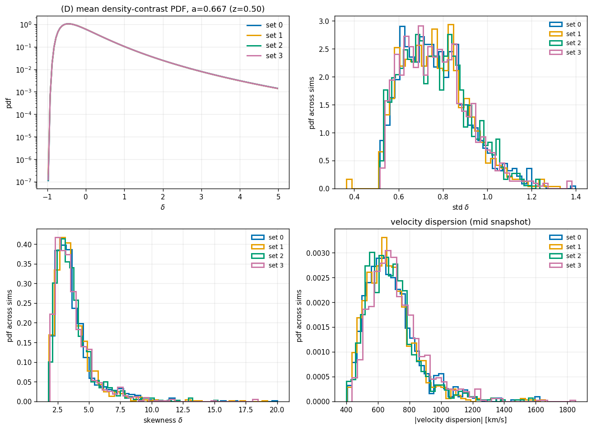
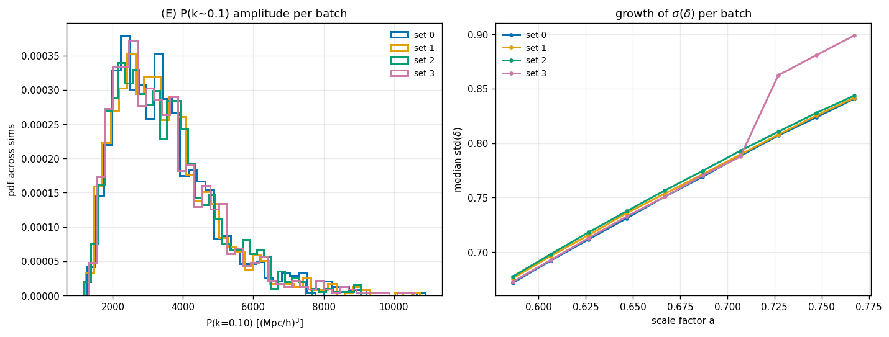

# Sanity check: FastPM MTNG-like L3000-N384 batch consistency (4 batches of 1000)

**Date**: 2026-08-13
**Type**: Miscellaneous / sanity
**Suite**: mtnglike fastpm L3000-N384, lhid 0–3999 split into four batches of 1000 (`lhid // 1000`), snapshots a=0.58622–0.76721 (z=0.70→0.30)
**Notes**: Data at `/anvil/scratch/x-mho1/cmass-ili/mtnglike/fastpm/L3000-N384/{0..3999}/nbody.h5`. 3999/4000 sims read successfully. Batch 3 (lhid 3012–3999, 988/1000 sims) was run by design with only 7 of 10 snapshots saved; lhid 3000–3011 (12 sims) have the full 10.

---

## Overview

- Cosmology parameter distributions (Ωm, Ωb, h, ns, σ8) overlap closely across all four batches and are flat across their latin-hypercube ranges, confirming the batches are fair sub-samples of the same design space — any summary-statistic difference between them would be attributable to the batch, not a shifted cosmology sample.

- Median P(k) ± 16–84% per batch overlap almost perfectly across k = 0.003–0.40 h/Mpc at a=0.667 (z=0.50); the shaded bands (driven by cosmology spread) are far wider than any offset between batch medians. The ratio of median P(k) to the all-sim mean P(k) (k ≳ 0.08 h/Mpc, where mode counts are large enough to be meaningful) sits at 0.935–0.940 for every batch, with each batch's own scatter (~0.6–0.9%) comparable to the ~0.5% spread between batches.

- P(k) growth across snapshots, one panel per batch colored by scale factor: batches 0–2 show all 10 monotonically-growing curves with consistent shape and no crossing. Batch 3 shows only 7 curves (the by-design truncation) with the same shape and growth as the other batches over the range they share, with no discontinuity at the truncation point.

- The mean density-contrast PDF (δ from −1 to 5, log scale) is indistinguishable across all four batches at a=0.667. The distributions across sims of std(δ), skewness(δ), and |velocity dispersion| (mid-snapshot) show the same shape and range for every batch. Median std(δ) at z≈0.5: batch 0 = 0.751, batch 1 = 0.753, batch 2 = 0.756, batch 3 = 0.751 — a 0.7% spread across batches, smaller than the point-to-point scatter within any one batch.

- P(k≈0.10 h/Mpc) amplitude distributions overlap across batches. The σ(δ) growth curve tracks together for all four batches up to a=0.70688, then batch 3's curve rises above the others for the last 3 points; only 12 of batch 3's 1000 sims (lhid 3000–3011, the ones with full snapshot coverage) contribute to those points, so this reflects N=12 statistics rather than a batch effect.

