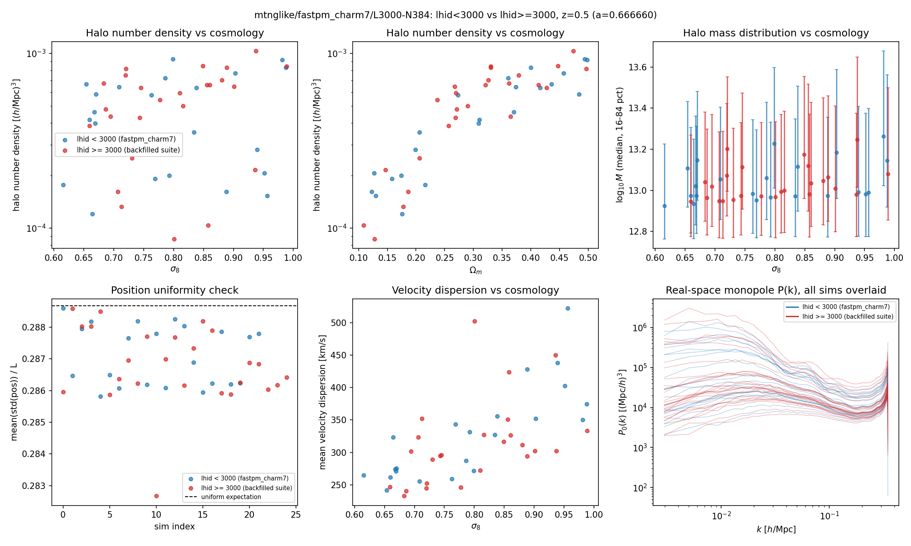
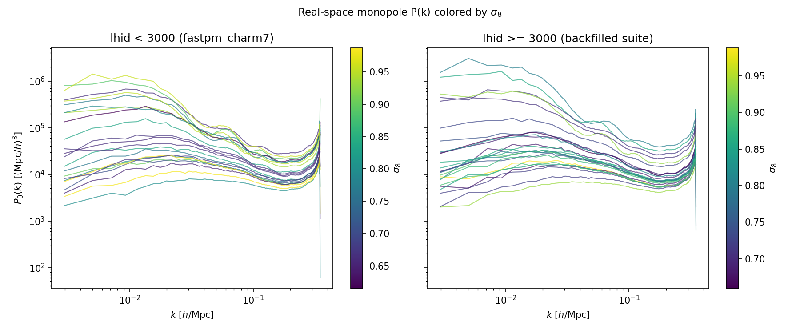

# Sanity check: mtnglike/fastpm_charm7 live pipeline vs. backfilled suite

**Date**: 2026-08-13
**Type**: Miscellaneous / sanity
**Suite**: mtnglike/fastpm_charm7, L=3000, N=384, z=0.5 (a=0.666660). lhid<3000 is produced by the current live FastPM→CHARM7 pipeline (624 available); lhid≥3000 is backfilled from a different, older simulation suite/pipeline (909 available). 25 lhids subsampled per group (evenly spaced over the sorted available lhids, seed=0).
**Notes**: `scripts/sanity_check_mtng_charm7.py`. P(k) monopole computed on a CIC mesh downsampled from N=384 to 192. 3 low-group lhids (1007, 1033, 1059) failed to load: both the direct `config.yaml` and the `fastpm/` fallback were missing, so these have no config left on disk at all (likely already offloaded without leaving a tombstone). All 25 high-group lhids loaded successfully.

---

## Overview

- Halo number density vs. σ8 and vs. Ωm follow the same trend in both groups, with low- and high-group points interleaved along the same curve and no systematic offset: nbar spans ~9×10⁻⁵–1×10⁻³ (h/Mpc)³ over σ8 ≈ 0.6–1.0, rising monotonically with Ωm from ~1×10⁻⁴ at Ωm≈0.1 to ~9×10⁻⁴ at Ωm≈0.5.

- Median halo mass vs. σ8 is consistent between groups, with 16–84th percentile error bars overlapping at every σ8 value; log10M_med ranges ~12.9–13.3 in both groups.

- Position uniformity (mean(std(pos))/L) sits close to the uniform-box expectation of 1/√12 ≈ 0.2887 for both groups, with values in ~0.283–0.289 and no low/high split.

- Velocity dispersion rises with σ8 in both groups with comparable scatter, spanning ~230–520 km/s; a single high-dispersion outlier (~500 km/s) appears in each group, at σ8≈0.80 (high) and σ8≈0.95 (low).

- The real-space monopole P0(k) overlay shows the same amplitude range and σ8-ordering (higher normalization at low σ8) in both groups, with curves from the two groups interleaving rather than separating into distinct bands across k ≈ 3×10⁻³–3×10⁻¹ h/Mpc.

