# abacuslike / fastpm_charm7 — self-consistent diagnostics + volume scaling

**Date**: 2026-08-19
**Type**: Self-consistent
**Suite**: abacuslike/fastpm_charm7
**Tracer**: galaxy
**kmax sweep summary**: zPk0+zPk2+zPk4 (k-cuts auto-discovered: k<0.2, k<0.4, k<0.6)
**Feature sweep kmax**: ~0.4 (per-summary k-cut with closest zPk kmax)
**Feature sweep summaries**: zPk0, zPk0+zPk2+zPk4, zPk0+zPk2+zPk4+zEqBk0, zPk0+zPk2+zPk4+zSqBk0, zPk0+zPk2+zPk4+zBk0
**Notes**: Includes a volume-scaling comparison (scripts/volume_scaling.py) against quijotelike/fastpm_charm7, testing whether fiducial Ωm/σ8 posterior stdev scales as V^-1/2 between L=1 and L=2 Gpc/h boxes.

## Overview

- Calibration median holds at ~0.49–0.50 for both Ωm and σ8 across every kmax and summary combination (within ±0.1 of the 0.5 target). The 68% interval fraction runs conservative throughout (0.70–0.78 vs. the 0.68 target) and widens slightly with increasing kmax.
- kmax sweep, zPk0 alone: Δ Ωm plateaus early (0.0157 → 0.0153 → 0.0153 across k<0.2/0.4/0.6) while Δσ8 keeps improving (0.100 → 0.090 → 0.063). Optuna history shows k<0.2 converging early (~trial 20) to a flat plateau around best validation log-prob ~16.5–17, while k<0.4 and k<0.6 show upward jumps around trial 60–80 before plateauing near log-prob ~20. Stdev-vs-theta shows Ωm stdev increasing with true Ωm (~0.009–0.022 across the test range) and σ8 stdev decreasing slightly with higher true σ8, both within measurement uncertainty.
- kmax sweep, bispectrum-family summaries (+zEqBk0/+zSqBk0/+zBk0): Δ Ωm and Δσ8 both decrease monotonically with kmax, no plateau.
- Feature sweep at kmax~0.4: Δ Ωm is non-monotonic — zPk0+zPk2+zPk4 reaches 0.0130, but adding zSqBk0 or zBk0 increases it to 0.0139/0.0137 despite the longer feature vector (117 → 127–140 features); Δσ8 improves monotonically across the same summaries (0.031 → 0.024–0.029). Optuna best validation log-prob plateaus worse for the +zBk0/+zSqBk0 models (~22.0–22.5) than for zPk0+zPk2+zPk4 alone (~20.0), despite the higher feature dimensionality. Stdev-vs-theta shows the Ωm stdev increase for +zBk0/+zSqBk0 concentrated at true Ωm ~0.40–0.45, while σ8 stdev improves across the full parameter range for the same summaries.
- Volume scaling (quijotelike V=1 vs. abacuslike V=8 (Gpc/h)³, matched fastpm_charm7 pipeline): for zPk0 alone, the measured Δ Ωm log-log slope vs. volume is ~-0.21 at all three kmax, and Δσ8 slope is ~-0.01 to -0.03 (essentially flat) — both well short of the -0.50 expected from 1/√V scaling. For zPk0+zPk2+zPk4, slopes improve to ~-0.25 to -0.26 (Ωm) and -0.21 to -0.32 (σ8, closest to -0.50 at kmax 0.4–0.6), still shallower than -0.50 in every case tested.

## Figures

### kmax sweep

kmax scaling

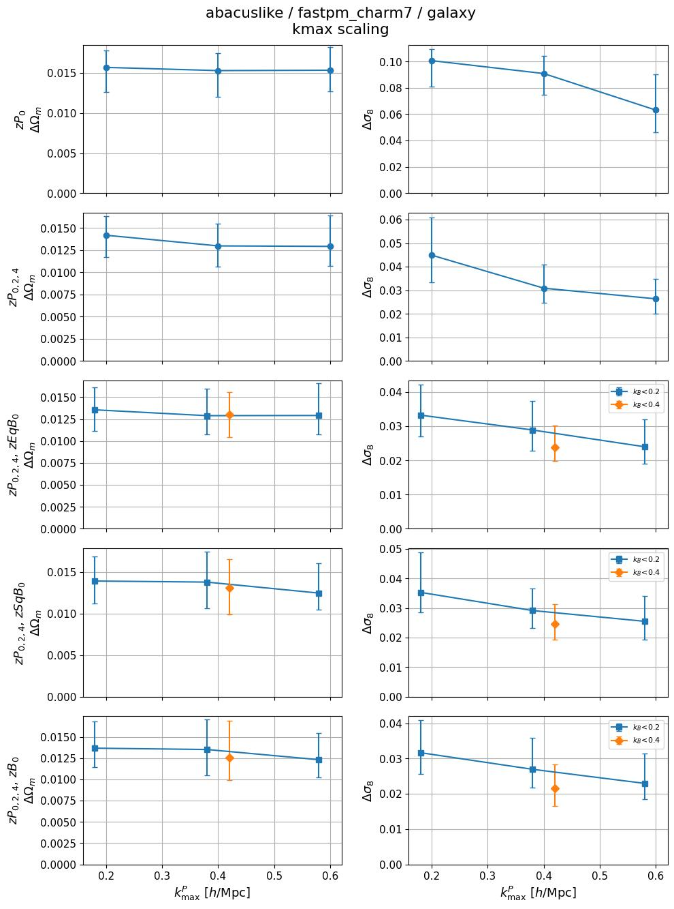

Calibration

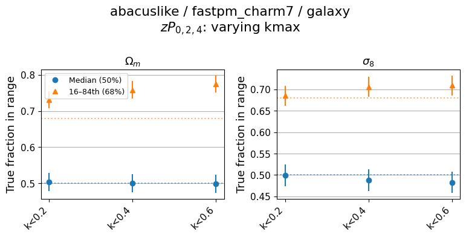

### Feature sweep

Feature length scaling

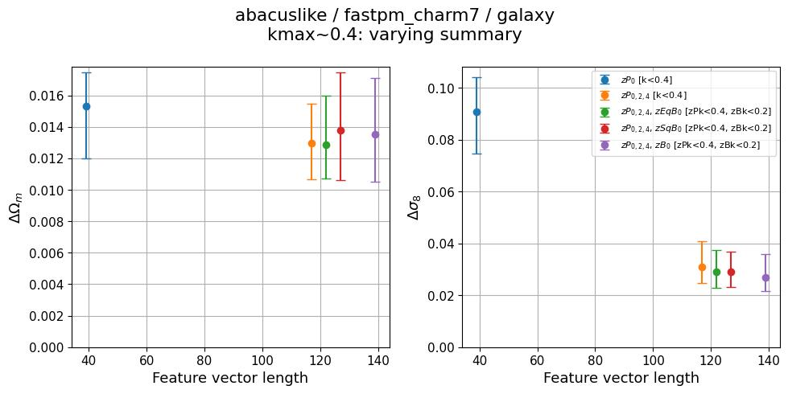

Calibration

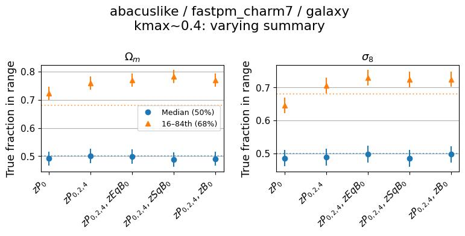

### Zoom-ins

kmax_sweep

<table>
<tr>
<td>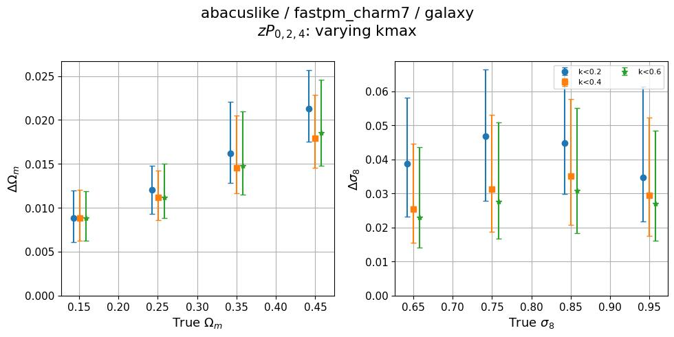</td>
<td>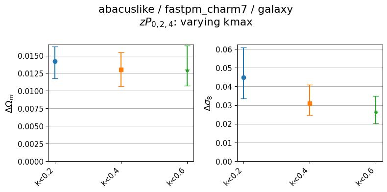</td>
</tr>
<tr>
<td>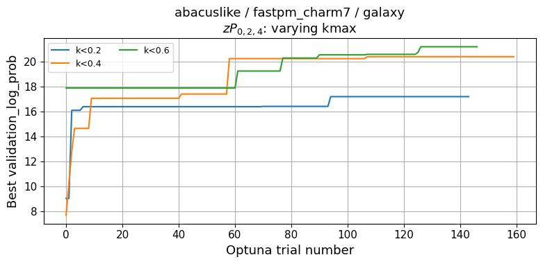</td>
<td></td>
</tr>
</table>

feature_sweep

<table>
<tr>
<td>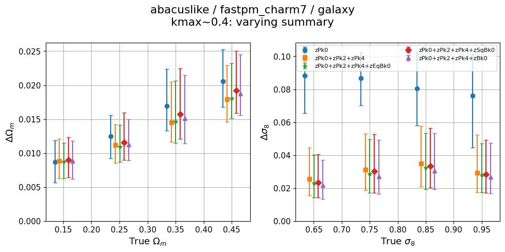</td>
<td>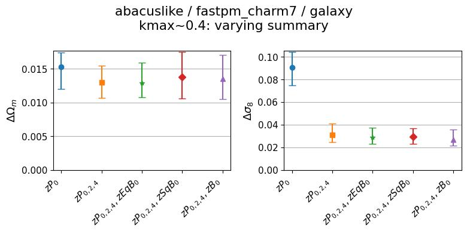</td>
</tr>
<tr>
<td>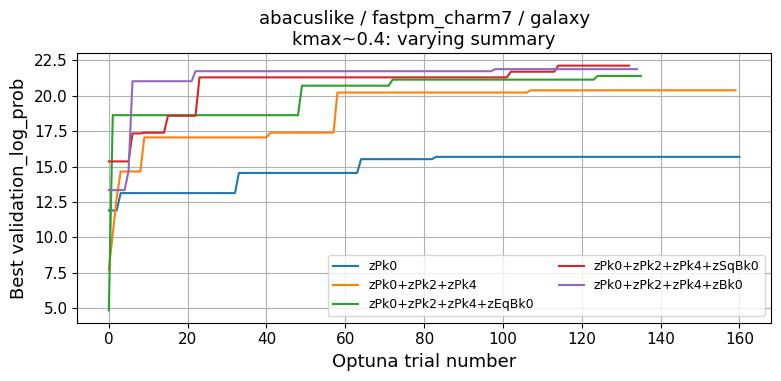</td>
<td></td>
</tr>
</table>

## Volume scaling: quijotelike vs. abacuslike

**Setup**: `scripts/volume_scaling.py` compares self-consistent fiducial posterior stdev (median stdev on Ωm/σ8 for test points near the fiducial cosmology Ωm=0.3/σ8=0.8, in a fixed nbar band — the same metric as `fiducial_stdev.jpg` above) between quijotelike (L=1 Gpc/h, V=1 (Gpc/h)³) and abacuslike (L=2 Gpc/h, V=8 (Gpc/h)³), both on the fastpm_charm7 pipeline, galaxy tracer. K-cuts are matched by directory name across suites, since both share the same pipeline's k-cut grid. Each panel plots measured stdev vs. volume on log-log axes (2 points, one per suite) against a V^-1/2 reference line anchored to the quijotelike point, with the empirical two-point log-log slope annotated in the panel title.

- zPk0 (monopole only): Δ Ωm slope ≈ -0.21 at kmax = 0.2/0.4/0.6 (quijotelike ~0.023–0.024 → abacuslike ~0.016); Δσ8 slope ≈ -0.01 to -0.03 (quijotelike ~0.09–0.10 → abacuslike ~0.06–0.10) — σ8 constraining power is nearly unchanged despite the 8x volume increase.

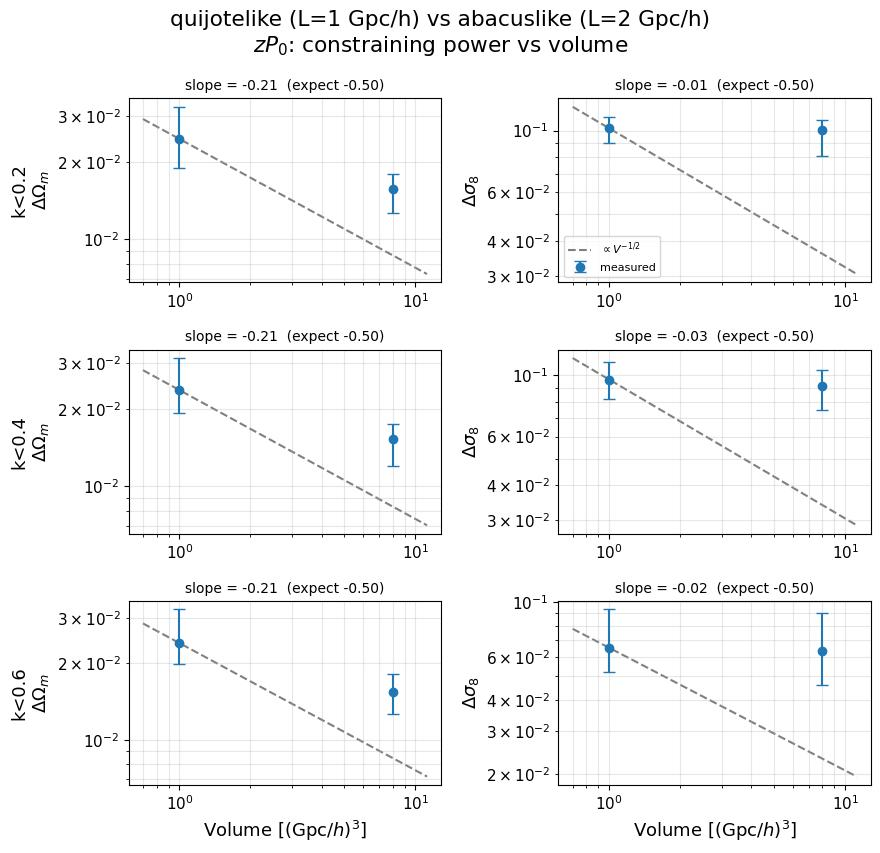

- zPk0+zPk2+zPk4 (monopole+quadrupole+hexadecapole): Δ Ωm slope ≈ -0.25 to -0.26 across kmax; Δσ8 slope ≈ -0.21 (k<0.2) to -0.32 (k<0.4) to -0.30 (k<0.6) — closer to the -0.50 reference than the monopole-only case, but still shallower at every kmax tested.

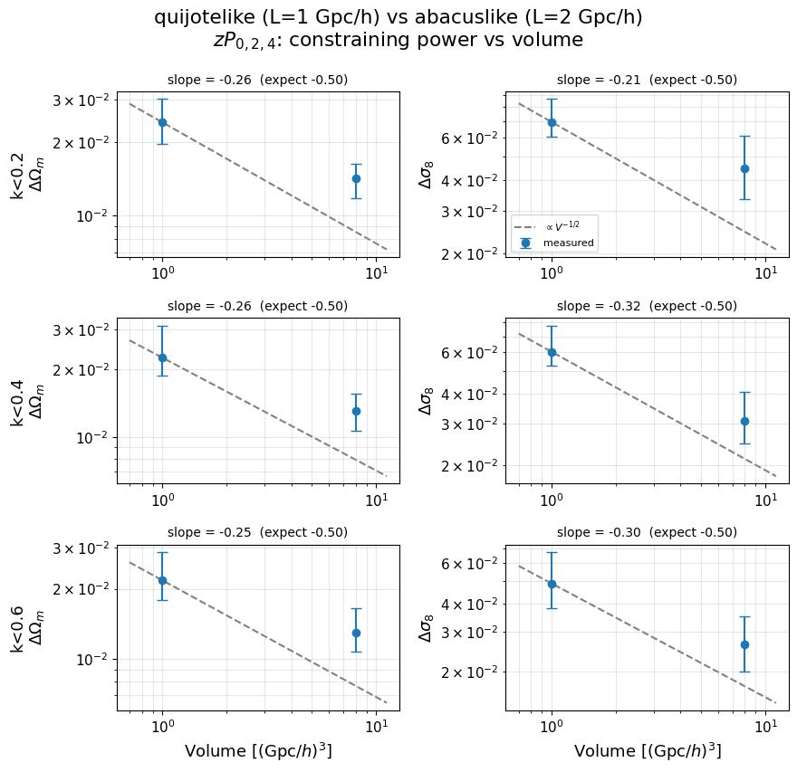

- Across both summaries and all kmax tested, measured log-log slopes range from -0.01 to -0.32, consistently shallower than the -0.50 expected from 1/√V scaling. This is a two-suite (two-point) comparison, so each slope is the secant between two measurements and is sensitive to the uncertainty on each individual stdev estimate, visible as the error bars in the figures above.
