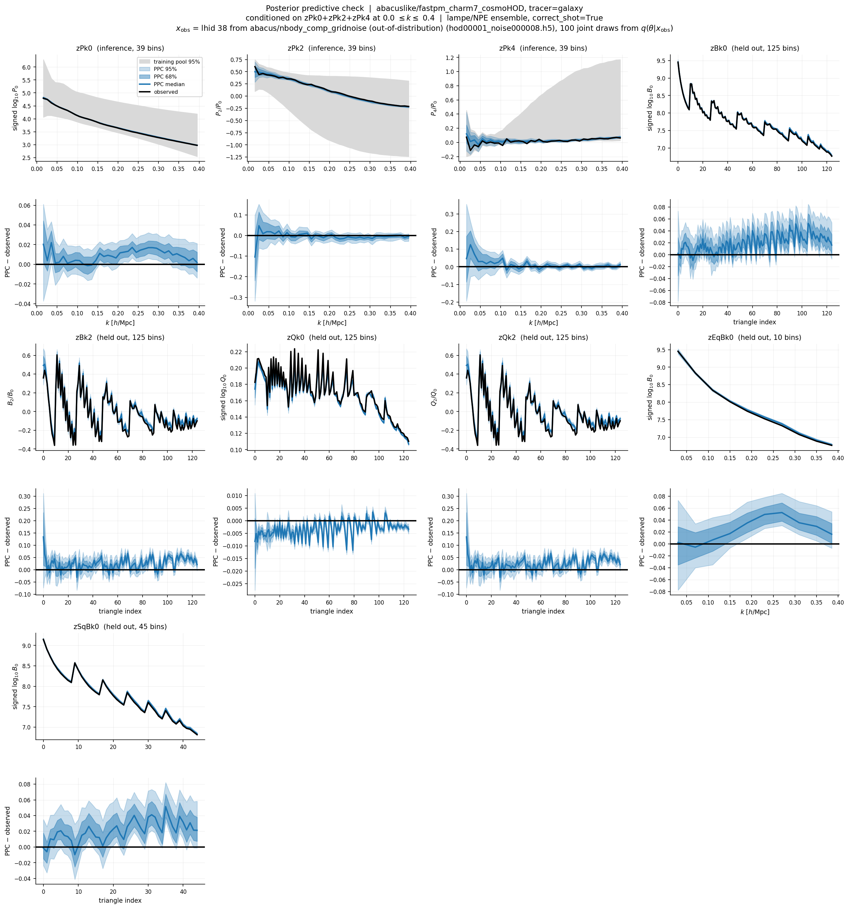
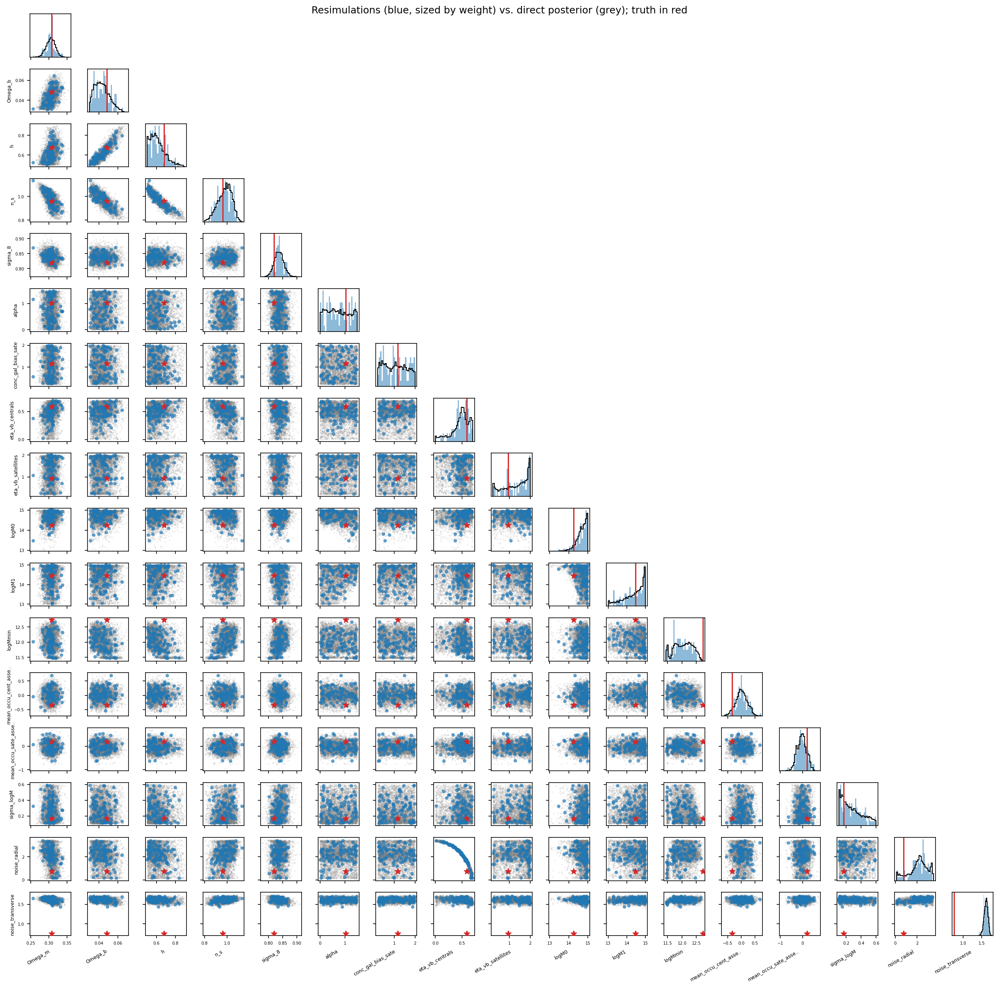
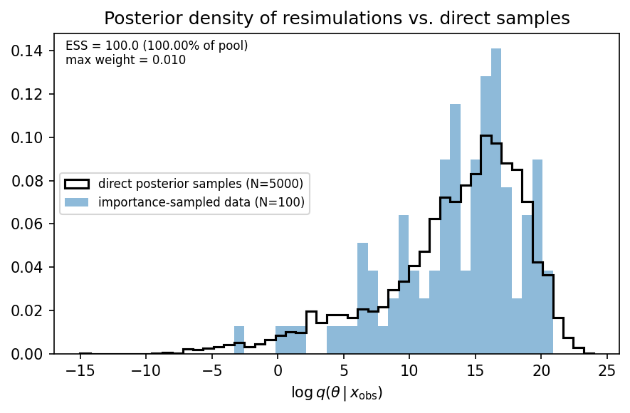

# Posterior predictive check: `abacuslike/fastpm_charm7_cosmoHOD` against an Abacus N-body observation (zPk024, kmax=0.4)

**Date**: 2026-09-22
**Type**: Miscellaneous / posterior predictive check
**Train**: abacuslike fastpm_charm7_cosmoHOD, L=2000 Mpc/h, N=256, z=0.5 (a=0.66666); posterior and forward chain both from this suite
**Test**: abacus nbody_comp_gridnoise, lhid 38 = `AbacusSummit_base_c018_ph000` ("MultiDark Planck"), LCDM with Mnu=0, L=2000 Mpc/h, `hod00001_noise000008.h5` (σ_rad = σ_tran = 0.75175)
**Notes**: Out-of-distribution: only the observation moves, the posterior, the forward chain and the quantile reference pool stay the training suite's. 100 joint draws from q(θ|x_obs), all 100 collected with cosmology, HOD and noise verified against the draw to 1e-5. Residuals are element-wise between resimulated and observed feature vectors. Same train/test pair as the 2026-08-20 OOD inference run.

---

## Setup

- Posterior: 10-net lampe/NPE ensemble at
  `abacuslike/fastpm_charm7_cosmoHOD/models/galaxy/zPk0+zPk2+zPk4/kmin-0.0_kmax-0.4`,
  `include_hod=True`, `include_noise=True`, `correct_shot=True`. 17 parameters
  (5 cosmology, 10 HOD, 2 noise); x is 117-dimensional (3 blocks of 39 k bins).
- Observed cosmology [0.30709, 0.04821, 0.6777, 0.96, 0.81971]. x_obs is
  preprocessed by the Abacus suite's own run; the k-grid, shot correction and
  log-linear settings match the training suite.
- One draw = one FastPM box (L=2000, N=256) through CHARM charm7, `apply_hod`
  and `cmass.diagnostics.summ`, with its own IC phase. No draw was rejected or
  dropped.

## Data-space bands

Fraction of bins where the observed value falls outside the predictive
interval. Bins within a summary are strongly correlated, so these are a
description of the figure rather than a test; median |z| is the median
residual in units of the 68% half-width.

| Block | Bins | Outside 68% | Outside 95% | Median (PPC − obs) | Median \|z\| |
|---|---|---|---|---|---|
| zPk0 (inference) | 39 | 54% | 36% | +0.009 | 1.23 |
| zPk2 (inference) | 39 | 18% | 3% | −0.005 | 0.59 |
| zPk4 (inference) | 39 | 31% | 8% | +0.004 | 0.64 |
| zBk0 (held out) | 125 | 70% | 46% | +0.019 | 1.33 |
| zEqBk0 (held out) | 10 | 70% | 50% | +0.023 | 1.47 |
| zSqBk0 (held out) | 45 | 80% | 42% | +0.019 | 1.33 |
| zBk2 (held out) | 125 | 63% | 37% | +0.024 | 1.42 |
| zQk0 (held out) | 125 | 83% | 68% | −0.003 | 3.10 |
| zQk2 (held out) | 125 | 63% | 37% | +0.024 | 1.42 |

- The predictive ensemble sits systematically above the observed zPk0 at every
  k: median offset +0.009 in signed log10 P0, i.e. the predicted P0 is high by
  +1.5% to +3.4% over 0.1 < k < 0.35 and by +4.8% at the lowest bin (k=0.016).
  The offset is worst over 0.2 < k < 0.3, where all 10 bins fall outside the
  68% band at a median 2.3σ; it relaxes to 1.1σ over 0.3 < k < 0.4 and to
  0.3σ over 0.05 < k < 0.1. The 68% half-width at k=0.2 is 0.007 dex, so the
  bands are tight enough that a sub-percent systematic exceeds them.
- zPk2 is the best-recovered conditioned block (median |z| = 0.59, no bin
  beyond 1.6σ). The largest single residual is −0.104 in P2/P0 at the lowest
  bin, k=0.016, where the band is ~0.11 wide (0.9σ).
- zPk4 agrees within 0.4σ over k > 0.2 but runs high at low k: +0.059 median
  residual in P4/P0 over k < 0.05, peaking at +0.125 (1.6σ) at k=0.026.
- The held-out bispectra all run high by a similar amount to zPk0 and more
  consistently: zBk0 +4.5% in B0 (median over 125 triangles, range −2% to
  +13%), zEqBk0 +5.5%, zSqBk0 +4.5%. The offset grows with triangle index
  across zBk0 and zSqBk0 — near zero for the first ~20 triangles, ~+0.04 dex
  by index 100 — and with k in zEqBk0, from ~0 at k=0.05 to +0.05 at k=0.27.
- zBk2 sits +0.024 above the observed B2/B0 across the triangle set, with a
  +0.13 spike at the first triangle index; 63% of bins are outside 68%.
  `zQk2` is numerically identical to `zBk2` (Q2/Q0 ≡ B2/B0), so that panel is
  a duplicate rather than an independent check.
- zQk0 is the tightest block and the most-exceeded one: the residual is only
  −0.003 dex (−0.7% in Q0) but the 68% half-width is 0.0009 dex, so 83% of
  bins land outside 68% and 68% outside 95%, at a median 3.1σ and up to 13σ.
  It is the one block where the PPC is systematically low rather than high.
- The predictive bands are far narrower than the training pool's 95% range on
  all three conditioned blocks: at k=0.4 the pool spans ~1.5 in P2/P0 and
  ~1.6 in P4/P0, against ~0.03 and ~0.04 for the predictive 68% band.

## Parameter space

The drawn parameters are direct posterior samples by construction, so these
figures check the campaign bookkeeping rather than the model.

- The 100 simulated vectors tile the direct 5000-sample posterior in all 17
  parameters with no visible offset in any 1D or 2D projection, so nothing
  drifted between drawing and simulating.
- Against the true values of the Abacus point, Ωm and σ8 are recovered
  (z = −0.2 and +1.2 on the marginals); the largest cosmology offset is h,
  0.613 (+0.096/−0.081) against 0.678. HOD offsets are larger, logMmin
  11.97 (+0.34/−0.26) against 12.73 being the most discrepant. The two noise
  parameters are recovered high (noise_transverse 1.61 ± 0.06 against 0.752),
  as expected when the training and testing suites carry different intrinsic
  noise in their forward models.

- The log-posterior-density histogram of the 100 simulated vectors overlaps
  the direct 5000-sample histogram. The ESS and max-weight annotations and the
  "importance-sampled data" legend label are inherited from the
  importance-sampling figure this reuses and are vacuous for an unweighted
  ensemble (ESS = N, max weight = 1/N by construction).
