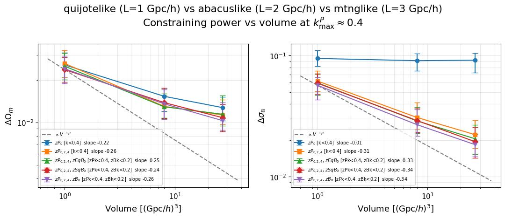
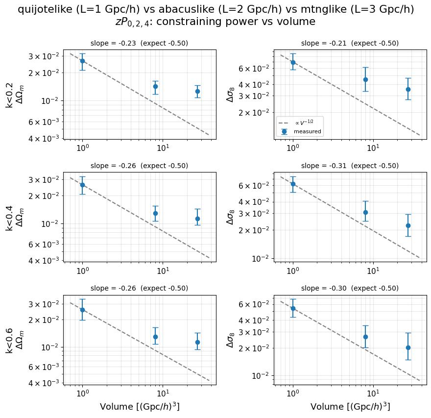
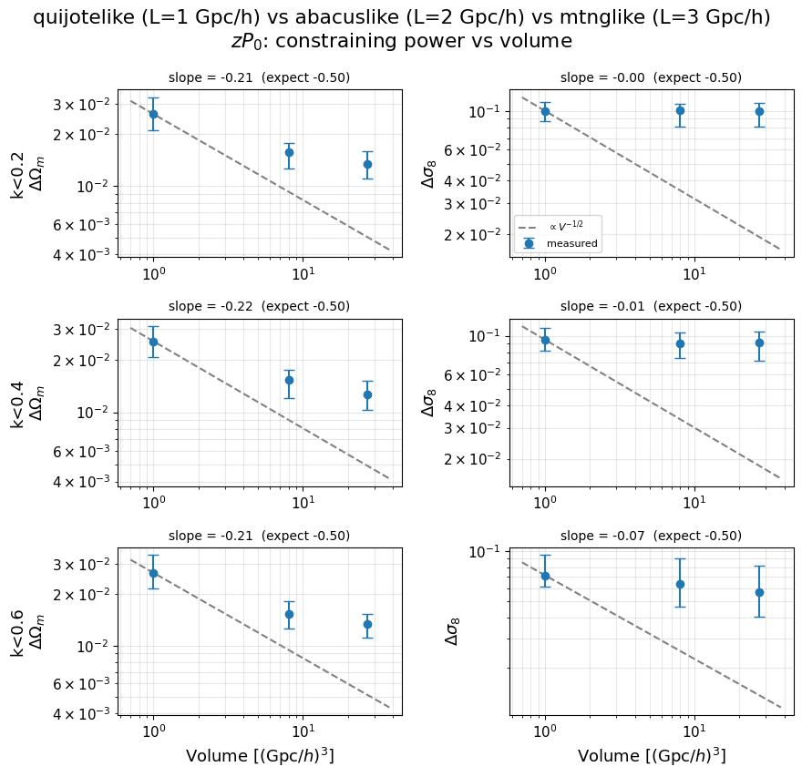
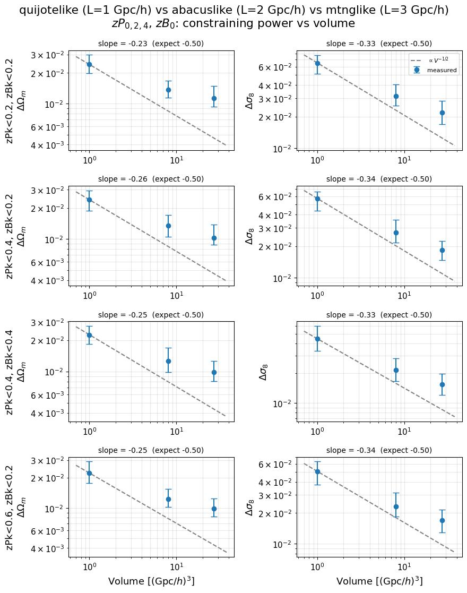
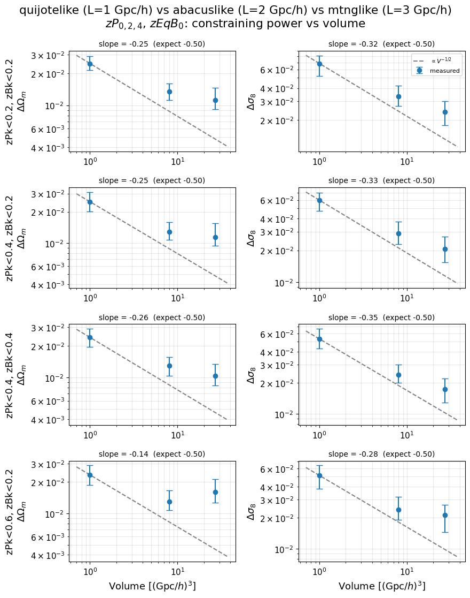
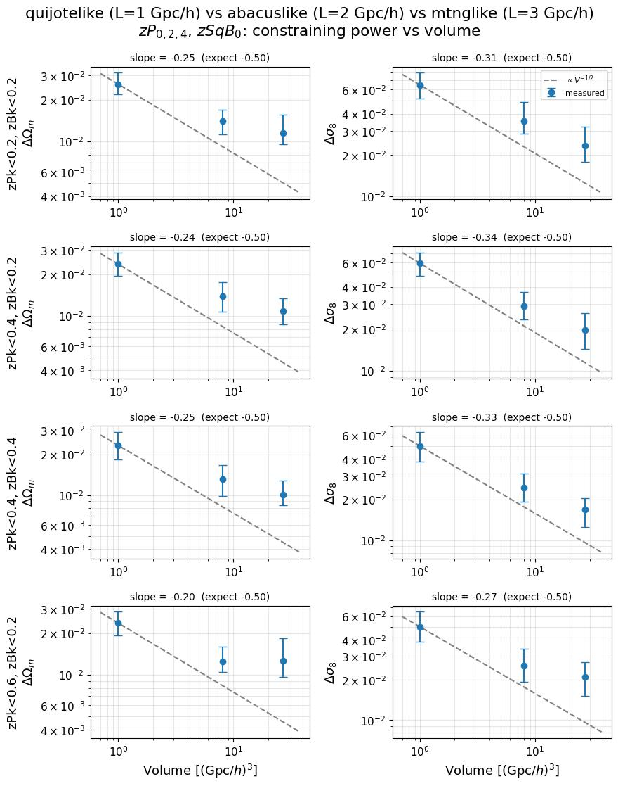
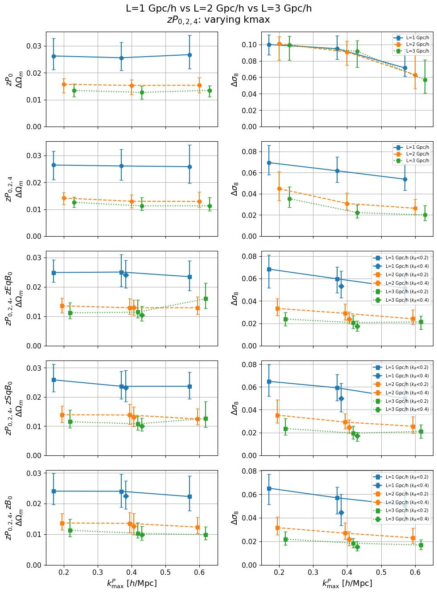
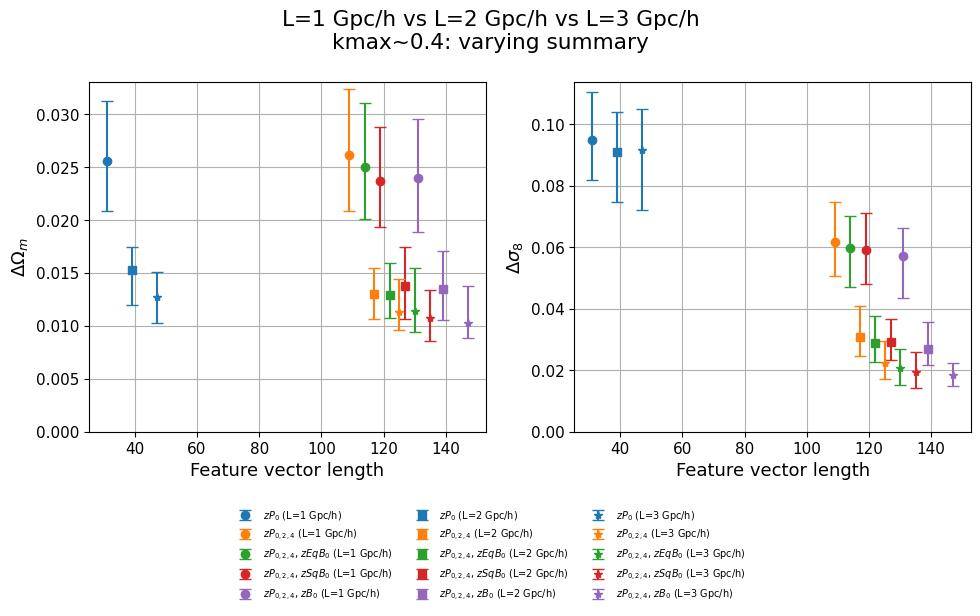

# Box-size ladder: 1 vs 2 vs 3 Gpc/h — constraining power vs volume

**Date**: 2026-09-23
**Type**: Multisim comparison
**Suites**: quijotelike/fastpm_charm7_cosmoHOD (L=1 Gpc/h, V=1), abacuslike/fastpm_charm7_cosmoHOD (L=2, V=8), mtnglike/fastpm_charm7 (L=3, V=27 (Gpc/h)³)
**Tracer**: galaxy
**Summaries**: zPk0, zPk0+zPk2+zPk4, zPk0+zPk2+zPk4+zEqBk0, zPk0+zPk2+zPk4+zSqBk0, zPk0+zPk2+zPk4+zBk0
**kmax**: zPk kmax 0.2–0.6; the all-summary overlay holds the reference cut at zPk≈0.4
**Fiducial nbar band**: 1e-4 to 5e-4
**Notes**: All three suites run the same fastpm_charm7 pipeline on the same galaxy tracer, infer the same 17-parameter theta (5 cosmology + 10 HOD + 2 noise), and share the same 5 summaries and the same k-cut grid, so cells match one-to-one by directory name. The metric is the median posterior stdev over test points near Ωm=0.3 / σ8=0.8 in a fixed nbar band — the same `fiducial_stdev` used by the self-consistent notes. This extends the two-suite comparison in [2026-08-19](../2026-08-19_self_abacuslike-fastpm_charm7/update.md) to a third volume; the suites there have since been renamed to `*_cosmoHOD`.

## Overview

- At a fixed zPk≈0.4 cut, every summary gains from volume but none of them at the 1/√V rate. Fitting log Δ against log V across the three boxes gives Ωm slopes of −0.22 to −0.26 and σ8 slopes of −0.31 to −0.34 for the four summaries containing the multipoles, against −0.50 expected. The V^-1/2 guide in the figure below sits clearly beneath every measured curve.

- zPk0 alone is the outlier and the clearest single result here: its σ8 slope is −0.01, i.e. Δσ8 is essentially unchanged from V=1 to V=27 (0.0948 → 0.0909 → 0.0917). Its Ωm slope is −0.22, in line with the other summaries. Adding the quadrupole and hexadecapole is what makes σ8 respond to volume at all, taking the slope from −0.01 to −0.31.
- Per-summary values at the reference cut, as (ΔΩm / Δσ8) for V = 1 / 8 / 27:

| Summary | k-cut | V=1 | V=8 | V=27 | slope Ωm | slope σ8 |
|---|---|---|---|---|---|---|
| zPk0 | k<0.4 | 0.0256 / 0.0948 | 0.0153 / 0.0909 | 0.0127 / 0.0917 | −0.22 | −0.01 |
| zPk024 | k<0.4 | 0.0261 / 0.0618 | 0.0130 / 0.0309 | 0.0113 / 0.0223 | −0.26 | −0.31 |
| +zEqBk0 | zPk<0.4, zBk<0.2 | 0.0250 / 0.0597 | 0.0129 / 0.0289 | 0.0114 / 0.0206 | −0.25 | −0.33 |
| +zSqBk0 | zPk<0.4, zBk<0.2 | 0.0237 / 0.0593 | 0.0138 / 0.0291 | 0.0108 / 0.0195 | −0.24 | −0.34 |
| +zBk0 | zPk<0.4, zBk<0.2 | 0.0240 / 0.0570 | 0.0135 / 0.0269 | 0.0103 / 0.0184 | −0.26 | −0.34 |

- The four multipole-containing summaries are nearly indistinguishable from each other in slope (−0.24 to −0.26 on Ωm, −0.31 to −0.34 on σ8) and stay within ~10% of each other in absolute stdev at every volume. Which bispectrum is added changes the normalisation slightly and the volume response essentially not at all.
- The shortfall is concentrated in the second step of the ladder. From V=1 to V=8 (8×) ΔΩm for zPk024 falls by a factor 2.0 and Δσ8 by 2.0; from V=8 to V=27 (3.4×) they fall by only 1.15 and 1.39. 1/√V would predict 2.8 and 1.8 respectively. The curve flattens at the large-volume end rather than tracking the reference line at a constant offset.
- The pattern holds across kmax, not just at the reference cut. Over all 18 (summary, k-cut) cells, Ωm slopes span −0.14 to −0.26 and σ8 slopes −0.00 to −0.35. The two shallowest Ωm cells are zPk<0.6, zBk<0.2 for +zEqBk0 (−0.14) and +zSqBk0 (−0.20) — the same two cells where the L=3 ΔΩm rises rather than falls in the [galaxy self-consistent note](../2026-09-23_self_mtnglike-fastpm_charm7_galaxy/update.md).

Per-k-cut detail, zPk0+zPk2+zPk4

Per-k-cut detail, zPk0

Per-k-cut detail, bispectrum summaries

## kmax and feature-length scaling across the three suites

- The three suites separate cleanly by volume at every kmax and every summary, and the ordering L=1 > L=2 > L=3 in stdev never inverts. Within each suite the kmax trends match what the individual self-consistent notes report: σ8 improves with kmax while Ωm is flat or nearly so.

kmax scaling, three suites overlaid

Feature-length scaling at kmax≈0.4, three suites overlaid

### Per-suite diagnostics

Each suite's own kmax and feature sweeps were regenerated alongside the comparison, under `figures/model_scaling/L_1_Gpc_h/`, `L_2_Gpc_h/` and `L_3_Gpc_h/`. The L=3 set duplicates the [galaxy self-consistent note](../2026-09-23_self_mtnglike-fastpm_charm7_galaxy/update.md), where it is discussed.
