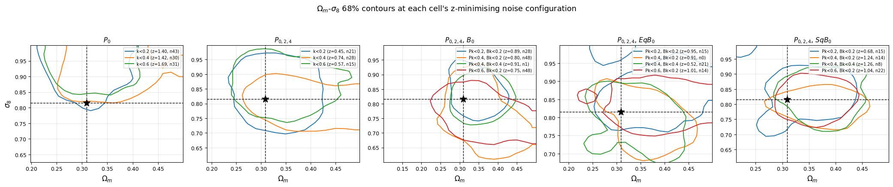
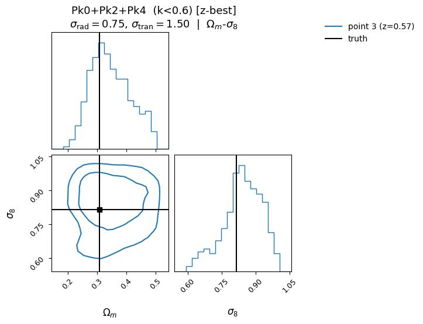
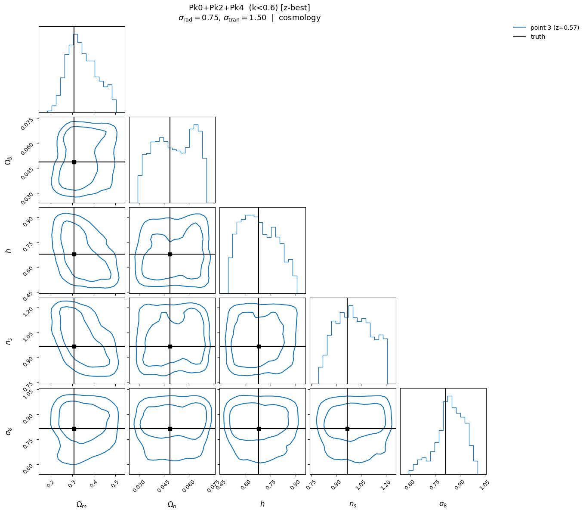
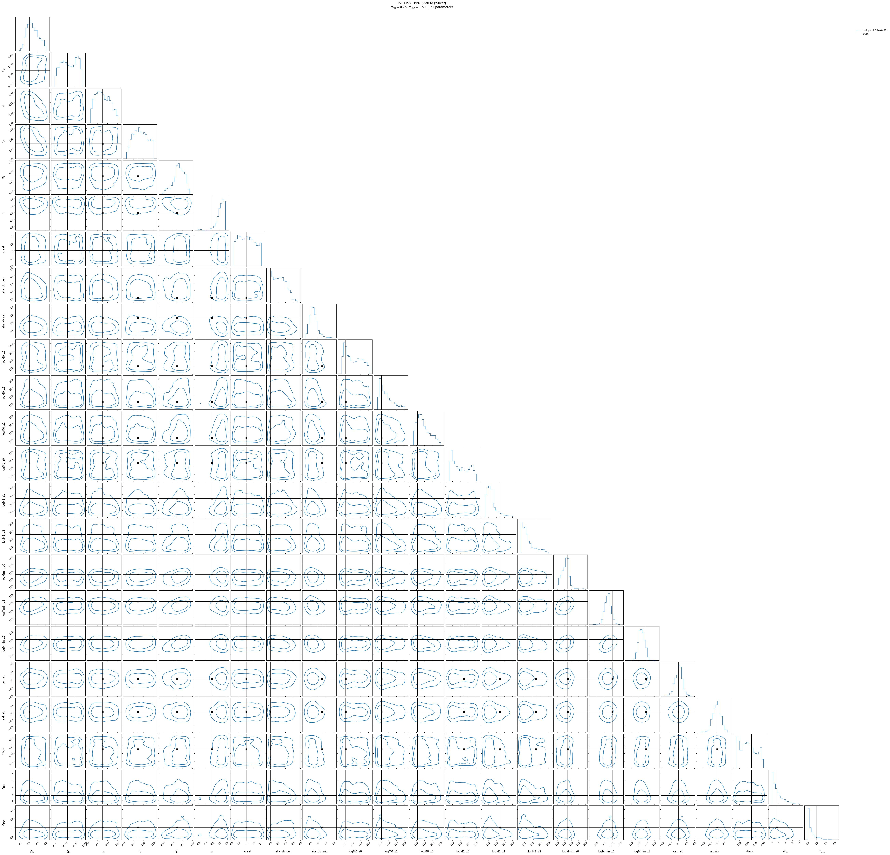
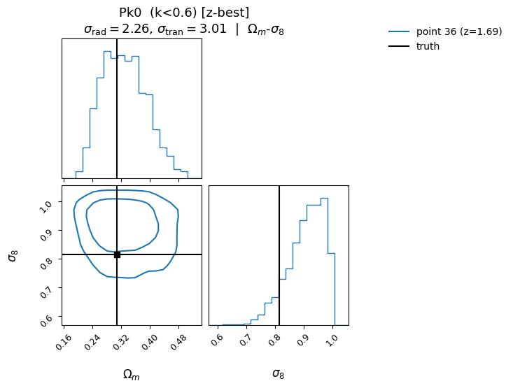
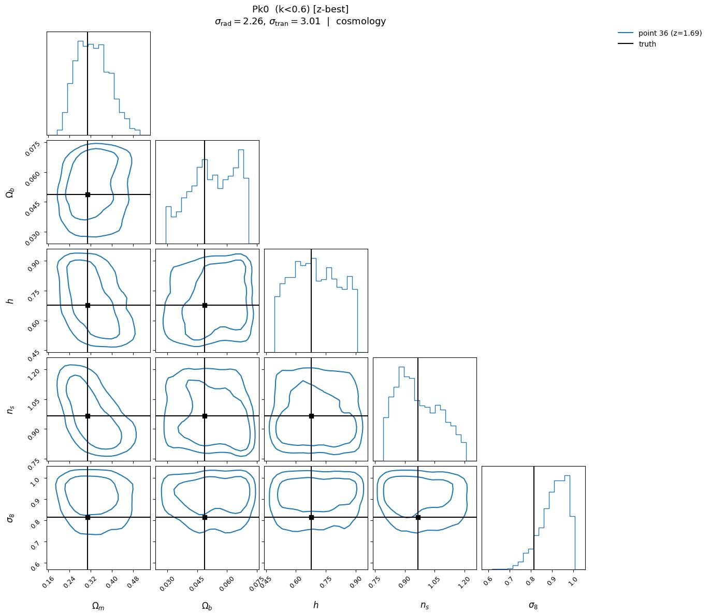
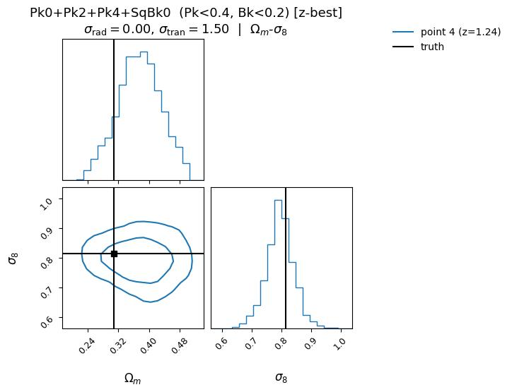
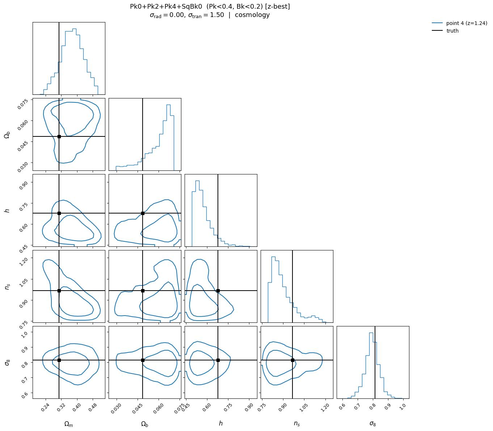

# mtnglike / fastpm_charm7 → MTNG lightcone — OOD inference

**Date**: 2026-09-23
**Type**: OOD inference (single-cosmology, corner plots)
**Train**: mtnglike/fastpm_charm7
**Test**: mtng/nbody
**Tracer**: mtng_lightcone
**Summaries**: Pk0, Pk0+Pk2+Pk4, Pk0+Pk2+Pk4+EqBk0, Pk0+Pk2+Pk4+SqBk0, Pk0+Pk2+Pk4+Bk0 (18 cells, all recovered)
**kmax**: Pk kmax 0.2–0.6, scalar and dynamic Pk/Bk cuts
**Notes**: MillenniumTNG lightcone at its own cosmology, 49 noise configurations with one test point each. A single true cosmology means coverage and calibration statistics over a population of cosmologies are not available, so none are produced; the diagnostic is the posterior against a known truth, summarised by the joint Mahalanobis z on (Ωm, σ8), z = sqrt(dᵀC⁻¹d) with d = θ_true − posterior median and C the 2×2 posterior covariance. Each cell contributes corners at its z-minimising noise configuration plus 3 drawn at random. No self-consistent reference is drawn.

## Overview

- Recovery is good across the board: mean z averaged over the full noise grid is 1.41, 89.8% of the 882 (cell, noise) combinations sit at z < 2, and all 18 cells reach z < 2 at their z-minimising configuration. Every cell's 68% Ωm–σ8 contour encloses the truth in the global figure.

- Pk0 alone is the weakest summary and the only one that fails often: 27.9% of its noise configurations exceed z = 2, rising to a cell mean of 2.01 at k<0.6. Adding the quadrupole and hexadecapole removes the failures entirely — Pk0+Pk2+Pk4 has no configuration above z = 2 at any kmax, and is the best summary overall (cell means 0.87–0.91 at k<0.6 and k<0.2).
- Adding a bispectrum to the multipoles does not improve on the multipoles alone and mildly degrades them: +Bk0 2.0%, +EqBk0 9.2% and +SqBk0 13.8% of configurations above z = 2, against 0.0% for Pk0+Pk2+Pk4. The worst bispectrum cell is +SqBk0 at Pk<0.4, Bk<0.2 (cell mean 1.75).
- The direction of the offset is consistent and dominated by Ωm, which is over-predicted in every one of the 18 cells: the median (pred − true) Ωm runs +0.012 to +0.086, or +0.16σ to +1.71σ in units of the posterior width. σ8 is over-predicted by +1.6σ to +1.9σ for Pk0 alone but drops to within ±0.9σ for every multipole and bispectrum cell, and changes sign with kmax (positive at Pk<0.2, negative at Pk<0.4 and above) for all three bispectra.
- z degrades monotonically with radial noise, from 1.27 at σ_rad = 0 to 1.72 at σ_rad = 4.51 averaged over cells. The transverse dependence is weaker and saturates: 1.34 at σ_tran = 0 rising to 1.47 at σ_tran = 3.01 and flat thereafter. Recovery is therefore most sensitive to line-of-sight positional noise.
- The z-minimising configuration is not systematically at low noise — it lands at σ_tran ≥ 1.50 for 12 of 18 cells, and at the grid corner (4.51, 4.51) for two +Bk0 cells. Given the spread across the grid, the per-cell best configuration should be read as one draw from a noisy surface rather than a preferred noise level.

## Figures

### Best-recovered cell — Pk0+Pk2+Pk4, k<0.6 (cell mean z = 0.87)

Corners at the z-minimising configuration (n15, σ_rad = 0.75, σ_tran = 1.50)

<table>
<tr>
<td></td>
<td></td>
</tr>
</table>

### Weakest cell — Pk0, k<0.6 (cell mean z = 2.01)

Corners at the z-minimising configuration (n31, σ_rad = 2.26, σ_tran = 3.01)

<table>
<tr>
<td></td>
<td></td>
</tr>
</table>

### Worst bispectrum cell — Pk0+Pk2+Pk4+SqBk0, Pk<0.4, Bk<0.2 (cell mean z = 1.75)

Corners at the z-minimising configuration (n14, σ_rad = 0.00, σ_tran = 1.50)

<table>
<tr>
<td></td>
<td></td>
</tr>
</table>

### Per-cell z table

`figures/z_summary.csv` holds the mean, min and max z for every (summary, k-cut, noise configuration) combination — 882 rows — alongside σ_rad and σ_tran and the number of test points per bin.
