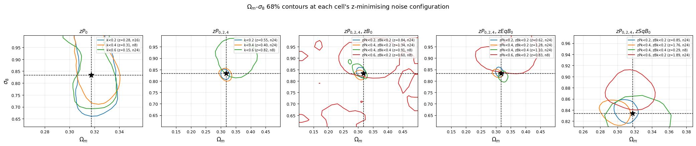
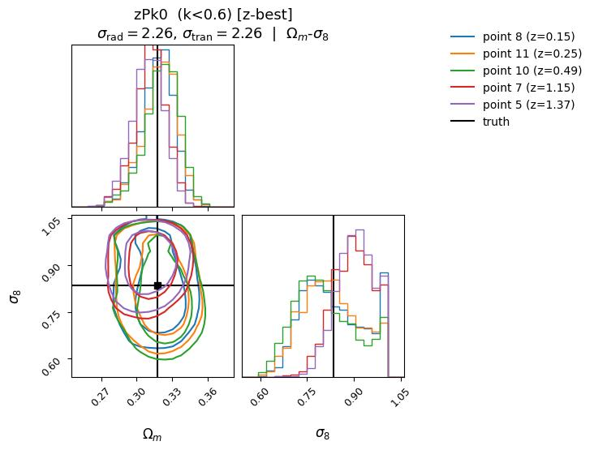
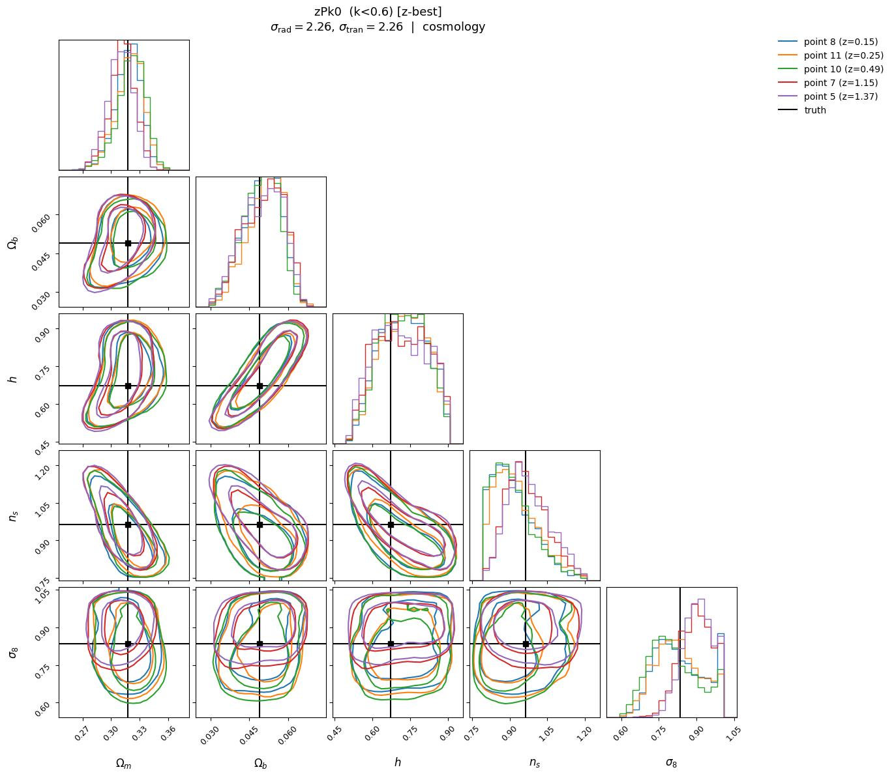
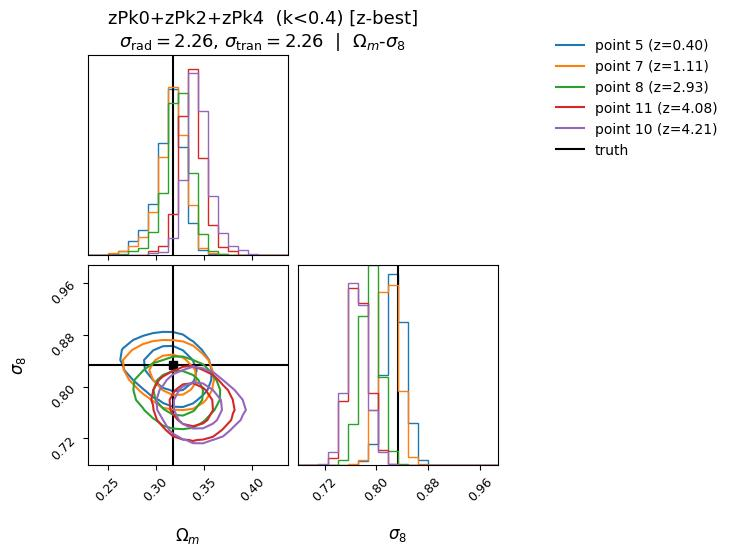
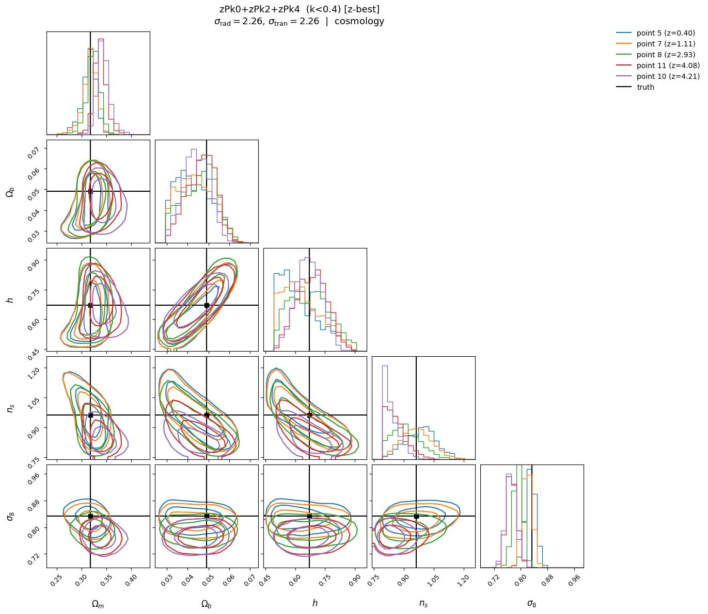
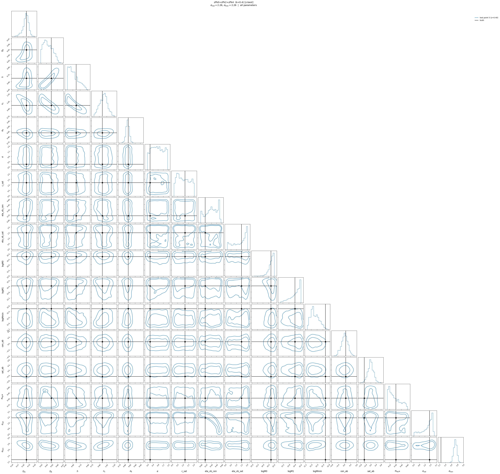
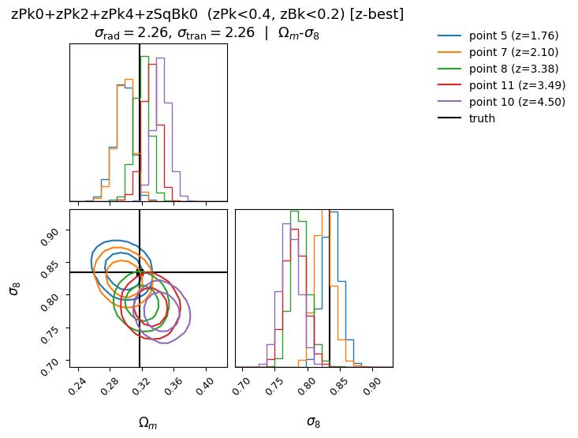
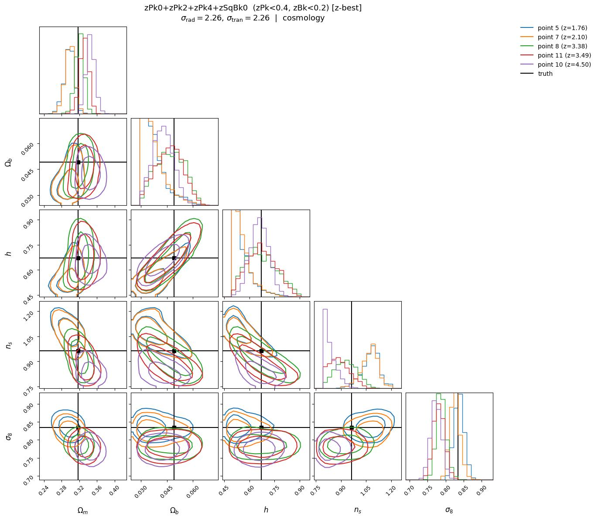

# mtnglike / fastpm_charm7 → Quijote 3 Gpc/h — OOD inference

**Date**: 2026-09-23
**Type**: OOD inference (single-cosmology, corner plots)
**Train**: mtnglike/fastpm_charm7
**Test**: quijote3gpch/nbody
**Tracer**: galaxy
**Summaries**: zPk0, zPk0+zPk2+zPk4, zPk0+zPk2+zPk4+zEqBk0, zPk0+zPk2+zPk4+zSqBk0, zPk0+zPk2+zPk4+zBk0 (18 cells, all recovered)
**kmax**: zPk kmax 0.2–0.6, scalar and dynamic zPk/zBk cuts
**Notes**: Single Quijote N-body realisation at the fiducial cosmology (lhid 2000, L=3 Gpc/h). A single true cosmology means coverage and calibration statistics over a population of cosmologies are not available, so none are produced; the diagnostic is the posterior against a known truth, summarised by the joint Mahalanobis z on (Ωm, σ8), z = sqrt(dᵀC⁻¹d) with d = θ_true − posterior median and C the 2×2 posterior covariance. No self-consistent reference is drawn.

**Coverage limitation**: this test set spans only 3 of the 49 noise-grid configurations, and all three lie on the σ_rad = σ_tran diagonal (0.75, 1.50, 2.26), with 5 HOD realisations each for 15 test points in total. There is no σ_rad vs σ_tran contrast available, so nothing here separates radial from transverse positional noise. The remaining 46 configurations need galaxy catalogues regenerated, not just preprocessing. The noise-selection logic in the script is general and will pick the rest up automatically once they exist.

## Overview

- Recovery degrades sharply and monotonically with the zPk cut, and this is the dominant pattern. Averaged over cells and noise configurations, mean z runs 0.80 at k<0.2, 1.79 at k<0.4 and 2.21 at k<0.6 for the scalar cuts, and 1.58 → 3.21 at zPk<0.2 → zPk<0.4 for the bispectrum summaries. Only 8 of 18 cells reach z < 2 even at their best noise configuration; the overall mean z is 2.25.

- Holding the zPk cut at 0.4 while loosening the zBk cut from 0.2 to 0.4 *improves* recovery (mean z 3.21 → 2.75), and every cell at zPk<0.2 is better than the same summary at zPk<0.4. The degradation therefore tracks the power-spectrum cut rather than the bispectrum cut.
- The only cells that stay well recovered at high kmax are zPk0 alone (cell mean z 0.74 / 0.97 / 2.17 at k<0.2 / 0.4 / 0.6) and zPk0+zPk2+zPk4 at k<0.2 (0.87). Every bispectrum summary is above z = 1.5 at its best cut.
- Ωm is over-predicted in 16 of 18 cells, and the offset grows with the zPk cut: median (pred − true) Ωm is +0.16σ to +0.24σ at zPk<0.2, and +0.59σ to +1.58σ at zPk<0.6, reaching +0.040 absolute (+1.21σ) for +zEqBk0.
- σ8 changes sign with the zPk cut in every summary that includes the multipoles. At zPk<0.4 it is strongly under-predicted — −2.93σ for zPk0+zPk2+zPk4, −3.72σ for +zBk0, −3.48σ for +zEqBk0, −3.37σ for +zSqBk0, the largest single-parameter offsets anywhere in this run. At zPk<0.6 the same cells over-predict σ8 by +1.22σ to +2.42σ. Loosening the zBk cut to 0.4 at fixed zPk<0.4 pulls σ8 back to within ±0.9σ.
- Scatter between the 5 HOD realisations at a fixed noise configuration is large and comparable to the bias itself: the z spread within a (cell, noise) bin has a median of 2.46 and reaches 6.42. In the featured corner below, the five realisations at one configuration span z = 0.40 to 4.21. Differences between individual cells should be read against that spread.
- The three available noise configurations differ little: mean z 2.28 / 2.36 / 2.10 at σ = 0.75 / 1.50 / 2.26. With only the diagonal sampled, no noise trend can be established.

## Figures

### Best-recovered cell — zPk0, k<0.6 (cell mean z = 0.68 at its best configuration)

Corners at the z-minimising configuration (n24, σ_rad = σ_tran = 2.26)

<table>
<tr>
<td></td>
<td></td>
</tr>
</table>

### σ8 sign flip — zPk0+zPk2+zPk4, k<0.4 (σ8 under-predicted by 2.93σ)

Corners at the z-minimising configuration (n24, σ_rad = σ_tran = 2.26)

<table>
<tr>
<td></td>
<td></td>
</tr>
</table>

### Worst cell — zPk0+zPk2+zPk4+zSqBk0, zPk<0.4, zBk<0.2 (cell mean z = 3.33)

Corners at the z-minimising configuration (n24, σ_rad = σ_tran = 2.26)

<table>
<tr>
<td></td>
<td></td>
</tr>
</table>

### Per-cell z table

`figures/z_summary.csv` holds the mean, min and max z for every (summary, k-cut, noise configuration) combination — 54 rows, 5 test points each — alongside σ_rad and σ_tran.
