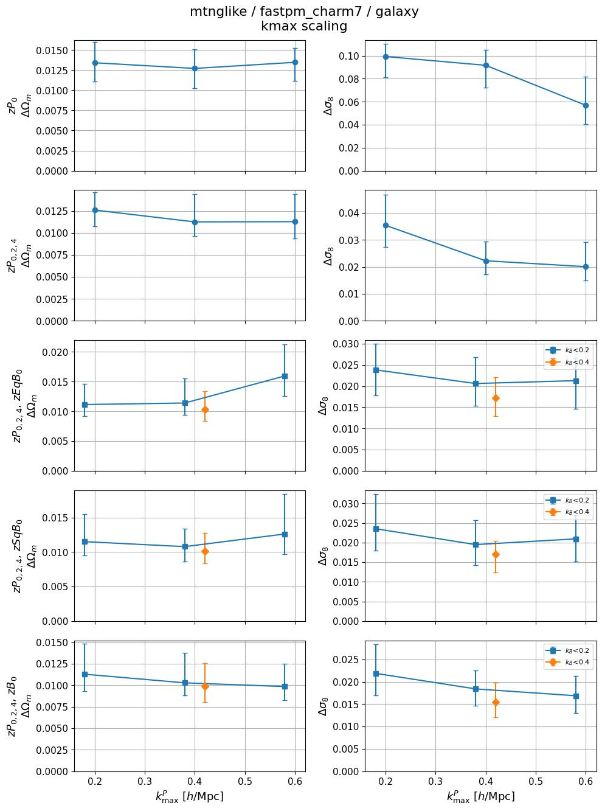
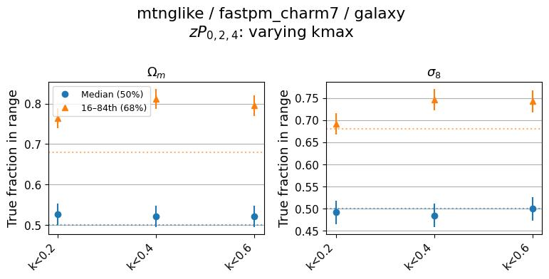
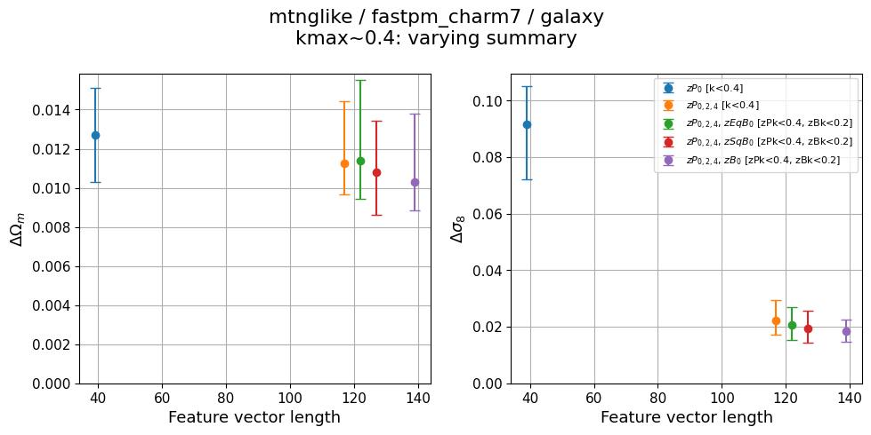
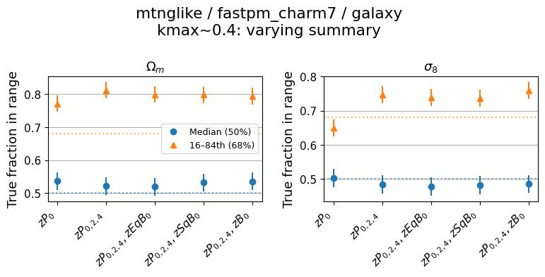
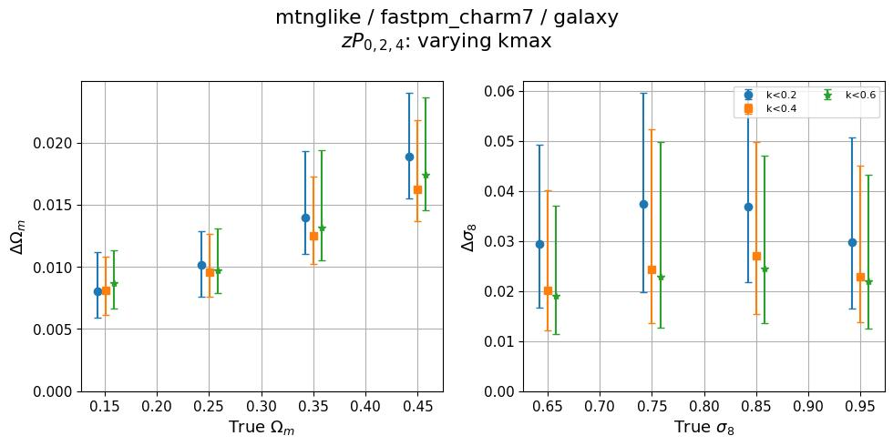
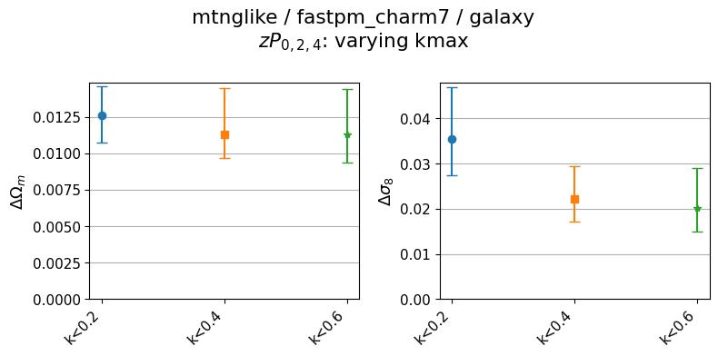
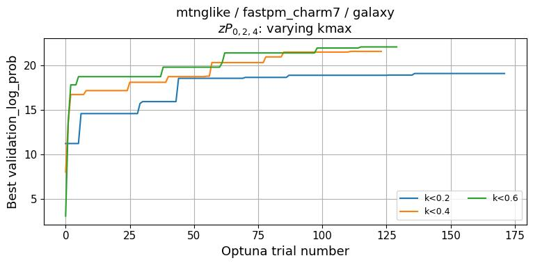
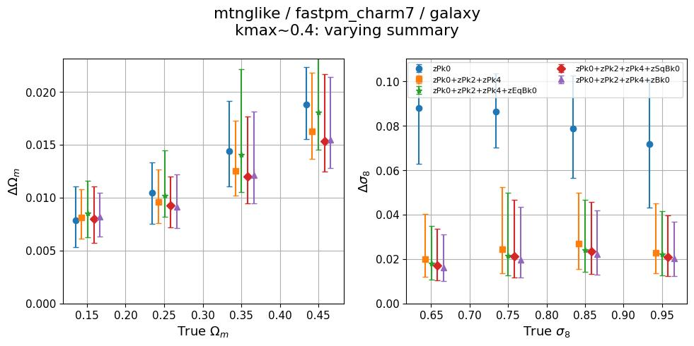
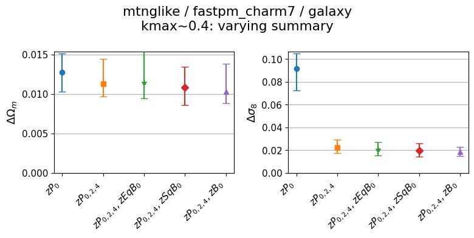
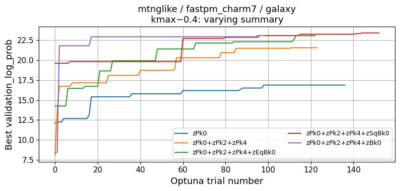

# mtnglike / fastpm_charm7 (galaxy) — self-consistent diagnostics

**Date**: 2026-09-23
**Type**: Self-consistent
**Suite**: mtnglike/fastpm_charm7 (L = 3 Gpc/h)
**Tracer**: galaxy
**kmax sweep summary**: zPk0+zPk2+zPk4 (k-cuts auto-discovered: k<0.2, k<0.4, k<0.6)
**kmax values**: zPk kmax 0.2–0.6, scalar and dynamic zPk/zBk cuts
**Feature sweep kmax**: ~0.4 (per-summary k-cut with closest zPk kmax)
**Feature sweep summaries**: zPk0, zPk0+zPk2+zPk4, zPk0+zPk2+zPk4+zEqBk0, zPk0+zPk2+zPk4+zSqBk0, zPk0+zPk2+zPk4+zBk0
**Notes**: 1775 test points, 18 (summary, k-cut) cells, all recovered. Fiducial stdev is the median over the 66 test points near Ωm=0.3 / σ8=0.8 with nbar in 1e-4 to 5e-4. A box-size ladder comparing this suite against the L=1 and L=2 Gpc/h suites is written up separately in [2026-09-23 multisim](../2026-09-23_multisim_quijotelike-fastpm_charm7_cosmoHOD_vs_abacuslike-fastpm_charm7_cosmoHOD_vs_mtnglike-fastpm_charm7/update.md).

## Overview

- Calibration holds throughout. The median coverage sits at 0.48–0.54 for both Ωm and σ8 across every kmax and every summary, well within the ±0.1 target. The 68% interval fraction runs conservative in both sweeps — 0.76–0.81 for Ωm and 0.65–0.76 for σ8 — and is flat with kmax rather than drifting.
- **Flagged, kmax sweep**: Ωm constraining power does not improve with kmax for the power spectrum alone. ΔΩm for zPk0 is 0.0134 / 0.0127 / 0.0135 at k<0.2 / 0.4 / 0.6 — flat to within the error bars — while Δσ8 over the same cuts improves substantially, 0.0993 → 0.0917 → 0.0569. zPk0+zPk2+zPk4 shows the same asymmetry more mildly: ΔΩm 0.0126 → 0.0113 → 0.0113 (plateauing after k<0.4) against Δσ8 0.0354 → 0.0223 → 0.0201.
- Two of the three bispectrum summaries get *worse* on Ωm at the loosest power-spectrum cut: ΔΩm for +zEqBk0 runs 0.0112 → 0.0114 → 0.0160 as the zPk cut goes 0.2 → 0.4 → 0.6 at fixed zBk<0.2, and +zSqBk0 runs 0.0115 → 0.0108 → 0.0126. +zBk0 is the exception and improves monotonically, 0.0113 → 0.0103 → 0.0099. Δσ8 improves or holds flat for all three over the same range.
- Loosening the bispectrum cut from zBk<0.2 to zBk<0.4 at fixed zPk<0.4 helps both parameters for every bispectrum summary: ΔΩm 0.0114→0.0103 (+zEqBk0), 0.0108→0.0101 (+zSqBk0), 0.0103→0.0099 (+zBk0); Δσ8 0.0206→0.0173, 0.0195→0.0170, 0.0184→0.0154. The best single cell anywhere in the sweep is +zBk0 at zPk<0.4, zBk<0.4 (ΔΩm 0.0099, Δσ8 0.0154).
- Feature sweep at kmax≈0.4 is monotonic within uncertainty for both parameters: ΔΩm 0.0127 (zPk0) → 0.0113 (zPk024) → 0.0114 (+zEqBk0) → 0.0108 (+zSqBk0) → 0.0103 (+zBk0) over feature vectors of length 39 → 117 → 122 → 127 → 139, and Δσ8 0.0917 → 0.0223 → 0.0206 → 0.0195 → 0.0184. The +zEqBk0 point sitting 0.0001 above zPk024 on Ωm is far inside the error bars. Nearly all of the σ8 gain comes from adding the multipoles; the bispectra add a further ~17%.
- Optuna converges cleanly in both sweeps with no divergence or instability. In the kmax sweep each cut plateaus within ~50–120 trials, with higher cuts reaching higher best validation log-prob (~22–23 at k<0.4–0.6 vs ~19 at k<0.2). In the feature sweep the ordering follows feature length: ~17 for zPk0, ~21.5 for zPk024, and ~23–23.5 for the three bispectrum summaries.
- Posterior stdev is cosmology-dependent for Ωm and roughly flat for σ8. ΔΩm rises steadily with true Ωm, from ~0.008 at Ωm ≈ 0.15 to ~0.019 at Ωm ≈ 0.45, and the kmax ordering is preserved across the whole range. Δσ8 is flat to mildly decreasing across true σ8 (~0.029 down to ~0.020 at k<0.6), with the k<0.2 curve clearly above the other two at every bin.

## Figures

### kmax sweep

kmax scaling

Calibration

### Feature sweep

Feature length scaling

Calibration

### Zoom-ins

kmax_sweep (flagged)

<table>
<tr>
<td></td>
<td></td>
</tr>
<tr>
<td></td>
<td></td>
</tr>
</table>

feature_sweep

<table>
<tr>
<td></td>
<td></td>
</tr>
<tr>
<td></td>
<td></td>
</tr>
</table>

