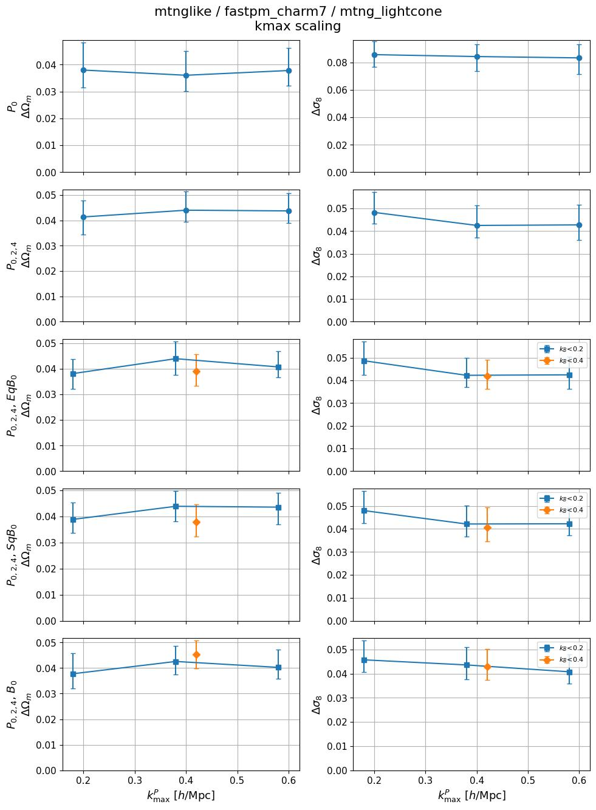
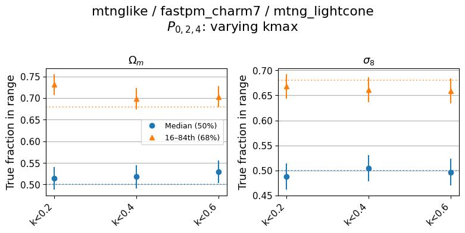
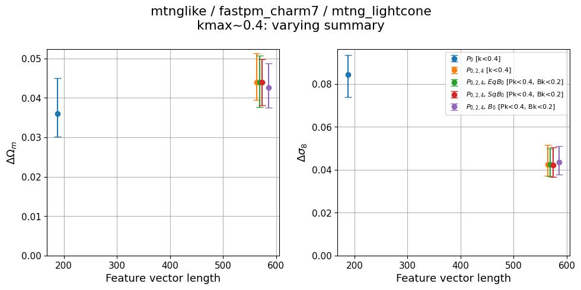
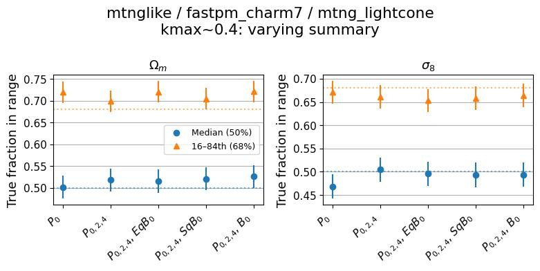
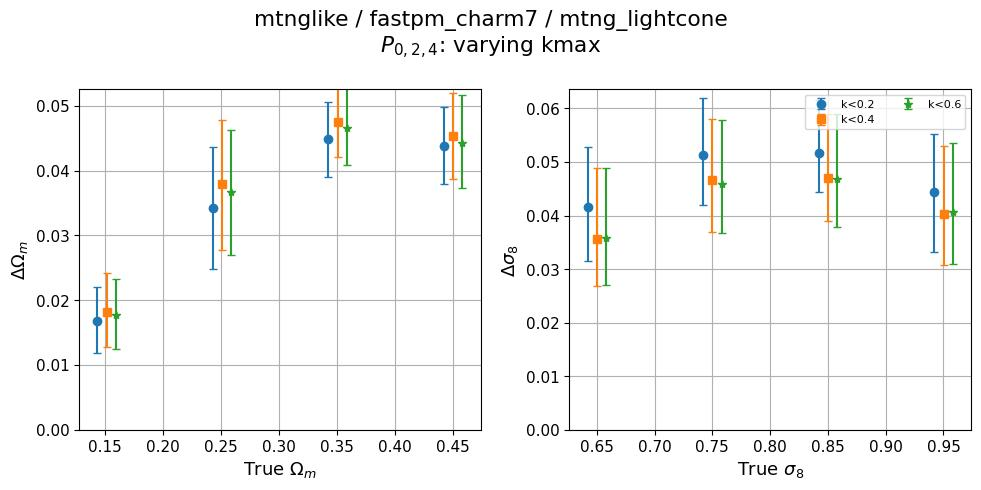
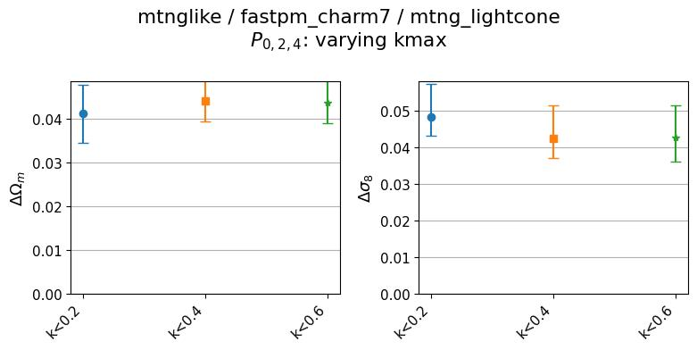
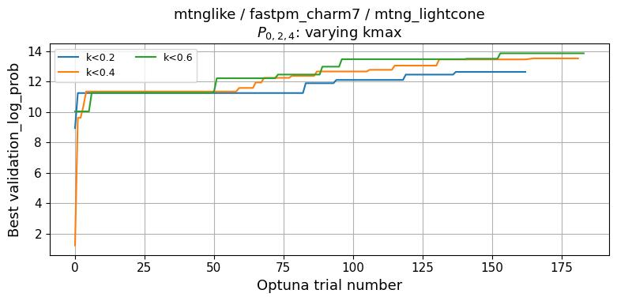
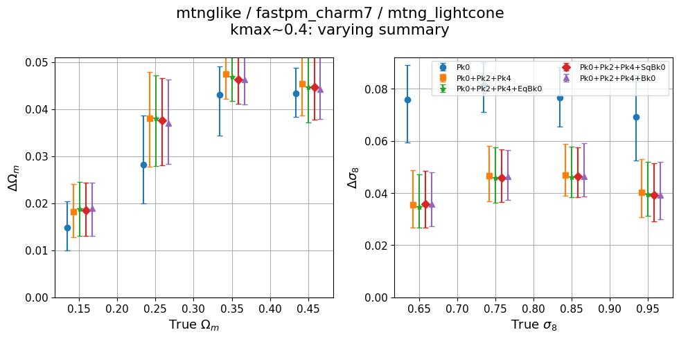
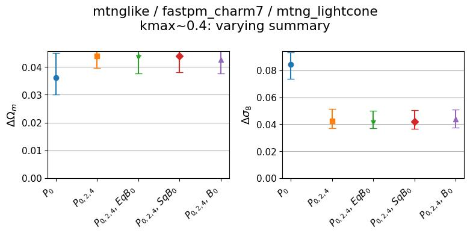
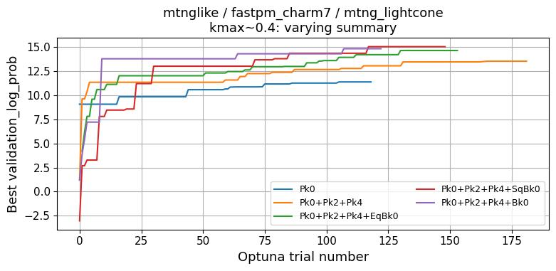

# mtnglike / fastpm_charm7 (mtng_lightcone) — self-consistent diagnostics

**Date**: 2026-09-23
**Type**: Self-consistent
**Suite**: mtnglike/fastpm_charm7 (L = 3 Gpc/h)
**Tracer**: mtng_lightcone
**kmax sweep summary**: Pk0+Pk2+Pk4 (k-cuts auto-discovered: k<0.2, k<0.4, k<0.6)
**kmax values**: Pk kmax 0.2–0.6, scalar and dynamic Pk/Bk cuts
**Feature sweep kmax**: ~0.4 (per-summary k-cut with closest Pk kmax)
**Feature sweep summaries**: Pk0, Pk0+Pk2+Pk4, Pk0+Pk2+Pk4+EqBk0, Pk0+Pk2+Pk4+SqBk0, Pk0+Pk2+Pk4+Bk0
**Notes**: 1780 test points, 18 (summary, k-cut) cells, all recovered. This tracer infers a 23-parameter theta (5 cosmology + 16 redshift-binned HOD + 2 noise) and its summaries carry no `z` prefix. Its nbar range is [-6.22, -4.22] in log10, an order of magnitude below the cubic-box galaxy tracer, so the fiducial-point band is 1e-5 to 1e-4 rather than the usual 1e-4 to 5e-4; that band selects 104 test points near Ωm=0.3 / σ8=0.8. Figures are directly comparable to the galaxy tracer's only with that difference in mind.

## Overview

- Calibration holds in both sweeps. Median coverage is 0.47–0.53 for both Ωm and σ8 across every kmax and summary, comfortably inside the ±0.1 target. The 68% interval fraction is 0.69–0.73 for Ωm (mildly conservative) and 0.65–0.67 for σ8 (mildly anti-conservative), both within roughly one error bar of the 0.68 target. Miscalibration is not what drives the problems below.
- **Flagged, kmax sweep**: neither parameter improves with kmax for any summary. ΔΩm for Pk0+Pk2+Pk4 runs 0.0413 → 0.0440 → 0.0437 at k<0.2 / 0.4 / 0.6, i.e. it gets slightly *worse* and then flattens; Pk0 alone runs 0.0380 → 0.0360 → 0.0378, flat within error. Δσ8 improves only marginally and then stops: 0.0482 → 0.0425 → 0.0427 for the multipoles, and 0.0858 → 0.0844 → 0.0834 for Pk0 alone. Every bispectrum summary shows the same flat-to-rising pattern on Ωm across the Pk cut.
- **Flagged, feature sweep**: adding the multipoles to Pk0 at kmax≈0.4 *increases* ΔΩm from 0.0360 to 0.0440 while the feature vector grows from 188 to 564 entries, and the three bispectrum summaries stay at that raised level (0.0439, 0.0439, 0.0426 for +EqBk0, +SqBk0, +Bk0 at 569–588 features). This is the known pathology where a longer feature vector yields a wider posterior when training is not extracting the added information. σ8 behaves as expected over the same range, improving sharply from 0.0844 to 0.0425 and then flat.
- The Ωm/σ8 asymmetry is the consistent story across both sweeps: σ8 responds to added multipole information (roughly a factor 2 improvement) and then saturates, while Ωm is flat or degrades no matter how much spectral information is added.
- Loosening the bispectrum cut from Bk<0.2 to Bk<0.4 at fixed Pk<0.4 helps Ωm for two of three bispectra — 0.0439→0.0389 (+EqBk0) and 0.0439→0.0378 (+SqBk0) — but hurts +Bk0, 0.0426→0.0453. σ8 is unchanged to within 0.001 for all three.
- Optuna converges cleanly with no oscillation or divergence in any cell. In the feature sweep, Pk0 plateaus near trial 50 at best validation log-prob ~11.4, Pk0+Pk2+Pk4 near trial 70 at ~13.5, and the bispectrum summaries take ~100–150 trials to reach ~14.5–15. Best log-prob therefore rises with feature length even where ΔΩm does not improve. In the kmax sweep all three cuts plateau by ~100 trials, k<0.6 highest at ~14 and k<0.2 lowest at ~12.5.
- Posterior stdev is strongly cosmology-dependent for Ωm: ΔΩm climbs from ~0.017 at true Ωm ≈ 0.15 to ~0.045 at Ωm ≈ 0.35–0.45, a factor of ~2.6 across the prior range, with the three kmax cuts indistinguishable at every bin. Δσ8 varies much less, ~0.036–0.051 across true σ8, peaking around σ8 ≈ 0.75–0.85.
- Compared with the galaxy tracer on the same suite and box ([2026-09-23 galaxy](../2026-09-23_self_mtnglike-fastpm_charm7_galaxy/update.md)), ΔΩm is roughly 3.5–4× larger (0.036–0.045 vs 0.010–0.016) and Δσ8 roughly 2× larger at kmax≈0.4 (0.042 vs 0.018–0.022), despite feature vectors 4–5× longer. The two tracers are selected on different nbar bands, so this is a comparison of each tracer at its own fiducial density rather than a like-for-like one.

## Figures

### kmax sweep

kmax scaling

Calibration

### Feature sweep

Feature length scaling

Calibration

### Zoom-ins

kmax_sweep (flagged)

<table>
<tr>
<td></td>
<td></td>
</tr>
<tr>
<td></td>
<td></td>
</tr>
</table>

feature_sweep (flagged)

<table>
<tr>
<td></td>
<td></td>
</tr>
<tr>
<td></td>
<td></td>
</tr>
</table>

