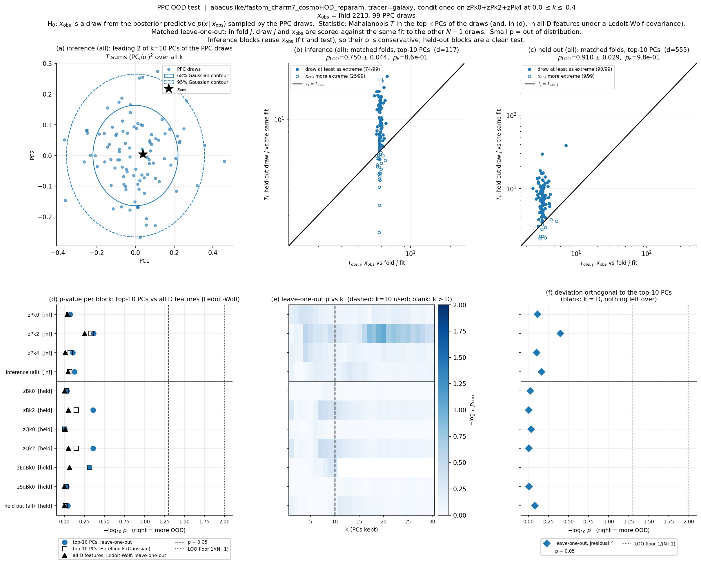
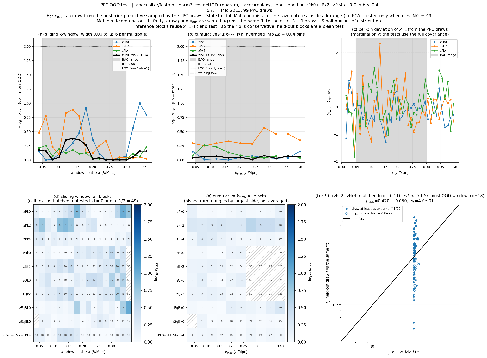
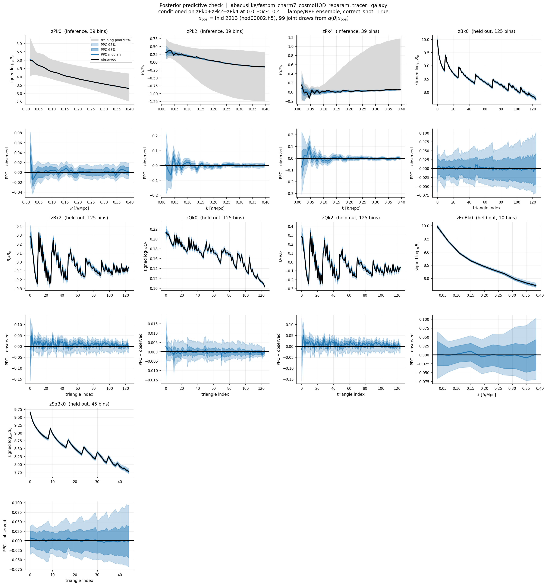
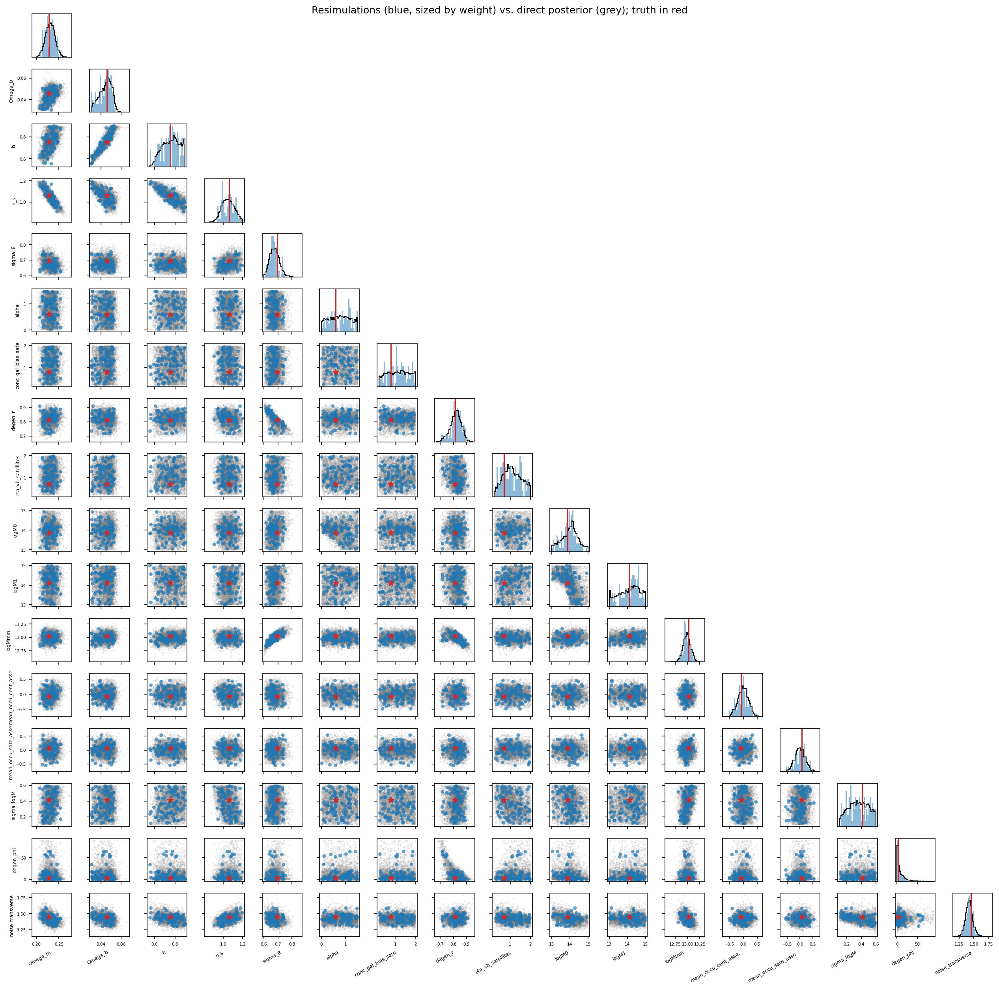
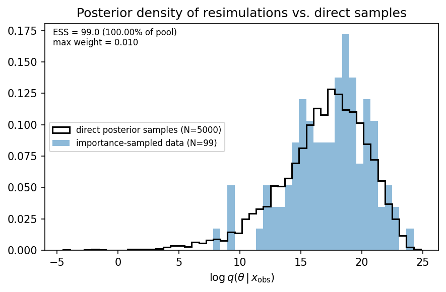

# Posterior predictive check: `abacuslike/fastpm_charm7_cosmoHOD_reparam` self-consistent (zPk024, kmax=0.4)

**Date**: 2026-09-24
**Type**: Miscellaneous / posterior predictive check
**Suite**: abacuslike fastpm_charm7_cosmoHOD_reparam, L=2000 Mpc/h, N=256, z=0.5; self-consistent, x_obs from the training suite's own test split (lhid 2213, `hod00002.h5`). Trained with `infer.reparam_degeneracy=True`, so the flow samples (`degen_r`, `degen_phi`) in place of (`eta_vb_centrals`, `noise_radial`)
**Notes**: 99 of 100 draws collected (one draw has status `missing_diag`), so N = 99 and the p-value floor is 1/(N+1) = 0.01. The draws were inverted to physical parameters for the simulations. Observed cosmology [Ωm, Ωb, h, ns, σ8] = [0.2277, 0.0457, 0.7534, 1.0621, 0.6942]. The self-consistent PPC on the non-reparam predecessor (`fastpm_charm6_comphod`, lhid 1880) is in the 2026-08-13 note; the OOD PPC on `fastpm_charm7_cosmoHOD` is in the 2026-09-22 note. `plots/ppc_pvalue.png` and `ppc_pvalues.tsv` in the campaign directory (38 draws, older p-value implementation) are stale and not used.

---

## Overview

- x_obs is typical of the posterior predictive in every test. In the top-10 PCA space p = 0.75 ± 0.04 for the conditioned vector (117 features) and 0.91 ± 0.03 for the held-out vector (555 features); Hotelling p_F = 0.86 and 0.98. Per block p = 0.85 (zPk0), 0.43 (zPk2), 0.79 (zPk4) for the conditioned blocks and 0.44-0.99 for the held-out blocks (zBk0 0.93, zBk2/zQk2 0.44, zQk0 0.99, zEqBk0 0.49, zSqBk0 0.94).

- The all-feature Ledoit-Wolf test also passes, p = 0.90 for the conditioned vector and 1.00 for the held-out vector (blocks 0.56-1.00), and the deviation orthogonal to the top-10 PCs is unremarkable in every block (p = 0.40-0.99). In the OOD PPC on the non-reparam suite the same two tests disagreed (Ledoit-Wolf at the floor against PCA 0.67 for the conditioned vector); here they agree.
- No k-bin subset test is significant. Every sliding-window and cumulative curve stays below -log10 p ≈ 1.0 (p ≳ 0.1). The largest values are zPk0 at the k = 0.34 window (p ≈ 0.1) and zPk2 at k = 0.14 (p ≈ 0.13), and the combined P(k) vector never exceeds -log10 p ≈ 0.4 in a window or ≈ 0.08 cumulatively at any kmax up to 0.4. The most OOD combined window, 0.11 ≤ k < 0.17, has p = 0.42 ± 0.05.

- The per-bin deviation of x_obs from the draws is within ±1.5σ in nearly all bins of zPk0, zPk2 and zPk4, with no trend in k and no sign preference. The exceptions are zPk2 at k ≈ 0.135 (+2.3σ) and zPk4 at k ≈ 0.045 (−1.9σ), and the neighbouring bin at −1.7σ.
- In data space the predictive median follows the observed vector through all nine blocks. The PPC − observed residual is within ±0.02 in signed log10 P0 for k > 0.03 (68% half-width ~0.01) and reaches +0.035 at the lowest bin, k = 0.016. zPk2 and zPk4 residuals are up to ~0.1 at k < 0.06 with bands of similar width and shrink to < 0.01 above k = 0.2. The held-out bispectra residuals stay within ±0.02 (B0) with 68% bands of ±0.025-0.04, and Q0 within ±0.002 with a band of ~0.003.

- The predictive bands are much narrower than the training pool's 95% range on the conditioned blocks: at k = 0.4 the pool spans ~1.5 in P2/P0 and ~1.2 in P4/P0, against ~0.03 for the predictive 68% band.
- The 99 simulated parameter vectors overlay the direct 5000-sample posterior in all 17 parameters, with no visible offset in any 1D or 2D projection, and the true parameters of lhid 2213 lie inside the bulk in every marginal. The posterior on `degen_phi` is strongly skewed, with the bulk at 0-10 and a sparse tail to ~80 that the draws sample as a handful of points; `degen_r` is anticorrelated with σ8 and logMmin, and σ8 correlates with logMmin.

- The log-posterior-density histogram of the 99 resimulated vectors overlaps the direct histogram (mode ~17-19 for both), with a few draws in a left tail at log q ≈ 8-10. The ESS = 99 and max-weight = 0.010 annotations, and the "importance-sampled data" label, are inherited from the importance-sampling figure and hold by construction for an unweighted ensemble.

## Caveats

- This is a self-consistent check at a single test point, and the two earlier PPCs differ in the point and the suite: lhid 2213 here, lhid 1880 for charm6 and Abacus lhid 38 for the OOD run. Passing here therefore does not test the OOD behaviour that failed in the 2026-09-22 note; the same OOD observation has not yet been checked against the reparam posterior.
- The inference-block p-values are conservative by construction, since x_obs is used to fit the same predictive. The held-out blocks are the informative test, and they pass.
- With N = 99 the leave-one-out p has Monte Carlo noise of ~0.05 near p = 0.5, so differences between blocks such as zPk2 (0.43) and zPk0 (0.85) are not significant.
