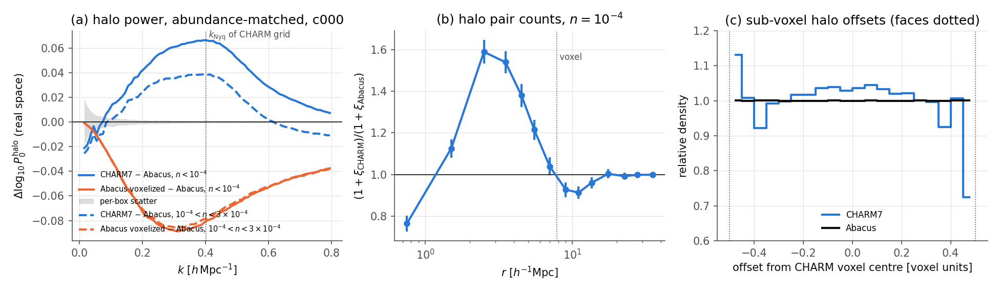
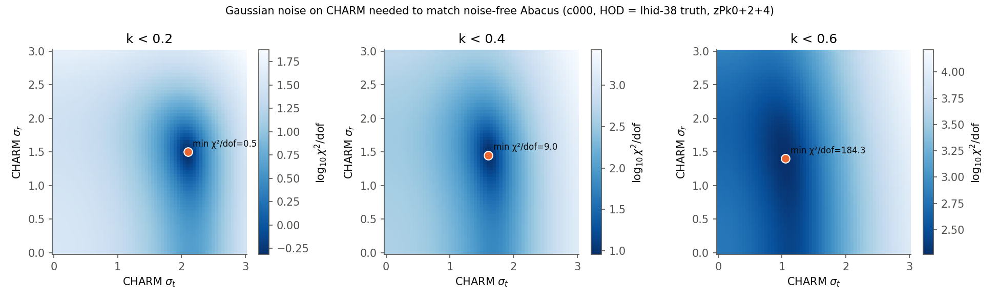
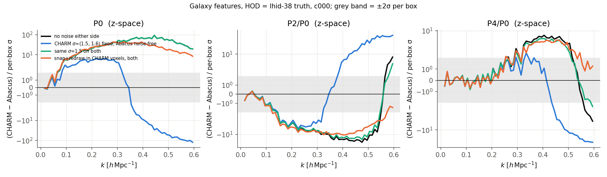
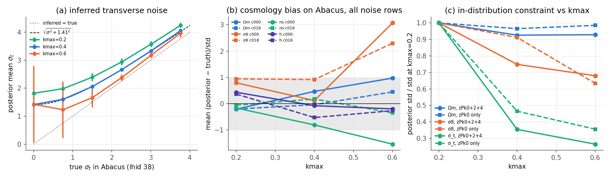
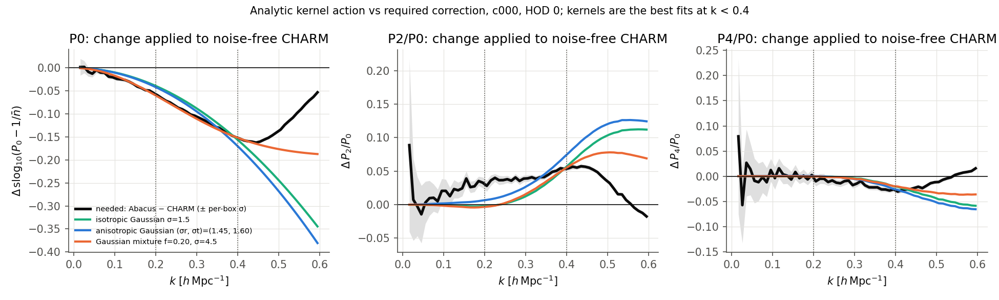
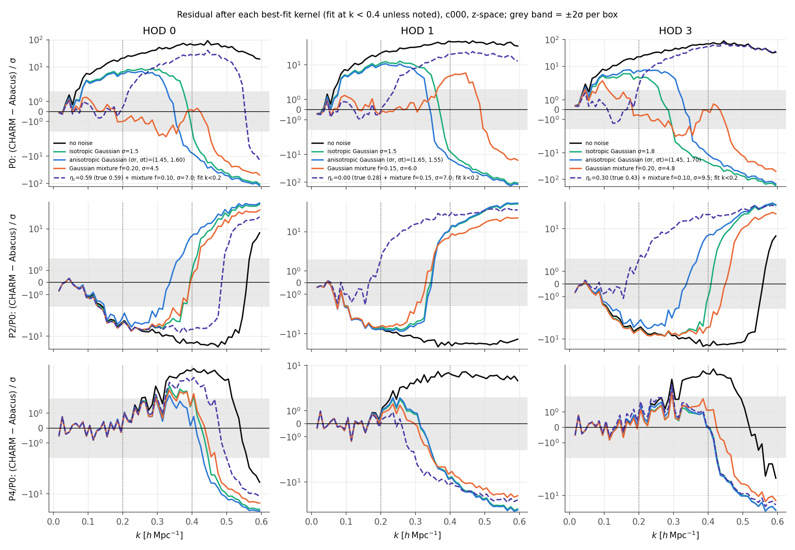
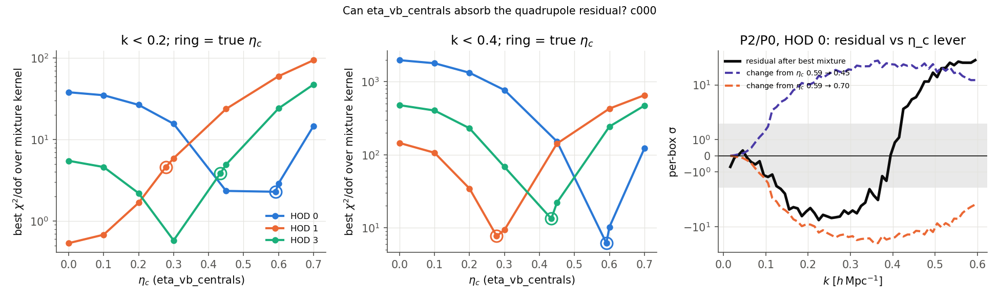

# Diagnosing the CHARM7 → Abacus OOD bias, and whether to drop or fix the noise nuisance

**Date**: 2026-09-28
**Type**: Diagnosis / model misspecification
**Train**: abacuslike fastpm_charm7 (halos) and fastpm_charm7_cosmoHOD (trained NPE ensembles), L=2000 Mpc/h, N=256, z=0.5
**Test**: abacus nbody_comp_gridnoise, c000 (Planck2018, lhid 0–5, six phases, Mν=0.06 eV) and c018 (lhid 38, Mν=0, the box used in the 2026-09-22 PPC)
**Notes**: No new N-body or halo catalogs. Galaxies were re-populated from existing `halos.h5` with shared HODs and summarized on a noise grid; all new data is in `cmass-ili/tmp/charm_vs_abacus/`. No networks were retrained.

---

## Summary

- **CHARM7 over-clusters halos on the scale of its own voxel.** At fixed number density, halo P0 is up to 16% too high at k ≈ 0.4. That is π/7.8 Mpc/h, the Nyquist frequency of the CHARM grid. The cause is **twice too many halo pairs at 1–4 Mpc/h straddling neighbouring voxels**. Voxel occupancy is exactly right.
- **The noise nuisance is not modelling voxelization error.** It is partially cancelling that excess. Real voxelization error has the opposite sign: it removes power. The network reads Abacus as CHARM with an extra σ_t = 1.41 Mpc/h of noise added in quadrature, almost exactly.
- **A Gaussian only has the right shape at k ≲ 0.2.** Beyond that, what is left over is the P0 residual seen in the 2026-09-22 PPC (+2–3% at 0.1 < k < 0.3). At k_max = 0.6 the inference breaks: σ8 is biased by +2 to +3σ.
- **Recommendations:**
  - Do not drop the noise.
  - If you fix it, use (σ_r, σ_t) ≈ (1.5, 1.6) Mpc/h for k_max = 0.4, or (1.5, 2.2) for k_max = 0.2.
  - Fixing it will not remove the misfit above k ≈ 0.2. That needs k_max ≲ 0.2–0.25 or a CHARM fix.

## 1. Halo level: CHARM has too much power, and not from voxelization

CHARM7 is predicted at each Abacus cosmology by a local quadratic regression over the 64 nearest LH boxes. The regression residuals give the per-box scatter. Halos are abundance-matched in rank bins, and "Abacus voxelized" re-draws each Abacus halo uniformly inside its 7.8 Mpc/h voxel.

- **(a) Power spectrum.** CHARM − Abacus is +0.041 / +0.061 / +0.066 / +0.053 dex at k = 0.2 / 0.3 / 0.4 / 0.5 for n < 10⁻⁴. That is 40–60× the per-box scatter. It is +0.02–0.04 dex for 10⁻⁴ < n < 3×10⁻⁴, and fades by k ≈ 0.7.
  - Voxelizing Abacus moves the other way: −0.07 to −0.09 dex over the same k.
  - c000 and c018 agree to within 0.002 dex, so neutrinos are not involved.
- **(b) Pair counts.** CHARM has 1.6× too many halo pairs at r = 2–5 Mpc/h and about 10% too few at 8–14 Mpc/h.
- **(c) Sub-voxel offsets.** These are in CHARM's own frame: voxels are centred on grid nodes (`index = int(pos/cell + 0.5)` in training). `reconstruct_catalog` clips the flow's offsets to [−0.5, 0.5], which puts 1.5–1.8% of CHARM halos exactly on a voxel face (Abacus: 0.002%). Clipped halos from both faces land on the same coordinate, hence the single spike at −0.5.
  - A finer histogram shows the flow's density is 0.62 of uniform in the outer 2.5% of the voxel and about 1.08 at the centre.
- **Other small differences.**
  - The z-space P2/P0 of the most massive halos is off by −0.03 to −0.04 at k = 0.2–0.4 (about 5σ).
  - CHARM's 1-point halo velocity dispersion is 2.5% high.
  - At fixed density, CHARM's mass thresholds are 0.02–0.03 dex lower.

### Mechanism

A diagnostic on the 3 CHARM boxes nearest c000 against 3 Abacus c000 phases, n = 10⁻⁴:

| | CHARM | Abacus |
|---|---|---|
| P(N halos per voxel), N = 0..3 | 0.959, 0.035, 0.005, 0.001 | identical |
| Fano factor of voxel counts | 1.303 | 1.302 |
| 1+ξ, same-voxel pairs, r = 1–2 / 2–3 / 3–4 | 19.0 / 9.3 / 4.4 | 21.2 / 7.8 / 3.8 |
| **1+ξ, adjacent-voxel pairs, r = 1–2 / 2–3 / 3–4** | **14.0 / 12.8 / 9.6** | 7.7 / 5.6 / 4.8 |
| Adjacent-voxel pairs with 1 < r < 4 involving a clipped halo | 11.8% | 0.02% |

- Counts per voxel and within-voxel pair structure are right.
- **The excess is all in pairs split across a voxel boundary.** Those pairs look like real ones in every respect: orientation relative to the grid axes, face/edge/corner mix, and distance from the shared face. There are simply 2× too many of them.
- This is systematic: identical across boxes and cosmologies, and locked to the grid. But it is not a rounding bug. There is no half-cell offset, and the excess pairs carry no grid-alignment signature.
- It follows from CHARM sampling each voxel's halos conditionally independently given the smooth field. Adjacent voxels next to the same density peak both put a halo near their shared face. The autoregressive slots give CHARM exclusion within a voxel, but nothing couples it across the boundary.
- Offset clipping contributes at most about 25% of the excess.

## 2. Galaxy level: what Gaussian noise can and cannot absorb

Galaxies were populated with a shared HOD on both suites; the figures use lhid 38's true HOD. I measured zPk024 on a 5×5 (σ_r, σ_t) grid from 0 to 3.0 Mpc/h, applied as in `summ.py` (noise, then wrap to the box, then RSD). Features are in the network's space: signed-log10(P0 − 1/n̄), P2/P0 and P4/P0.

**Sanity check.** Abacus lhid 38 at σ = 0.75 reproduces the NPE's `x_test` row to 0.0025 dex in P0.

Best-fit Gaussian noise on CHARM to match **noise-free** Abacus, χ²/dof against the per-box scatter:

| k_max | HOD 0 | HOD 1 | HOD 3 | χ²/dof with no noise |
|---|---|---|---|---|
| 0.2 | (1.50, 2.10) χ² 0.5 | (1.45, 2.35) χ² 0.9 | (1.60, 2.25) χ² 1.3 | 34–50 |
| 0.3 | (1.45, 1.85) χ² 2.0 | (1.60, 1.90) χ² 6.0 | (1.50, 1.95) χ² 3.6 | 143–194 |
| 0.4 | (1.45, 1.60) χ² 9.0 | (1.65, 1.55) χ² 26 | (1.45, 1.70) χ² 12 | 417–449 |
| 0.6 | (1.40, 1.05) χ² 184 | (1.70, 0.95) χ² 179 | (1.25, 1.10) χ² 187 | 639–786 |

- Entries are (σ_r, σ_t). The values for c018 match c000 to within 0.05.
- HOD 2 (lhid 1's truth) is off-trend: it needs σ_t ≈ 2.3–3 and never fits better than χ²/dof ≈ 5. Its no-noise χ² is also small (15–26). But its per-box scatter is 5–10× that of the other HODs (0.015–0.024 against 0.002–0.008 dex in P0), meaning the quadratic cosmology regression describes it poorly. **It is a weak test rather than a physically different case.** (Correction: an earlier version attributed n̄ = 1.6×10⁻⁴ to HOD 2. The low-density HOD is HOD 1, n̄ = 1.7×10⁻⁴ with 29% satellites, and it follows the same trend as HODs 0 and 3.)
- For noisy data, the best fit adds in quadrature: σ_A = 0.75 → (1.65, 1.8) at k_max = 0.4.

**The CHARM7 mass function is low near its floor.** Cumulative n(>M), CHARM / Abacus:

| log M | 12.70 | 12.75 | 12.80 | 12.90 | 13.0 | 13.2 | 13.5 | 14.0 | 14.5 |
|---|---|---|---|---|---|---|---|---|---|
| c000 | 0.78 | 0.84 | 0.88 | 0.92 | 0.93 | 0.94 | 0.96 | 0.97 | 0.98 |
| c018 | 0.78 | 0.84 | 0.88 | 0.91 | 0.92 | 0.93 | 0.95 | 0.95 | 0.97 |

- As a result, at a fixed HOD CHARM galaxy samples are 15–18% sparser than Abacus for HODs 0, 2 and 3, whose logMmin ≈ 12.6–12.75 sits at the floor. For example, n̄ = 5.2 against 6.3 ×10⁻⁴ for HOD 0.
- This is very likely why the 2026-09-22 posterior put logMmin at 11.97 against a true 12.73: CHARM needs a lower threshold to reach the observed density.
- It slightly raises the bias of the CHARM sample in the fixed-HOD galaxy comparisons of this section, which probably accounts for the +0.01–0.02 dex low-k P0 offset.
- The high-k excess is not caused by it. The halo-level comparison (§1) is abundance-matched and shows the same excess.

- **No noise on either side (black):** CHARM P0 is high by 0.05 dex at k = 0.2 and 0.15 dex at 0.4, 20–75× the per-box scatter.
- **Fixed CHARM noise (1.5, 1.6) (blue):** matches to within 2σ up to k ≈ 0.12. It is +3 to +8σ over 0.15–0.3, then overshoots to −10 to −100σ above 0.35.
  - With the noise the NPE actually inferred, (2.11, 1.60), P0 remains +2–3% high over 0.1–0.3 and dips at 0.4. This is the PPC's zPk0 residual.
  - The same noise drives P2/P0 to −9 to −19σ over 0.2–0.4.
- **Same σ on both sides (green):** no improvement at any σ ≤ 3. χ²/dof over k < 0.4 only falls from about 415 to 215–290, and stays at 30–45 over k < 0.2. Smoothing the data as well is not a fix.
- **Snapping galaxies to CHARM's voxels and re-drawing them uniformly, on both sides (orange):** also no improvement. χ²/dof is 34–51 at k < 0.2 and 250–290 at k < 0.4. The excess lives in correlations between adjacent voxels, which snapping preserves.
- The excess is already present in real space (+0.067 dex at k = 0.2, against +0.053 in z-space). It is a position effect, not a velocity effect.

## 3. What the trained NPE does with it

The existing ensembles were evaluated on every Abacus noise-grid row for c000 (195 rows) and lhid 38 (49 rows), and on 300 CHARM test rows as an in-distribution control.

**(a) Inferred noise.** At k_max = 0.4 the inferred σ_t on lhid 38 is √(σ_true² + 1.41²) at every grid level:

| true σ_t | 0 | 0.75 | 1.50 | 2.25 | 3.01 | 3.76 |
|---|---|---|---|---|---|---|
| inferred σ_t | 1.41 | 1.60 | 2.06 | 2.66 | 3.33 | 4.05 |
| √(σ² + 1.41²) | 1.41 | 1.60 | 2.06 | 2.66 | 3.32 | 4.01 |

- Inferred σ_r ≈ 2.0 at σ_true = 0, but σ_r is degenerate with `eta_vb_centrals`, so it is less clean.
- At k_max = 0.6 the σ_r tracking breaks down.
- Rows at σ = 4.51, the prior's upper edge, come out at about 2.3 ± 1.3 at every k_max. This is a prior-boundary failure, unrelated to CHARM.

**(b) Cosmology bias.** Mean (posterior − truth)/std over all rows, c000 / c018:

| | k_max = 0.2 | 0.4 | 0.6 |
|---|---|---|---|
| Ωm | −0.21 / −0.21 | +0.46 / −0.04 | +0.97 / +0.44 |
| σ8 | +0.79 / +0.94 | +0.11 / +0.91 | **+3.07 / +2.30** |
| n_s | −0.17 / −0.06 | −0.81 / +0.17 | −1.55 / −0.35 |

- The c018 rows are 49 noise realizations of a single phase, so they share its cosmic variance.
- On the in-distribution control, the spread of z-scores is 0.83–1.0 (well calibrated to slightly conservative).
- Abacus posteriors are 1.0–2× wider than in-distribution ones.

**(c) Constraining power versus k_max.** Median in-distribution posterior std, zPk024, at k_max = 0.2 / 0.4 / 0.6:
- Ωm: 0.014 / 0.013 / 0.013
- σ8: 0.041 / 0.030 / 0.028
- σ_t: 0.35 / 0.12 / 0.09

## Answers to the hypotheses

- **The noise parameters are insufficient, or cause misspecification.**
  - Insufficient: yes, above k ≈ 0.2, because the CHARM error is not Gaussian-shaped.
  - Causing misspecification: not directly. They absorb a real CHARM error that would otherwise be even more OOD. But because they absorb it, the inferred noise has no physical meaning: σ_t is 1.6 when the truth is 0.75.
- **The network ignores high-k P0.**
  - For Ωm: effectively yes. It tightens by 7% from k_max = 0.2 to 0.4.
  - The extra high-k information goes into the noise (3× tighter) and σ8 (25% tighter). That is exactly the part CHARM gets wrong.
- **The posterior is overconstrained.**
  - No. Posteriors are calibrated in-distribution and 1–2× wider on Abacus.
  - At k_max = 0.4 the mean cosmology bias is under 1σ, apart from c018 σ8 at about +0.9σ.
  - The failure is in data space (the PPC). At k_max = 0.6 it is in cosmology too.

## Recommendation on the noise nuisance

1. **Do not remove it.** With no noise, CHARM and N-body differ by 20–75σ per k bin over 0.2–0.4, and every Abacus or real-data vector would be far OOD.
2. **Fixed noise is defensible, but it is a calibration of CHARM, not a model of voxelization.**
   - Use (σ_r, σ_t) ≈ (1.5, 1.6) Mpc/h for k_max = 0.4, or (1.5, 2.2) for k_max = 0.2.
   - These values are stable across three of four HODs and both cosmologies.
   - If the data has its own position noise σ_obs, add it in quadrature.
   - A narrowed prior (e.g. σ_t ∈ [1.2, 2.5], σ_r ∈ [1, 2.5]) is a middle ground. It keeps some flexibility but stops the noise wandering to absorb unrelated signal.
   - Untested: whether fixing moves the cosmology bias. A cheap conditional-posterior (clamped-σ MCMC) test was started and cancelled as too slow; retraining is the proper test.
3. **Fixing the noise will not fix the high-k bias.** Of the options tested here, only k_max ≲ 0.2–0.25 makes CHARM consistent with N-body under a Gaussian nuisance (χ²/dof ≈ 1). That costs about 25% in σ8 and under 10% in Ωm.

## Suggested next steps

- **Retrain** fastpm_charm7_cosmoHOD zPk024:
  - with noise fixed at (1.5, 1.6);
  - with the narrowed noise prior;
  - at k_max = 0.25 and 0.3;
  
  then rerun the Abacus OOD inference and PPC. This is the direct test of recommendation 2.
- **Options for fixing CHARM (not implemented here):**
  1. Couple neighbouring voxels in the sampler, e.g. a checkerboard two-pass scheme where the second sub-lattice conditions on halos already placed in the first, or give the flow the neighbours' sampled positions as context.
  2. Post-hoc cross-voxel repulsion/merging, calibrated on N-body ξ(r) at 1–4 Mpc/h. The excess extends well beyond R₂₀₀, so it is not plain exclusion.
  3. Replace `np.clip` in `reconstruct_catalog` with reflection or rejection. This is cheap but addresses at most about 25% of the excess.
- **Confirm the mechanism with matched initial conditions** in the 1 Gpc/h suite, where quijotelike CHARM runs share initial conditions with Quijote halos. That would remove the regression step used here.
- **Before adopting a single fixed σ:** recheck HOD 2 with a better cosmology emulator (its regression scatter is 5–10× the others'), and test more low-density HODs like HOD 1.
- **Recalibrate CHARM's mass function near the 10^12.7 floor,** where it is 22% low (§2).
- **Quadrupole residual (see the addendum):** test whether an anisotropic mixture kernel or a velocity-rescaling nuisance absorbs the remaining P2/P0 residual. Separately, check CHARM's velocities against Abacus: σ_v(M) and the pairwise velocity dispersion at matched mass.

## Addendum: non-Gaussian isotropic noise kernels

*Added 2026-09-28.* Question: would a displacement kernel with a different shape absorb the CHARM error better than a Gaussian?

**Method.** Independent per-galaxy displacements with characteristic function W(k) commute with the RSD displacement. So the z-space multipoles of any kernel follow exactly from the noise-free measurements:
- P_ℓ → |W|²(P_ℓ − δ_ℓ0/n̄) + δ_ℓ0/n̄.

Two isotropic families were fitted over a grid in (f, scale), with the same per-box cosmology regression and χ² as above:
- **Gaussian mixture:** W = (1 − f) + f·exp(−k²σ²/2). A fraction f of galaxies is displaced by σ; the rest stay put.
- **Yukawa mixture:** W = (1 − f) + f/(1 + k²b²). The same, with a heavy-tailed kernel.

f = 1 recovers a pure isotropic kernel.

**Sanity check.** At f = 1 the analytic Gaussian reproduces the measured σ_r = σ_t points to 0.0014 / 0.0029 / 0.0070 dex in P0 at σ = 0.75 / 1.5 / 2.26 (k < 0.4). At the largest σ that is up to about 1–3× the per-box scatter.

**Prediction beforehand.** A mixture would help but not fully: χ²/dof about 2–5 at k < 0.4 and 10–30 at k < 0.6. The reasoning: its |W|² plateaus at (1 − f)² instead of falling to zero like a Gaussian. It is still a blur, however, and cannot remove specific excess pairs.

**What the kernels can do, in theory.** The figure below compares the correction CHARM needs (black: Abacus − CHARM, both noise-free, in the network's features) with what each best-fit kernel (k < 0.4 fit) does to noise-free CHARM. The kernel curves are analytic.
- Isotropic kernels multiply every multipole by |W|².
- The anisotropic Gaussian is P(k, μ)·exp[−k²(σ_t² + (σ_r² − σ_t²)μ²)], projected back onto ℓ ≤ 4. At (1.5, 2.26) it reproduces the measured noise grid to better than 10⁻³ in P2/P0.

- **P0:** the needed suppression grows to −0.16 dex at k ≈ 0.43 and then turns back towards zero. Every kernel suppresses monotonically. A Gaussian keeps falling (−0.35 dex at 0.6), and the mixture's plateau at (1 − f)² only postpones that fall. No displacement kernel can follow the upturn, which is the fingerprint of an excess peaked at the CHARM grid's Nyquist frequency.
- **P2/P0:** the needed correction is about +0.04, roughly flat over k = 0.15–0.45. Isotropic kernels change P2/P0 only through the shot-noise term in P0, which is negligible below k ≈ 0.25. The anisotropic Gaussian adds only about +0.01 there. All kernels overshoot above 0.45.
- **P4/P0:** small everywhere; the kernels match it to k ≈ 0.45.

**Result.** χ²/dof against noise-free Abacus, c000, HOD 0 / 1 / 3:

| k_max | Isotropic Gaussian | Gaussian mixture | Yukawa mixture | Anisotropic Gaussian (§2) |
|---|---|---|---|---|
| 0.2 | 3.0 / 5.3 / 4.6 | 2.3 / 4.6 / 3.9 | 2.3 / 4.6 / 3.7 | 0.5 / 0.9 / 1.3 |
| 0.4 | 15.7 / 31 / 28.5 | 6.1 / 7.7 / 12.8 | 6.7 / 7.9 / 12.6 | 9.0 / 26 / 12 |
| 0.6 | 240 / 253 / 234 | 97 / 91 / 67 | 92 / 96 / 74 | 184 / 179 / 187 |

- c018 agrees to within about 15%.
- Best-fit mixture parameters: f ≈ 0.15–0.20 with σ ≈ 4.5–6 Mpc/h (Gaussian), or b ≈ 2.75–4 Mpc/h (Yukawa). f and the scale are degenerate: HOD 1 prefers f = 0.10 with σ = 9.5 at k < 0.6.
- HOD 2 fits at χ²/dof ≈ 3–5 with any kernel, but its regression scatter is 5–10× larger, so it is a weak test.

**The isotropic mixture fixes P0 but not P2/P0.** Split by block for the best k < 0.4 fit:

| | P0 | P2/P0 | P4/P0 |
|---|---|---|---|
| HOD 0 (f = 0.20, σ = 4.5) | 1.3 | 15.2 | 2.0 |
| HOD 1 (f = 0.15, σ = 6.0) | 1.3 | 17.9 | 3.9 |
| HOD 3 (f = 0.20, σ = 4.75) | 2.6 | 34.6 | 1.1 |

- P0 is within about 2σ in every bin up to k = 0.35. The Gaussian left +3 to +8σ there.
- The remaining misfit is P2/P0 at −5 to −8σ over k = 0.15–0.3. This is the same quadrupole residual as with no noise at all, because an isotropic kernel multiplies every multipole by the same |W|² and cannot change P2/P0.
- The anisotropic Gaussian (§2) did better at k < 0.2 only because σ_r ≠ σ_t gives it some leverage on the quadrupole.
- At k < 0.6 the mixture still leaves P0 +10 to +24σ at k = 0.4–0.5, and its plateau cannot follow the excess there either.

The residuals after each best-fit kernel, in units of the per-box scatter, are shown below. The anisotropic Gaussian here is the empirical noise surface from §2; the other kernels are analytic. The dashed η_c curve is described in the next subsection.

- **P0 (top):** the mixture (orange) stays within ±2σ to k ≈ 0.35 for HODs 0 and 3, and to about 0.3 for HOD 1. The Gaussians stay +5 to +10σ high over 0.1–0.3 and then overshoot.
- **P2/P0 (middle):** every kernel leaves the same −5 to −8σ trough over 0.15–0.35, identical to no noise. Kernels differ only above 0.35, where they overshoot.
- **P4/P0 (bottom):** within ±2σ to about 0.3 for all kernels, apart from +3 to +5σ spikes for HOD 0 at 0.3–0.4.

**Interpretation.**
1. The P0 part of the CHARM error behaves like "about 15–20% of galaxies misplaced by about half a voxel". That is the right order of magnitude for the doubled cross-voxel pair counts (§1), but this fit does not prove that link.
2. CHARM's P2/P0 is too negative at 0.15–0.3, i.e. it has too much small-scale radial suppression.
   - Most likely cause (hypothesis): a velocity mismatch, since the halo-level 1-point velocity dispersion is 2.5% high in CHARM (§1).
   - Real-space P2 is about zero for both suites, so the quadrupole difference comes from RSD.
   - A position kernel cannot remove velocity dispersion.
   - `eta_vb_centrals` (η_c) adds a random line-of-sight velocity of width η_c·V_vir(M) on top of the halo's own velocity (`Centrals_vBiasedNFWPhaseSpace`, prior [0, 0.7]). It never rescales the halo velocity. But it can be lowered below its true value, which removes line-of-sight smearing relative to the truth. That is a genuine but bounded lever on the quadrupole: it floors at η_c = 0.
   - `eta_vb_satellites` scales only the satellites' velocities within the halo, and satellites are 0.1% / 29% / 1.2% of galaxies in HODs 0 / 1 / 3.
   - This lever is consistent with the NPE's degeneracy arc. On lhid 38 it lowers η_c (posterior mean 0.47 against a true 0.59) while raising σ_r to 2.1.
   - The fits in this addendum held the HOD at its true values, so this lever was not available to them. It is tested separately below.
3. Neither mixture family reaches χ²/dof ≈ 1 at k_max = 0.4. Changing the kernel shape alone is not enough.

**Implications for the noise recommendation.**
- An isotropic mixture nuisance (f, scale) plus something that lowers the quadrupole would be needed to reach k_max = 0.4. Options:
  - an anisotropic mixture, σ_r ≠ σ_t, as a four-parameter nuisance (untested);
  - a velocity-rescaling nuisance, v → α_v·v with α_v < 1 allowed (untested).
- Either adds parameters that will trade off against the HOD velocity terms. The CHARM fixes above remain the cleaner route.
- For k_max = 0.2, the anisotropic Gaussian already fits (χ²/dof 0.5–1.3), so there is no case for a different shape there.

### Can η_c absorb the quadrupole residual?

**Method.**
- Six CHARM boxes nearest c000 were repopulated with only `eta_vb_centrals` changed, over η_c ∈ {0, 0.1, 0.2, 0.3, 0.45, 0.6, 0.7} plus the true value.
- Occupations and random draws were identical to rep 0 of the main measurement.
- The paired response ΔP_ℓ(η_c)/P0,clust(η_true), averaged over the six boxes, was applied to all 64 regression boxes.
- A joint grid over η_c × Gaussian mixture (f, σ) was then fitted against noise-free Abacus at the true HOD, with the same regression and χ² as above.

**Result.** Best χ²/dof per η_c, optimized over the mixture kernel (c000):

| HOD (η_true) | k_max | 0.0 | 0.1 | 0.2 | 0.3 | 0.45 | 0.6 | 0.7 | at η_true |
|---|---|---|---|---|---|---|---|---|---|
| 0 (0.59) | 0.2 | 38 | 35 | 27 | 16 | 2.3 | 2.9 | 15 | 2.3 |
| 0 (0.59) | 0.4 | 1977 | 1796 | 1331 | 770 | 152 | 10 | 122 | **6.1** |
| 1 (0.28) | 0.2 | **0.5** | 0.7 | 1.7 | 5.9 | 24 | 60 | 94 | 4.6 |
| 1 (0.28) | 0.4 | 145 | 107 | 35 | 9.3 | 142 | 429 | 654 | **7.7** |
| 3 (0.43) | 0.2 | 5.5 | 4.6 | 2.2 | **0.6** | 4.9 | 24 | 48 | 3.9 |
| 3 (0.43) | 0.4 | 478 | 404 | 231 | 68 | 22 | 244 | 471 | **13.3** |

- c018 agrees for HODs 0 and 1: same best η_c, and χ² within about 30%. HOD 3 was not run for c018 because the login-node analysis timed out.

- **Left and middle:** best χ²/dof over the mixture kernel as a function of η_c; rings mark the true η_c. At k < 0.4 every HOD's minimum sits on its ring. At k < 0.2, HODs 1 and 3 prefer a lower η_c.
- **Right:** why η_c cannot fix k < 0.4 (HOD 0). The P2/P0 residual after the best mixture (black) is a −6σ trough over 0.15–0.35 that crosses zero at 0.4. Lowering η_c (0.59 → 0.45, purple) moves P2/P0 in the right direction but by +20σ, and the shift stays large out to 0.6. Any η_c shift big enough to fill the trough overshoots above k ≈ 0.25, so the fit keeps η_c at its true value.
- The dashed purple curves in `kernel_residual.png` show the k < 0.2 joint fit. For HOD 1 (η_c = 0) P2/P0 is fixed below 0.2 but goes to +10 to +30σ by 0.3.

- With η_c alone (no kernel), the fit always moves η_c *up*, to 0.45–0.7. The extra fingers-of-god then damp the high-k P0 excess, but χ² stays at 20–45 at k < 0.2.

**Interpretation.**
1. **At k < 0.4, η_c does not help.** P2/P0 is very sensitive to it: shifting η_c by 0.1–0.15 from the truth costs 10–100× in χ². The fit therefore pins η_c to its true value, and the P2/P0 misfit (χ² 12–35) stays unchanged. The quadrupole residual has a different k shape from the FoG damping that η_c produces.
2. **At k < 0.2, lowering η_c helps some HODs.** For HODs 1 and 3, a lower η_c together with the mixture kernel reaches χ²/dof 0.5–0.6 (η_c = 0 and 0.30, true 0.28 and 0.43), comparable to the anisotropic Gaussian. HOD 0 keeps its true η_c. The required shift is therefore HOD-dependent, and inference would convert it into a biased η_c. This matches the NPE's η_c–σ_r degeneracy seen on lhid 38.
3. **What this means for the recommendation.** An η_c shift can stand in for the anisotropic part of the noise only at k_max ≈ 0.2, and only at the cost of a biased η_c. At k_max = 0.4 no combination of η_c and isotropic noise fits. The untested anisotropic mixture or velocity-rescaling nuisances, or a CHARM fix, remain the only candidates there. The recommendation in the main text is unchanged.

## Reproduce

Scripts are in `ltu-cmass/scripts/`, job files in `ltu-cmass/jobs/`. Outputs are in `cmass-ili/tmp/charm_vs_abacus/`.

| Step | Command | Output |
|---|---|---|
| Neighbour selection | `python scripts/charm_abacus_tasks.py` | `neighbors.npz`, `tasks.txt` |
| Halo + galaxy measurements | `sbatch jobs/slurm_charm_abacus_measure.sh` (`charm_abacus_measure.py`; 81 tasks, about 30 min each) | `parts/` |
| NPE probes | `sbatch jobs/slurm_charm_abacus_nnprobe.sh` (`charm_abacus_nnprobe.py`) | `nnprobe/` |
| Symmetric galaxy voxelization | `sbatch jobs/slurm_charm_abacus_galvox.sh` (`charm_abacus_galvox.py`) | `galvox/` |
| Aggregation | `python scripts/charm_abacus_analyze.py` | `results.npy` |
| Figures | `PYTHONPATH=.:scripts python scripts/charm_abacus_figures.py --out <figures> [--figs ...]` (addendum figures: `--figs kernel_theory kernel_resid etavb`, under a minute; they need the kernel and η_c outputs) | this entry |
| Non-Gaussian kernels (addendum; login node, a few minutes) | `PYTHONPATH=scripts python scripts/charm_abacus_kernels.py --target c000` | `kernels_c000.npy`, `kernels_c018.npy` |
| η_c response (addendum) | `NPROC=4 sbatch jobs/slurm_charm_abacus_etavb.sh` (144 populations; at 16 workers it exceeds 64 G), then `PYTHONPATH=.:scripts python scripts/charm_abacus_etavb.py analyze --target c000` (about 5 min per HOD) | `etavb/`, `etavb_c000.npy` |
| Clamped-noise MCMC (cancelled) | `scripts/charm_abacus_fixednoise.py`, `jobs/slurm_charm_abacus_fixednoise.sh` | none |

The voxel-occupancy and cross-voxel pair diagnostics in the Mechanism section were throwaway scripts and are not saved.
